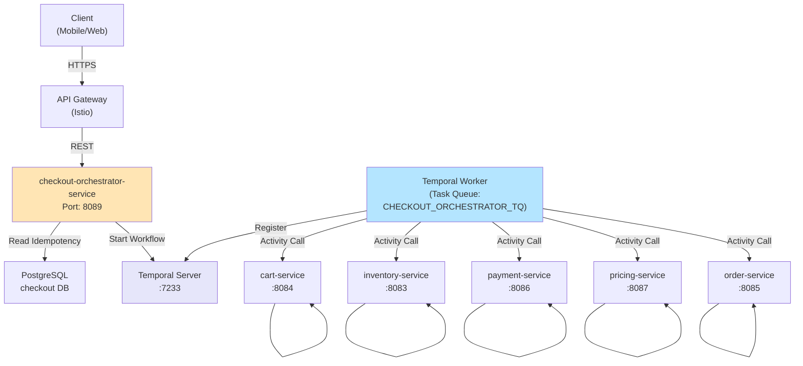

# Checkout Orchestrator Service - High-Level Design

## Deployed Topology



## Traffic Flow

1. **Client** sends POST /checkout request to API Gateway with `Idempotency-Key` header
2. **Checkout Controller** validates JWT + checks idempotency cache in PostgreSQL
3. **If cache hit**: Returns cached response immediately
4. **If cache miss**:
   - Generates workflowId = "checkout-{principal}-{idempotencyKey}"
   - Starts Temporal workflow via WorkflowClient
   - Workflow executes activities for cart → inventory → payment → pricing → order
   - Caches response in PostgreSQL with 30-min TTL
5. **Temporal Server** orchestrates activities across distributed services

## Key Dependencies

```
checkout-orchestrator-service
├── Temporal Server (workflow orchestration engine)
├── PostgreSQL (idempotency cache + ShedLock)
├── cart-service (sync HTTP, circuit breaker)
├── inventory-service (sync HTTP, circuit breaker)
├── payment-service (sync HTTP, circuit breaker)
├── pricing-service (sync HTTP, circuit breaker)
└── order-service (sync HTTP, circuit breaker)
```

## Failure Handling

- **Circuit Breaker**: 50% failure threshold → open after 10 calls, retry after 30s
- **Idempotent Retries**: Same idempotencyKey always returns same response
- **Timeout**: 5-minute workflow timeout
- **DLQ**: Failed workflows surface via Temporal DLQ (manual intervention required)
