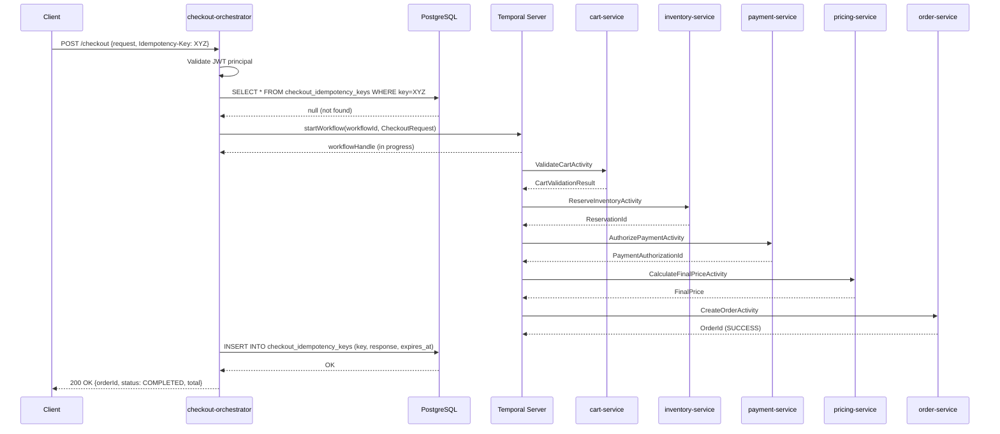
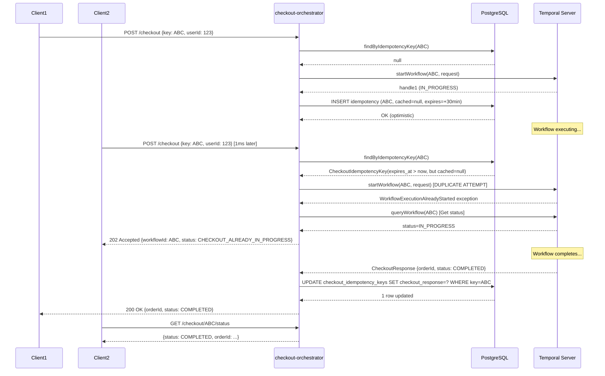
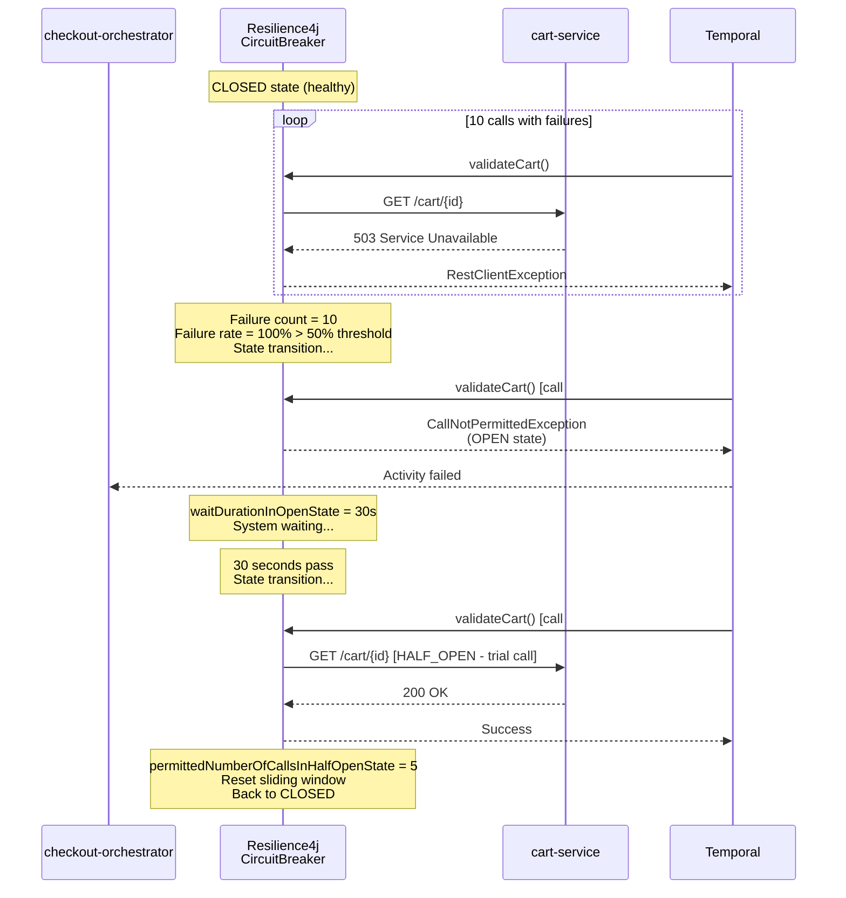
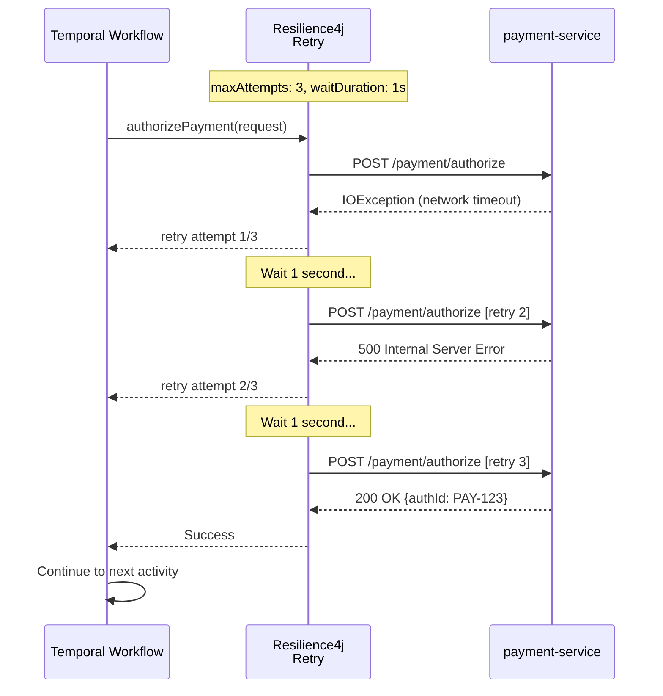

# Checkout Orchestrator Service - Sequence Diagrams

## Standard Checkout Flow (Happy Path)

## Duplicate Request During In-Flight Workflow

## Circuit Breaker Activation

## Payment Authorization with Retries

