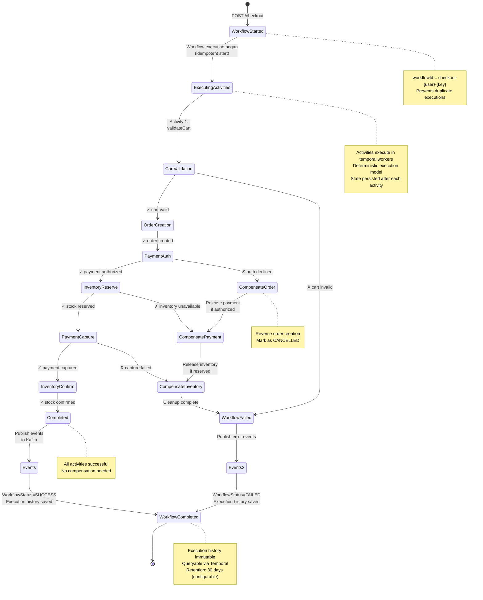
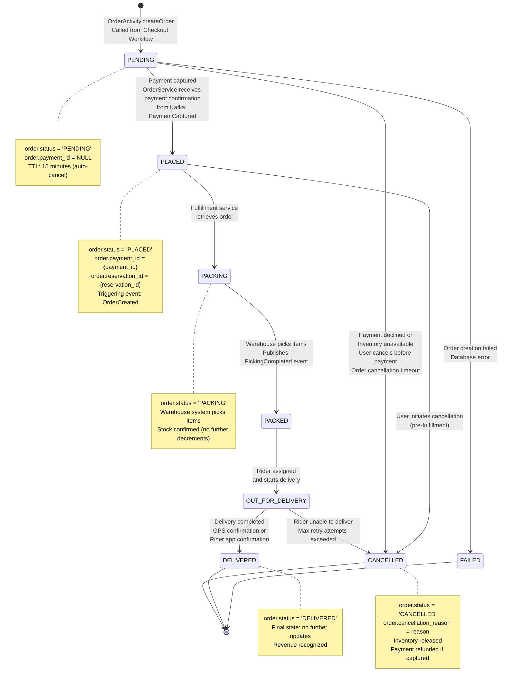
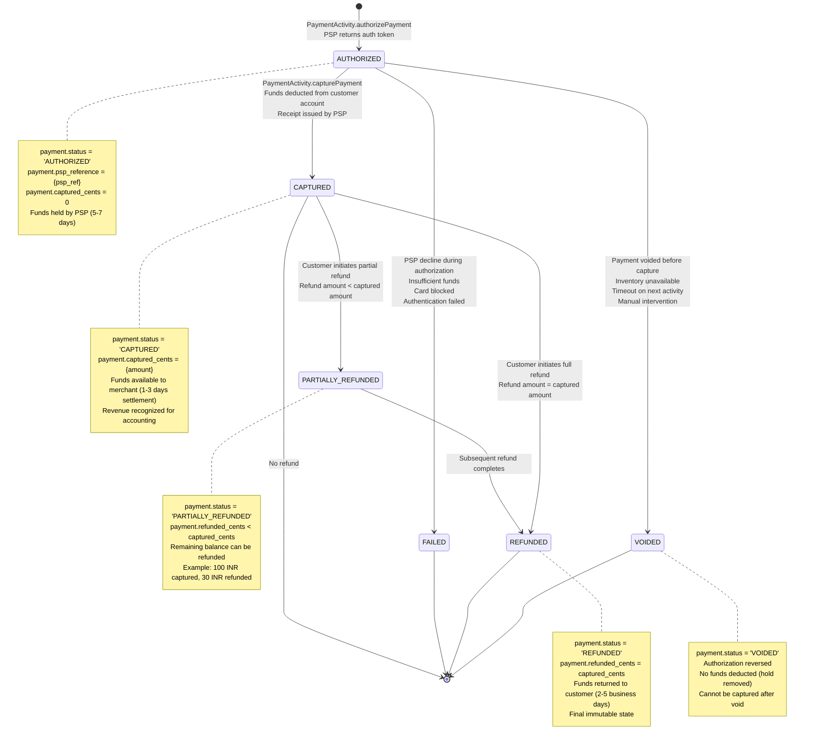
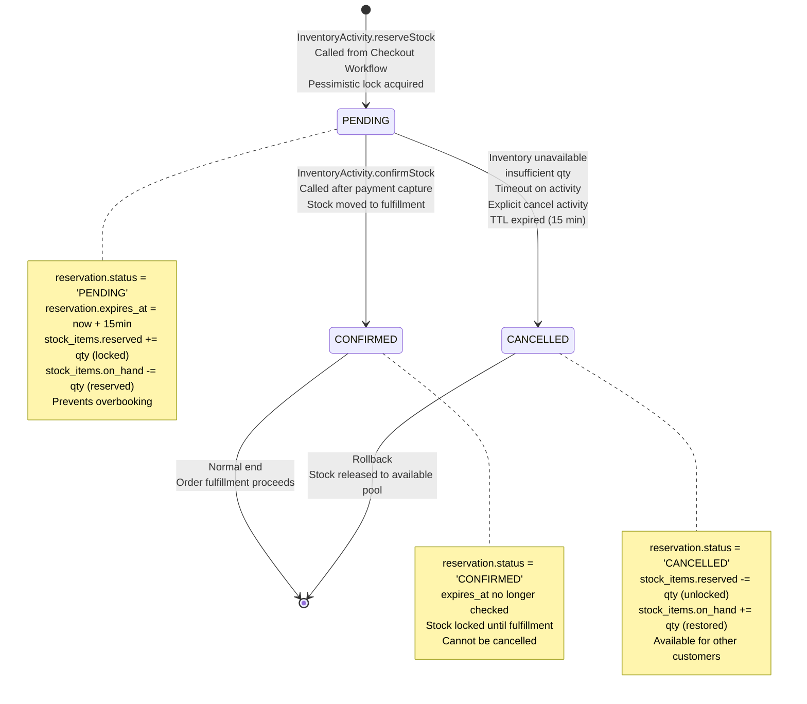
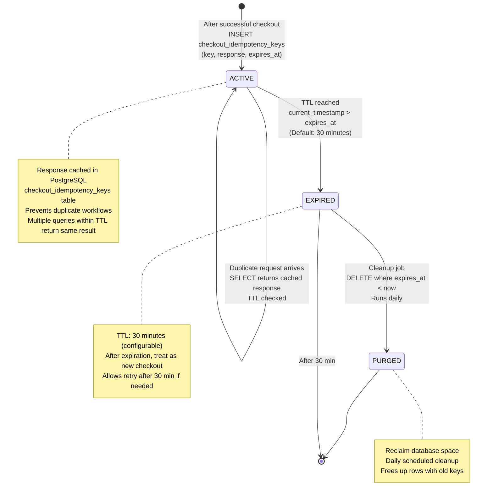
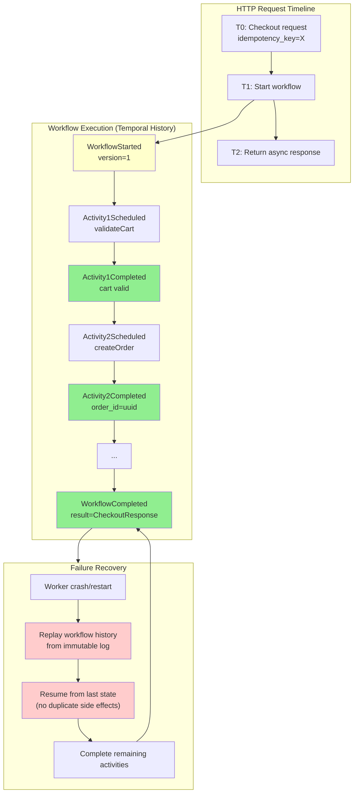

# Checkout Orchestrator Service - Entity Lifecycle & State Machines

## Temporal Workflow Execution Lifecycle

## Order Entity Lifecycle

## Payment Entity Lifecycle

## Inventory Reservation Lifecycle

## Idempotency Key Lifecycle (Database)

## Workflow State Persistence in Temporal

## Key Lifecycle Rules

| Entity | Initial State | Final States | TTL/Timeout | Notes |
|--------|---|---|---|---|
| **Workflow** | Started | Completed, Failed | 5 min | Replayed on worker recovery |
| **Order** | PENDING | DELIVERED, CANCELLED, FAILED | 15 min (auto-cancel) | Status immutable after PLACED |
| **Payment** | AUTHORIZED | CAPTURED, VOIDED, REFUNDED, FAILED | N/A | 180-day audit trail required |
| **Reservation** | PENDING | CONFIRMED, CANCELLED | 15 min (auto-release) | Prevents stock overbooking |
| **Idempotency Key** | ACTIVE | EXPIRED | 30 min | After expiration, new checkout allowed |
