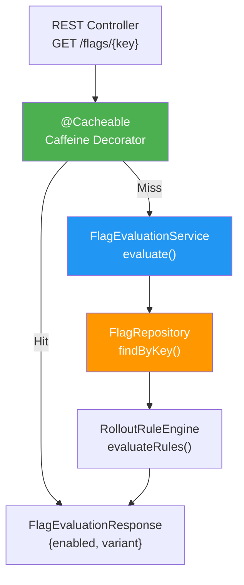
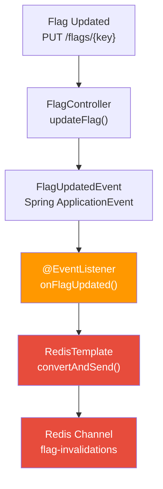
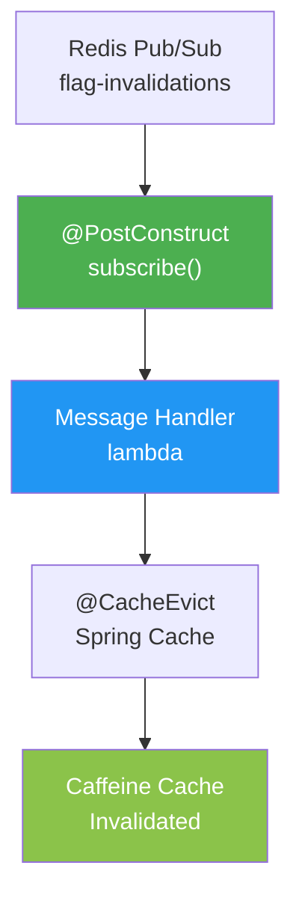
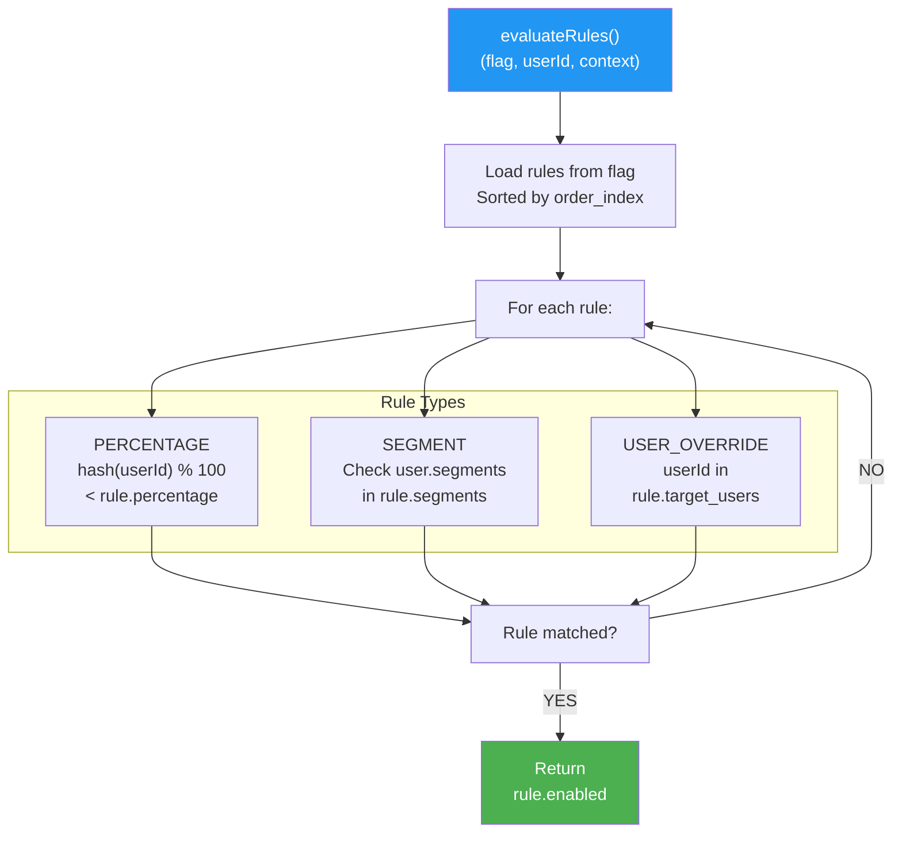
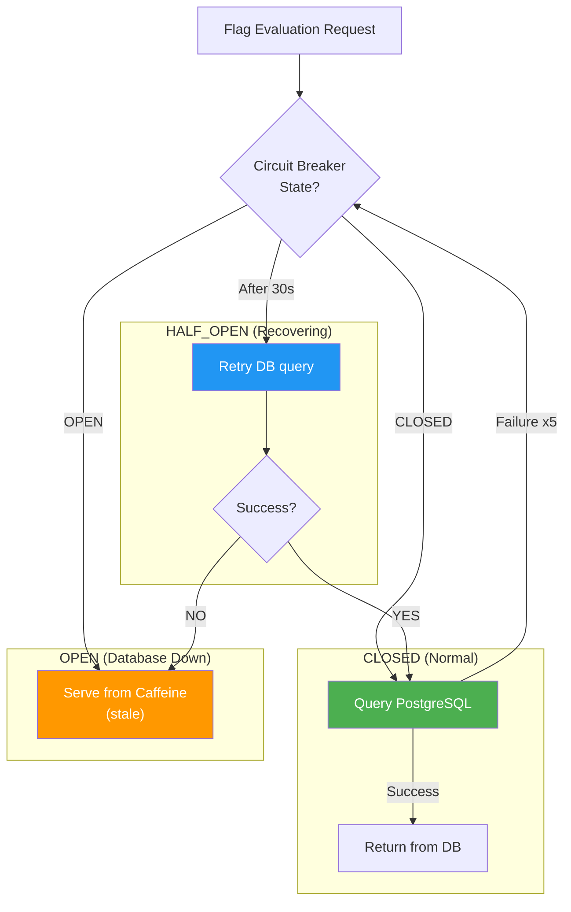
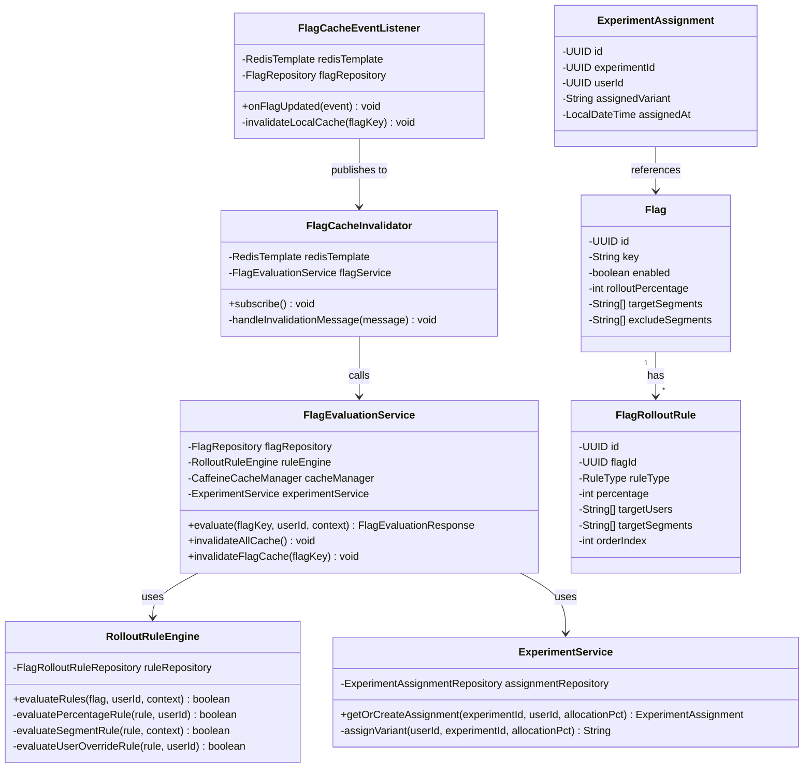

# Config & Feature Flag Service - Low-Level Design (LLD)

## Component Architecture

This document details the internal components, interfaces, and interactions of the config-feature-flag-service.

---

## Core Components

### 1. FlagEvaluationService (Component)

**Purpose**: Evaluate feature flags with context awareness, manage Caffeine cache



**Key Methods**:

```java
@Service
public class FlagEvaluationService {

    private final FlagRepository flagRepository;
    private final RolloutRuleEngine ruleEngine;
    private final CaffeineCacheManager cacheManager;
    private final ExperimentService experimentService;

    // Cached method: cache key = "{flagKey}:{userId}:{contextHash}"
    @Cacheable(
        value = "featureFlags",
        key = "#flagKey + ':' + (#userId != null ? #userId.toString() : 'null') + ':' + (#context != null ? T(java.lang.Integer).toHexString(#context.hashCode()) : 'null')",
        unless = "#result.isError()"
    )
    public FlagEvaluationResponse evaluate(String flagKey, UUID userId, Map<String, Object> context) {
        // 1. Load flag from DB
        Flag flag = flagRepository.findByKey(flagKey)
            .orElseThrow(() -> new FlagNotFoundException(flagKey));

        // 2. Check if active
        if (!flag.isEnabled()) {
            return FlagEvaluationResponse.disabled(flagKey);
        }

        // 3. Evaluate rollout rules (percentage, segment, user override)
        boolean isEligible = ruleEngine.evaluateRules(flag, userId, context);

        // 4. If A/B experiment active, get variant assignment
        String variant = flag.getDefaultVariant();
        if (flag.hasActiveExperiment()) {
            Experiment exp = flag.getActiveExperiment();
            ExperimentAssignment assignment = experimentService.getOrCreateAssignment(
                exp.getId(), userId, exp.getVariantAllocation()
            );
            variant = assignment.getVariant();
        }

        // 5. Build response
        return FlagEvaluationResponse.builder()
            .flagKey(flagKey)
            .enabled(isEligible)
            .variant(variant)
            .reason("Gradual rollout: " + flag.getRolloutPercentage() + "%")
            .cacheKey(generateCacheKey(flagKey, userId, context))
            .build();
    }

    // Explicit cache eviction (called by FlagCacheInvalidator)
    @CacheEvict(value = "featureFlags", allEntries = true)
    public void invalidateAllCache() {
        // Wildcard clear when Redis pub/sub fails
        logger.info("Cleared all feature flag cache");
    }

    // Specific flag eviction (called by Redis message handler)
    public void invalidateFlagCache(String flagKey) {
        Cache cache = cacheManager.getCache("featureFlags");
        if (cache != null) {
            // Clear all entries matching this flagKey
            cache.invalidate(); // Spring Cache abstraction
        }
    }
}
```

---

### 2. FlagCacheEventListener (Component)

**Purpose**: Listen for flag updates, publish invalidation messages to Redis



**Implementation**:

```java
@Component
public class FlagCacheEventListener {

    private final RedisTemplate<String, String> redisTemplate;
    private final FlagRepository flagRepository;
    private static final String INVALIDATION_CHANNEL = "flag-invalidations";
    private static final Logger logger = LoggerFactory.getLogger(FlagCacheEventListener.class);

    // Listen for flag update events
    @EventListener
    public void onFlagUpdated(FlagUpdatedEvent event) {
        logger.info("Flag updated event received: {}", event.getFlagKey());

        try {
            // Publish to Redis pub/sub channel
            String message = "flag-invalidation:" + event.getFlagKey();
            Long subscribers = redisTemplate.convertAndSend(INVALIDATION_CHANNEL, message);

            // Log subscriber count for observability
            logger.info("Published flag invalidation to {} subscribers", subscribers);

            // Record metric
            meterRegistry.counter("featureflag.redis.pub.count", "flag", event.getFlagKey()).increment();
        } catch (RedisConnectionFailureException e) {
            // Graceful fallback: invalidate locally and let TTL handle it
            logger.warn("Redis pub/sub unavailable, using TTL fallback", e);
            meterRegistry.counter("featureflag.redis.failures", "type", "publish").increment();
            invalidateLocalCache(event.getFlagKey());
        }
    }

    // Fallback: clear local cache when Redis unavailable
    private void invalidateLocalCache(String flagKey) {
        Cache cache = cacheManager.getCache("featureFlags");
        if (cache != null) {
            cache.invalidate();
            logger.info("Cleared local Caffeine cache for flag: {}", flagKey);
        }
    }
}
```

---

### 3. FlagCacheInvalidator (Component)

**Purpose**: Subscribe to Redis pub/sub, trigger cache eviction on all pods



**Implementation**:

```java
@Component
public class FlagCacheInvalidator {

    private final RedisTemplate<String, String> redisTemplate;
    private final FlagEvaluationService flagService;
    private final MeterRegistry meterRegistry;
    private static final String INVALIDATION_CHANNEL = "flag-invalidations";
    private static final Logger logger = LoggerFactory.getLogger(FlagCacheInvalidator.class);

    @PostConstruct
    public void subscribe() {
        logger.info("Subscribing to Redis channel: {}", INVALIDATION_CHANNEL);

        try {
            // Create subscription in separate thread (non-blocking)
            Thread subscriptionThread = new Thread(() -> {
                RedisConnection connection = redisTemplate.getConnectionFactory().getConnection();
                connection.subscribe(
                    // Message listener
                    message -> handleInvalidationMessage(message),
                    // Channel names (as bytes)
                    INVALIDATION_CHANNEL.getBytes()
                );
            });
            subscriptionThread.setName("redis-flag-cache-invalidator");
            subscriptionThread.setDaemon(false);
            subscriptionThread.start();

            logger.info("Cache invalidation subscriber thread started");
        } catch (Exception e) {
            logger.error("Failed to subscribe to Redis channel", e);
            meterRegistry.counter("featureflag.redis.failures", "type", "subscribe").increment();
        }
    }

    // Handle incoming invalidation message from Redis
    private void handleInvalidationMessage(Message message) {
        try {
            String payload = new String(message.getBody(), StandardCharsets.UTF_8);
            logger.debug("Received invalidation message: {}", payload);

            // Message format: "flag-invalidation:{flagKey}"
            if (payload.startsWith("flag-invalidation:")) {
                String flagKey = payload.substring("flag-invalidation:".length());

                // Record start time for latency tracking
                long startTime = System.currentTimeMillis();

                // Evict from Caffeine cache
                flagService.invalidateFlagCache(flagKey);

                // Record metrics
                long latencyMs = System.currentTimeMillis() - startTime;
                meterRegistry.timer("featureflag.redis.sub.latency_ms").record(latencyMs, TimeUnit.MILLISECONDS);
                meterRegistry.counter("featureflag.redis.sub.count", "flag", flagKey).increment();

                logger.info("Cache invalidated for flag: {} (latency: {}ms)", flagKey, latencyMs);
            }
        } catch (Exception e) {
            logger.error("Error processing invalidation message", e);
            meterRegistry.counter("featureflag.redis.failures", "type", "message_handler").increment();
        }
    }
}
```

---

### 4. RolloutRuleEngine (Component)

**Purpose**: Evaluate flag eligibility based on rollout rules



**Implementation**:

```java
@Service
public class RolloutRuleEngine {

    private final FlagRolloutRuleRepository ruleRepository;

    public boolean evaluateRules(Flag flag, UUID userId, Map<String, Object> context) {
        // Load all rules for this flag, sorted by execution order
        List<FlagRolloutRule> rules = ruleRepository.findByFlagIdOrderByOrderIndex(flag.getId());

        if (rules.isEmpty()) {
            // No rules = use default flag.enabled value
            return flag.isEnabled();
        }

        // Evaluate rules in order until first match
        for (FlagRolloutRule rule : rules) {
            if (evaluateRule(rule, flag, userId, context)) {
                return rule.isEnabled();
            }
        }

        // No rule matched, fall back to flag default
        return flag.isEnabled();
    }

    private boolean evaluateRule(FlagRolloutRule rule, Flag flag, UUID userId, Map<String, Object> context) {
        switch (rule.getRuleType()) {
            case PERCENTAGE:
                return evaluatePercentageRule(rule, userId);
            case SEGMENT:
                return evaluateSegmentRule(rule, context);
            case USER_OVERRIDE:
                return evaluateUserOverrideRule(rule, userId);
            default:
                return false;
        }
    }

    // Percentage-based rollout: hash(userId) % 100 < rollout_percentage
    private boolean evaluatePercentageRule(FlagRolloutRule rule, UUID userId) {
        if (userId == null) {
            return false; // Not eligible if no user ID
        }

        // Consistent hash across pod restarts
        int hash = Math.abs(userId.toString().hashCode()) % 100;
        return hash < rule.getPercentage();
    }

    // Segment-based: check if user's segments match rule
    private boolean evaluateSegmentRule(FlagRolloutRule rule, Map<String, Object> context) {
        @SuppressWarnings("unchecked")
        List<String> userSegments = (List<String>) context.get("segments");

        if (userSegments == null || userSegments.isEmpty()) {
            return false;
        }

        List<String> ruleSegments = Arrays.asList(rule.getTargetSegments());
        return userSegments.stream().anyMatch(ruleSegments::contains);
    }

    // User override: explicit user ID in target list
    private boolean evaluateUserOverrideRule(FlagRolloutRule rule, UUID userId) {
        if (userId == null) {
            return false;
        }

        UUID[] targetUsers = rule.getTargetUsers();
        return Arrays.stream(targetUsers).anyMatch(u -> u.equals(userId));
    }
}
```

---

### 5. ExperimentService (Component)

**Purpose**: Manage A/B experiment assignments with consistent hashing

**Key Methods**:

```java
@Service
public class ExperimentService {

    private final ExperimentAssignmentRepository assignmentRepository;
    private final ExperimentRepository experimentRepository;

    // Get or create assignment: deterministic hash-based assignment
    public ExperimentAssignment getOrCreateAssignment(UUID experimentId, UUID userId, int allocationPct) {
        // First, check if assignment already exists (idempotent)
        Optional<ExperimentAssignment> existing = assignmentRepository
            .findByExperimentIdAndUserId(experimentId, userId);

        if (existing.isPresent()) {
            return existing.get(); // Deterministic: same variant on retry
        }

        // Assign variant using hash: ensures same user always gets same variant
        String variant = assignVariant(userId, experimentId, allocationPct);

        // Persist assignment
        ExperimentAssignment assignment = new ExperimentAssignment();
        assignment.setExperimentId(experimentId);
        assignment.setUserId(userId);
        assignment.setAssignedVariant(variant);
        assignment.setAssignedAt(LocalDateTime.now());

        return assignmentRepository.save(assignment);
    }

    // Deterministic variant assignment: hash(userId + experimentKey) % 100
    private String assignVariant(UUID userId, UUID experimentId, int allocationPct) {
        // Combine user ID and experiment ID to ensure consistency across experiments
        String hashInput = userId.toString() + ":" + experimentId.toString();

        // MD5 hash → convert to integer → modulo 100
        int hash = Math.abs(hashCode(hashInput)) % 100;

        // If hash < allocation, assign to variant B, else variant A
        return hash < allocationPct ? "B" : "A";
    }

    private int hashCode(String input) {
        // Use a cryptographic hash for consistency across Java versions
        try {
            byte[] messageDigest = MessageDigest.getInstance("MD5").digest(input.getBytes(StandardCharsets.UTF_8));
            int hash = 0;
            for (byte b : messageDigest) {
                hash = hash * 31 + (b & 0xFF);
            }
            return hash;
        } catch (NoSuchAlgorithmException e) {
            throw new RuntimeException("MD5 algorithm not available", e);
        }
    }
}
```

---

### 6. Circuit Breaker Pattern (PostgreSQL Resilience)

**Purpose**: Graceful degradation when PostgreSQL unavailable



**Configuration**:

```yaml
resilience4j:
  circuitbreaker:
    instances:
      flagDatabase:
        slidingWindowSize: 100
        failureRateThreshold: 50  # 50% failure rate triggers circuit open
        waitDurationInOpenState: 30000  # Wait 30s before retry
        permittedNumberOfCallsInHalfOpenState: 10
        slowCallRateThreshold: 80
        slowCallDurationThreshold: 2000  # 2s considered slow
```

---

### 7. Observability & Metrics

**Key Metrics**:

```
# Cache metrics
cache.caffeine.hits{service="config-feature-flag-service"}
cache.caffeine.misses{service="config-feature-flag-service"}
cache.caffeine.hitRate{service="config-feature-flag-service"}
cache.caffeine.evictions{service="config-feature-flag-service"}

# Redis pub/sub metrics
featureflag.redis.pub.count{flag="new_checkout_ui"}
featureflag.redis.sub.count{flag="new_checkout_ui"}
featureflag.redis.sub.latency_ms{flag="new_checkout_ui"}
featureflag.redis.failures{type="publish|subscribe|message_handler"}

# Evaluation metrics
featureflag.evaluation.latency_ms{flag="new_checkout_ui"}
featureflag.evaluation.total{flag="new_checkout_ui",result="enabled|disabled"}

# Experiment metrics
featureflag.experiment.assignment.total{experiment="checkout_variant_test",variant="A|B"}
```

---

## Class Diagram



---

## Error Handling Strategy

| Error | Detection | Action |
|-------|-----------|--------|
| **PostgreSQL Down** | DB connection fails | Circuit breaker opens → serve stale cache |
| **Redis Unavailable** | Pub/sub connection fails | Fall back to TTL expiration (30s) |
| **Flag Not Found** | FlagNotFoundException | Return 404 with error reason |
| **Invalid Context** | Context parsing fails | Log warning, evaluate with partial context |
| **Cache Corrupted** | Corrupted cache entry | Clear entry, reload from DB |

