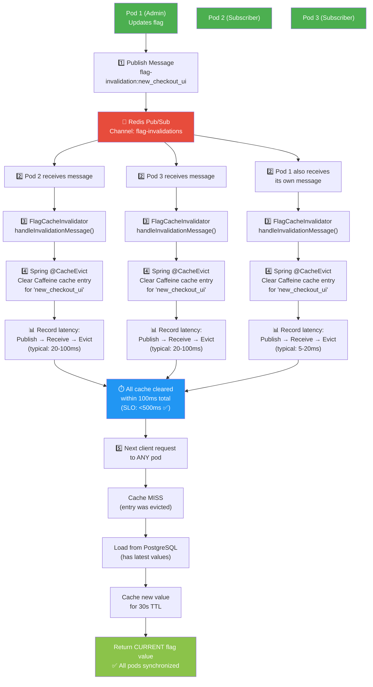
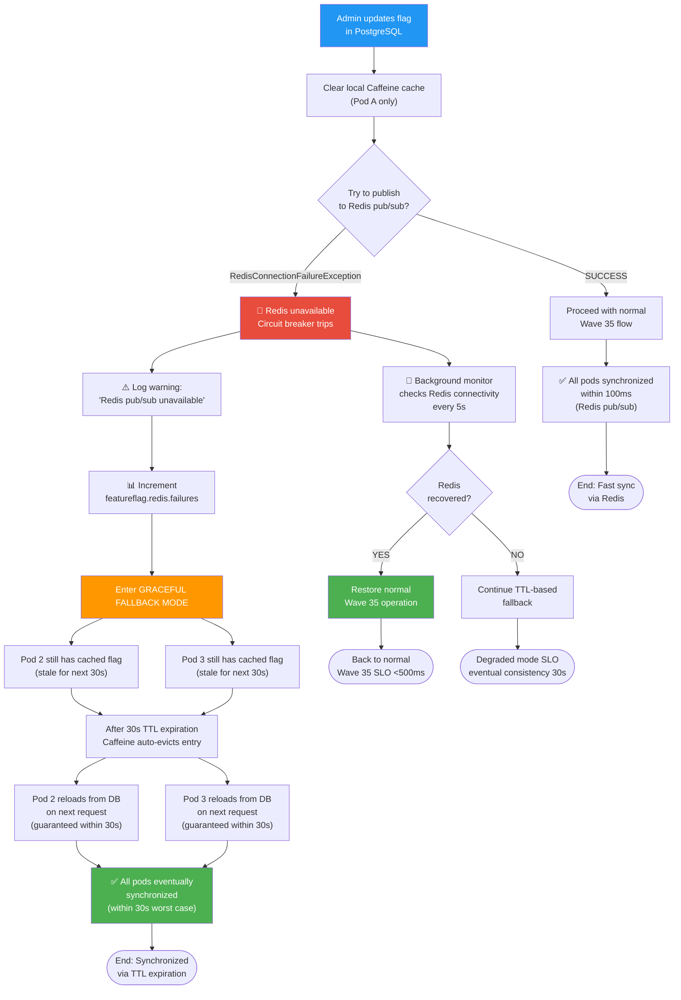
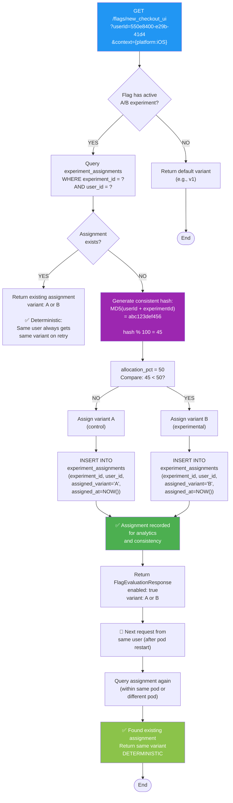
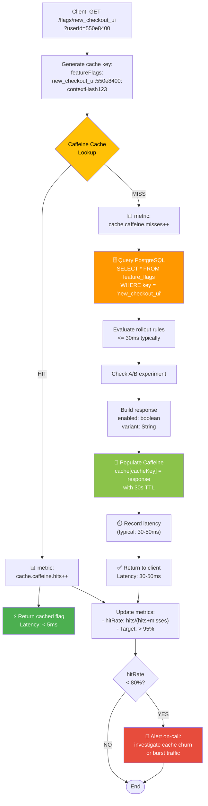

# Config & Feature Flag Service - Flowchart Diagrams

## Flag Evaluation Flow (Read Path)

### Main Evaluation Process

```mermaid
flowchart TD
    Start([Client Request: GET /flags/{key}?userId=123&context={...}]) --> ValidateInput{Input Validation:<br/>- Flag key not null<br/>- Context valid JSON}

    ValidateInput -->|FAIL| InvalidInput["Return 400<br/>Bad Request"]
    ValidateInput -->|PASS| CheckAuth{Authentication &<br/>Authorization?}

    CheckAuth -->|FAIL| Unauthorized["Return 401<br/>Unauthorized"]
    CheckAuth -->|PASS| CacheLookup{"Check Caffeine Cache<br/>Key: {flagKey}:{userId}:{contextHash}"}

    CacheLookup -->|HIT| IncHitMetric["📊 Increment hit counter"]
    IncHitMetric --> RecordLatency["⏱️ Record latency &lt; 5ms"]
    RecordLatency --> ReturnCached["Return cached flag<br/>enabled: boolean<br/>variant: String"]

    CacheLookup -->|MISS| IncMissMetric["📊 Increment miss counter"]
    IncMissMetric --> LoadFromDB["🗄️ Query PostgreSQL<br/>SELECT * FROM feature_flags<br/>WHERE key = ?"]

    LoadFromDB --> DBFound{Flag<br/>Found?}

    DBFound -->|NO| FlagNotFound["Return 404<br/>Flag not found"]
    DBFound -->|YES| CheckEnabled{Flag<br/>enabled=true?}

    CheckEnabled -->|NO| ReturnDisabled["Return FlagEvaluationResponse<br/>enabled: false<br/>reason: 'Flag disabled globally'"]

    CheckEnabled -->|YES| LoadRules["Load rollout rules<br/>FROM flag_rollout_rules<br/>WHERE flag_id = ?<br/>ORDER BY order_index"]

    LoadRules --> EvalRules{"Evaluate rules<br/>(userId, context, rules)"}

    EvalRules -->|First rule matches<br/>and enabled=true| RuleMatched["Eligible for flag"]
    EvalRules -->|First rule matches<br/>and enabled=false| RuleExcluded["Not eligible for flag"]
    EvalRules -->|No rules match| DefaultFallback["Use flag.enabled<br/>= true"]

    RuleMatched --> CheckExperiment{Active A/B<br/>Experiment?}
    RuleExcluded --> ReturnIneligible["Return FlagEvaluationResponse<br/>enabled: false<br/>reason: 'Failed rollout rule'"]
    DefaultFallback --> CheckExperiment

    CheckExperiment -->|NO| BuildResponse["Build response<br/>enabled: boolean<br/>variant: flag.defaultVariant<br/>cacheKey: generated"]
    CheckExperiment -->|YES| GetAssignment["Get experiment assignment<br/>FOR userId in experiment"]

    GetAssignment --> AssignmentExists{Assignment<br/>exists?}

    AssignmentExists -->|YES| UseExistingVariant["Use existing variant (A or B)<br/>Deterministic: same user<br/>always gets same variant"]
    AssignmentExists -->|NO| GenerateAssignment["Generate new assignment<br/>hash(userId + experimentKey) % 100<br/>If hash &lt; allocation%: variant B<br/>Else: variant A"]

    GenerateAssignment --> PersistAssignment["PERSIST to experiment_assignments"]

    UseExistingVariant --> BuildResponseWithVariant["Build response<br/>enabled: true<br/>variant: assignedVariant<br/>reason: 'A/B experiment'"]
    PersistAssignment --> BuildResponseWithVariant

    BuildResponse --> CacheResult["💾 Cache result in Caffeine<br/>Key: {flagKey}:{userId}:{contextHash}<br/>TTL: 30s"]
    BuildResponseWithVariant --> CacheResult

    CacheResult --> ReturnSuccess["✅ Return 200 OK"]

    ReturnSuccess --> RecordMetrics["📊 Record metrics:<br/>- Latency (typical: 30ms)<br/>- Flag evaluation count"]
    RecordMetrics --> End([End])

    InvalidInput --> End
    Unauthorized --> End
    FlagNotFound --> End
    ReturnDisabled --> End
    ReturnIneligible --> End

    style Start fill:#2196F3,color:#fff
    style End fill:#4CAF50,color:#fff
    style CacheLookup fill:#FFC107,color:#000
    style LoadFromDB fill:#FF9800,color:#fff
    style EvalRules fill:#9C27B0,color:#fff
    style GetAssignment fill:#9C27B0,color:#fff
    style CacheResult fill:#8BC34A,color:#fff
    style ReturnSuccess fill:#4CAF50,color:#fff
```

---

## Flag Update Flow (Write Path + Cache Invalidation)

### Admin Updates Flag with Wave 35 Redis Pub/Sub

```mermaid
flowchart TD
    Start([Admin: PUT /flags/{key}<br/>Request: {enabled, rollout%, segments}]) --> Auth{Authentication:<br/>JWT + ADMIN role?}

    Auth -->|FAIL| Forbidden["Return 403<br/>Forbidden"]
    Auth -->|PASS| Validate{Input Validation:<br/>- key not null<br/>- rollout: 0-100}

    Validate -->|FAIL| InvalidReq["Return 400<br/>Bad Request"]
    Validate -->|PASS| BeginTransaction["BEGIN PostgreSQL<br/>Transaction<br/>(Isolation Level: REPEATABLE_READ)"]

    BeginTransaction --> LockFlag["LOCK flag row<br/>FOR UPDATE<br/>(prevent concurrent updates)"]

    LockFlag --> LoadCurrentFlag["SELECT * FROM feature_flags<br/>WHERE key = ?"]

    LoadCurrentFlag --> FlagExists{Flag<br/>exists?}

    FlagExists -->|NO| InsertNewFlag["INSERT INTO feature_flags<br/>(id, key, enabled, rollout_percentage, ...)<br/>VALUES (...)"]
    FlagExists -->|YES| UpdateExistingFlag["UPDATE feature_flags<br/>SET enabled=?, rollout_percentage=?, updated_at=NOW()<br/>WHERE key=?"]

    InsertNewFlag --> RecordChange["INSERT INTO flag_audit_log<br/>(flag_id, action, old_value, new_value, changed_by, changed_at)"]
    UpdateExistingFlag --> RecordChange

    RecordChange --> CommitDB["COMMIT transaction"]

    CommitDB --> ClearLocalCache["🗑️ Spring @CacheEvict<br/>Clear local Caffeine cache<br/>for this flagKey"]

    ClearLocalCache --> PublishRedis["🔴 Publish to Redis Channel<br/>Channel: flag-invalidations<br/>Message: 'flag-invalidation:{flagKey}'<br/><br/>Redis pub/sub broadcasts<br/>to all subscribers"]

    PublishRedis --> RedisOk{Redis<br/>publish<br/>success?}

    RedisOk -->|YES| CountSubscribers["Log subscriber count<br/>📊 Metric: featureflag.redis.pub.count"]
    RedisOk -->|NO| RedisFailed["⚠️ Redis publish failed<br/>Graceful fallback active"]

    CountSubscribers --> BuildAuditEvent["Build audit event:<br/>- flagKey<br/>- old values<br/>- new values<br/>- timestamp<br/>- admin user"]
    RedisFailed --> BuildAuditEvent

    BuildAuditEvent --> PublishKafka["📨 OPTIONAL: Publish to Kafka<br/>Topic: flag-updates<br/>(for analytics/audit trail)"]

    PublishKafka --> ReturnSuccess["✅ Return 200 OK<br/>Response: {flagKey, enabled, rollout%, variant}"]

    ReturnSuccess --> End([End])
    Forbidden --> End
    InvalidReq --> End

    style Start fill:#2196F3,color:#fff
    style End fill:#4CAF50,color:#fff
    style BeginTransaction fill:#FF9800,color:#fff
    style PublishRedis fill:#E74C3C,color:#fff
    style ClearLocalCache fill:#8BC34A,color:#fff
    style CommitDB fill:#4CAF50,color:#fff
```

---

## Redis Pub/Sub Invalidation Flow (Wave 35)

### Cache Invalidation Across All 3 Replicas



---

## Fallback Behavior (Redis Unavailable)

### Grace Degradation When Redis Down



---

## Experiment Assignment Logic

### Deterministic Variant Assignment



---

## Caching Strategy: Hit vs Miss



