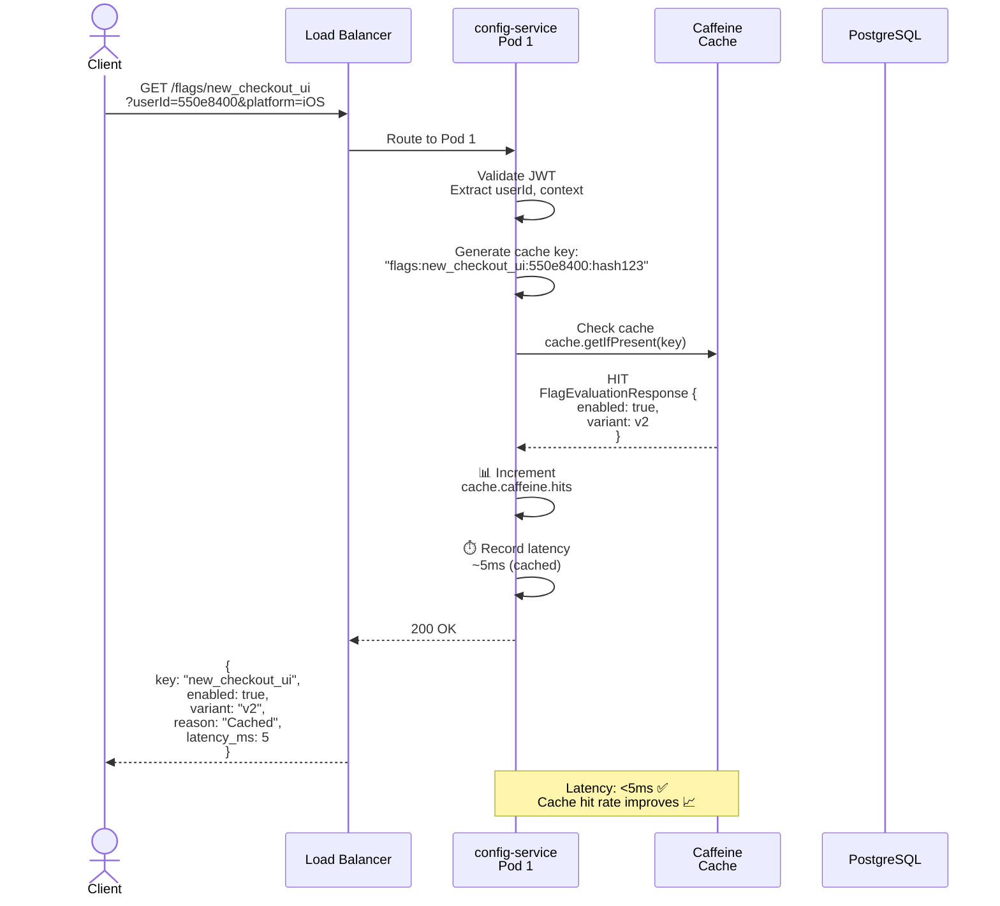
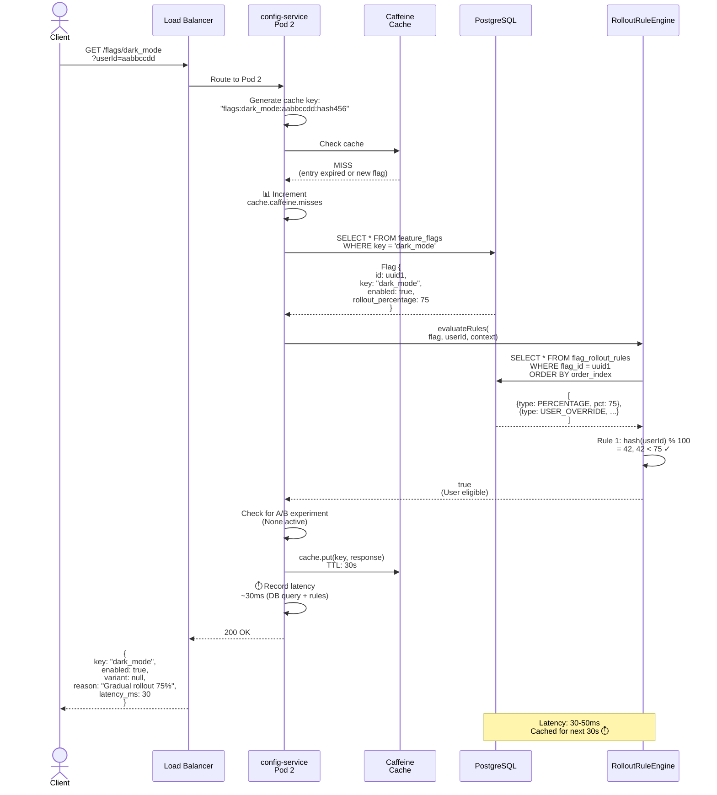
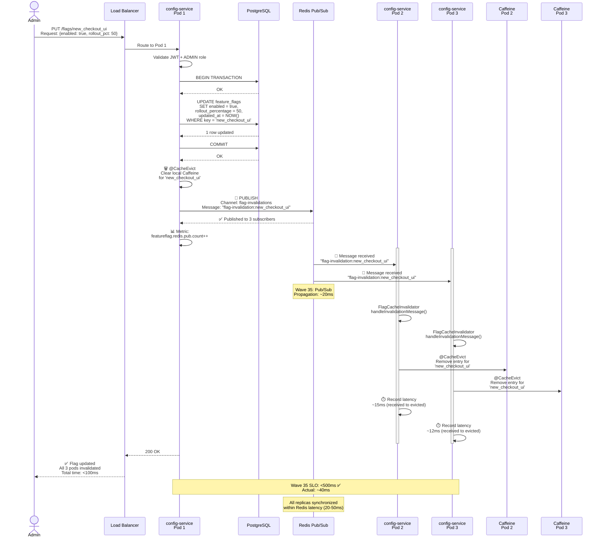
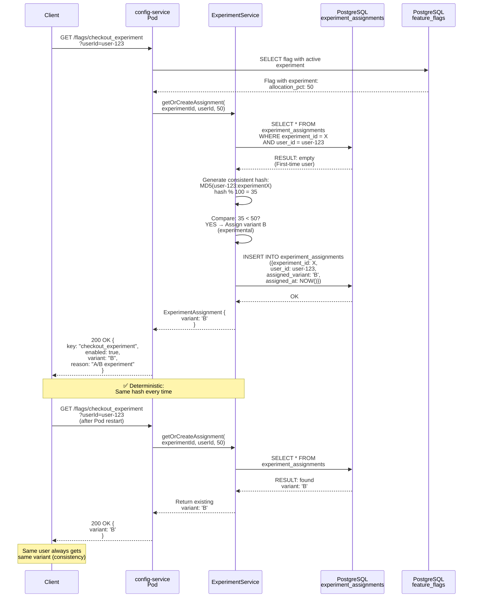
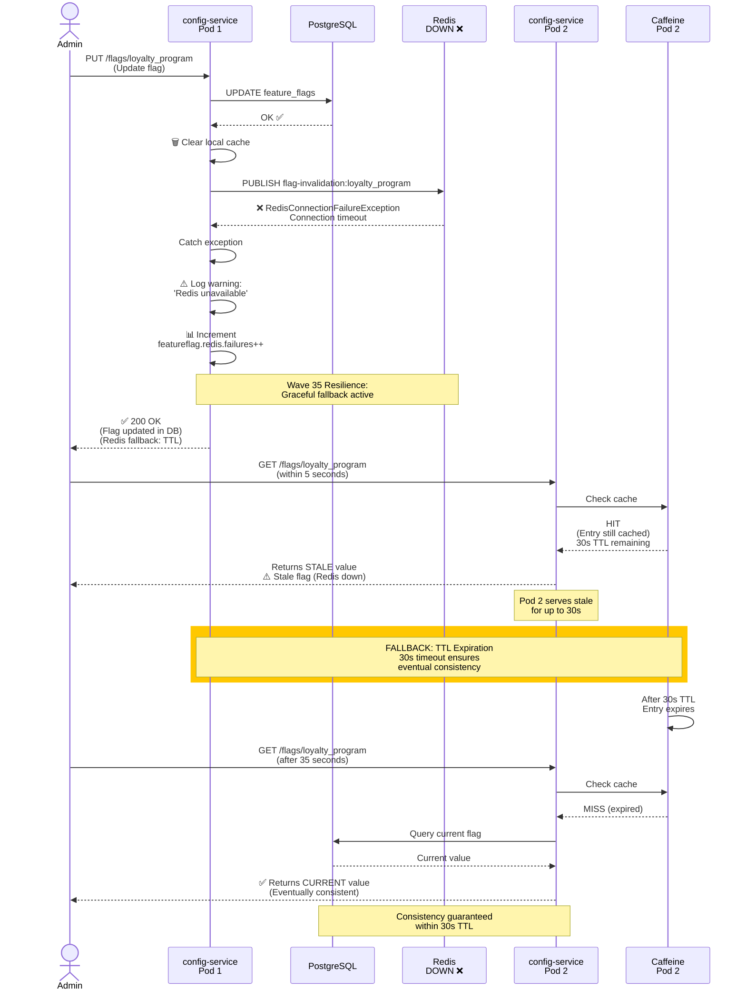
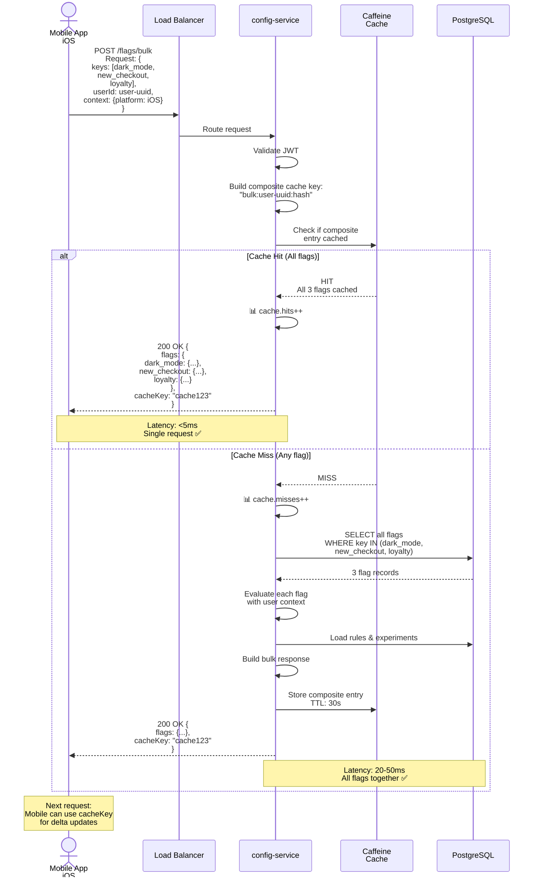
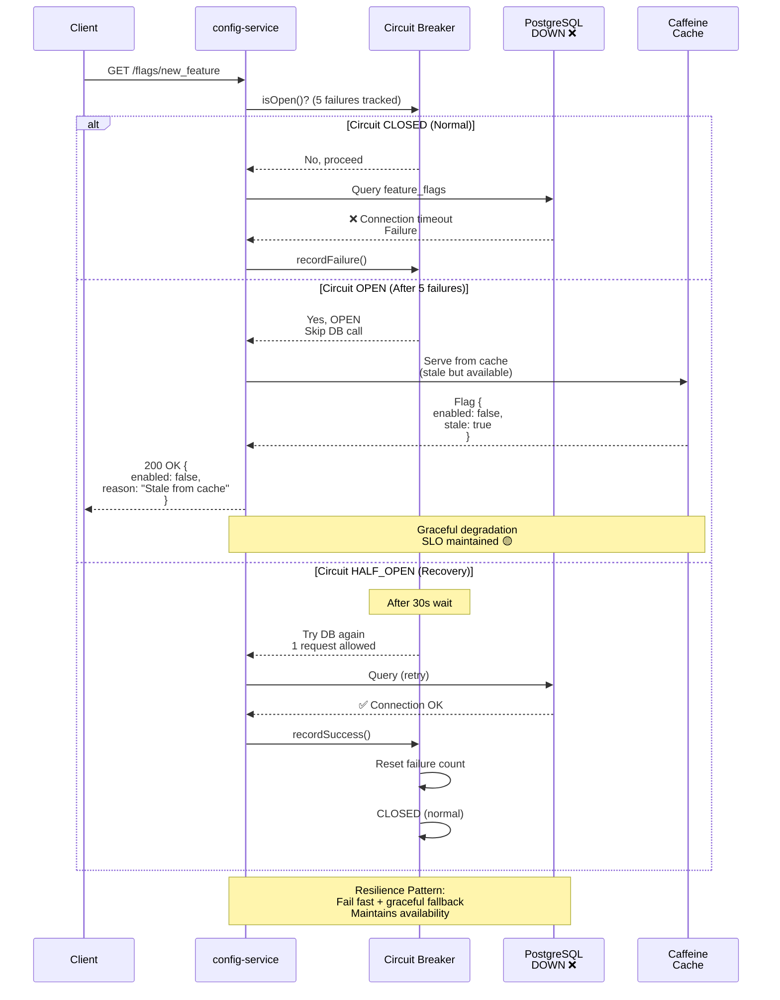

# Config & Feature Flag Service - Sequence Diagrams

## Sequence 1: Flag Evaluation Request (Cache Hit)

---

## Sequence 2: Flag Evaluation Request (Cache Miss)

---

## Sequence 3: Flag Update with Redis Pub/Sub (Wave 35)

### Admin Updates Flag → All Pods Invalidate Cache

---

## Sequence 4: A/B Experiment Assignment (Deterministic)

---

## Sequence 5: Cache Invalidation Fallback (Redis Down)

---

## Sequence 6: Bulk Flag Evaluation (Mobile Optimization)

---

## Sequence 7: Circuit Breaker Activation (PostgreSQL Down)

