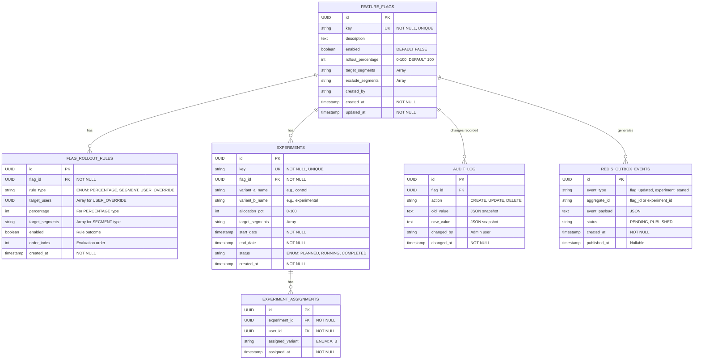

# Config & Feature Flag Service - ER Diagram & Schema Design

## Entity Relationship Diagram (Wave 35 Schema)



---

## Core Tables Detailed Schema

### 1. feature_flags Table

**Purpose**: Core feature flag definitions with rollout configuration

```sql
CREATE TABLE feature_flags (
    id UUID PRIMARY KEY DEFAULT gen_random_uuid(),
    key VARCHAR(255) NOT NULL UNIQUE,
    description TEXT,
    enabled BOOLEAN NOT NULL DEFAULT FALSE,
    rollout_percentage INT NOT NULL DEFAULT 100 CHECK (rollout_percentage >= 0 AND rollout_percentage <= 100),
    target_segments VARCHAR[] DEFAULT '{}',
    exclude_segments VARCHAR[] DEFAULT '{}',
    default_variant VARCHAR(100) DEFAULT 'v1',
    created_by VARCHAR(255),
    created_at TIMESTAMP NOT NULL DEFAULT CURRENT_TIMESTAMP,
    updated_at TIMESTAMP NOT NULL DEFAULT CURRENT_TIMESTAMP
);

CREATE INDEX idx_feature_flags_key ON feature_flags(key);
CREATE INDEX idx_feature_flags_enabled ON feature_flags(enabled);
CREATE INDEX idx_feature_flags_rollout ON feature_flags(rollout_percentage);
CREATE INDEX idx_feature_flags_updated_at ON feature_flags(updated_at DESC);
```

**Columns**:

| Column | Type | Purpose | Example |
|--------|------|---------|---------|
| `id` | UUID | Primary key | `550e8400-e29b-41d4...` |
| `key` | VARCHAR(255) | Flag identifier | `new_checkout_ui` |
| `description` | TEXT | Human-readable purpose | `New checkout experience for Q2` |
| `enabled` | BOOLEAN | Global enable/disable | `true` |
| `rollout_percentage` | INT (0-100) | Gradual rollout percentage | `50` (50% of users) |
| `target_segments` | VARCHAR[] | Segments to enable for | `['MOBILE_USERS', 'PREMIUM']` |
| `exclude_segments` | VARCHAR[] | Segments to exclude | `['VIP', 'INTERNAL']` |
| `default_variant` | VARCHAR(100) | Default variant if no experiment | `v1` |
| `created_by` | VARCHAR(255) | Admin who created | `admin@example.com` |
| `created_at` | TIMESTAMP | Creation time (UTC) | `2025-04-01 10:00:00` |
| `updated_at` | TIMESTAMP | Last modification | `2025-04-05 14:30:00` |

**Indexes**:
- `key`: O(1) lookup by flag name
- `enabled`: Fast query for active flags
- `rollout_percentage`: Query flags being rolled out
- `updated_at DESC`: Get recently modified flags

---

### 2. flag_rollout_rules Table

**Purpose**: Define evaluation rules for flag eligibility

```sql
CREATE TABLE flag_rollout_rules (
    id UUID PRIMARY KEY DEFAULT gen_random_uuid(),
    flag_id UUID NOT NULL REFERENCES feature_flags(id) ON DELETE CASCADE,
    rule_type VARCHAR(50) NOT NULL CHECK (rule_type IN ('PERCENTAGE', 'SEGMENT', 'USER_OVERRIDE')),
    target_users UUID[] DEFAULT '{}',
    percentage INT CHECK (percentage IS NULL OR (percentage >= 0 AND percentage <= 100)),
    target_segments VARCHAR[] DEFAULT '{}',
    enabled BOOLEAN NOT NULL DEFAULT TRUE,
    order_index INT NOT NULL,
    created_at TIMESTAMP NOT NULL DEFAULT CURRENT_TIMESTAMP
);

CREATE UNIQUE INDEX idx_flag_rollout_rules_order ON flag_rollout_rules(flag_id, order_index);
CREATE INDEX idx_flag_rollout_rules_type ON flag_rollout_rules(rule_type);
```

**Columns**:

| Column | Type | Purpose | Example |
|--------|------|---------|---------|
| `id` | UUID | Primary key | UUID |
| `flag_id` | UUID (FK) | Reference to flag | Links to feature_flags |
| `rule_type` | VARCHAR(50) | Type of rule | `PERCENTAGE`, `SEGMENT`, `USER_OVERRIDE` |
| `target_users` | UUID[] | Users for override | `[uuid1, uuid2, uuid3]` |
| `percentage` | INT (0-100) | Rollout percentage | `75` (75% of users) |
| `target_segments` | VARCHAR[] | User segments | `['MOBILE_USERS', 'iOS']` |
| `enabled` | BOOLEAN | Whether rule is active | `true` |
| `order_index` | INT | Evaluation order | `1`, `2`, `3` (evaluate in sequence) |
| `created_at` | TIMESTAMP | Rule creation time | `2025-04-01 10:00:00` |

**Rule Types**:

1. **PERCENTAGE**: Percentage-based gradual rollout
   - Evaluation: `hash(userId) % 100 < percentage`
   - Example: 75% of users

2. **SEGMENT**: Segment-based targeting
   - Evaluation: `userId.segments.contains(target_segment)`
   - Example: Enable for MOBILE_USERS only

3. **USER_OVERRIDE**: Explicit user list
   - Evaluation: `userId in target_users`
   - Example: Force enable/disable for specific users

---

### 3. experiments Table

**Purpose**: A/B experiment configuration

```sql
CREATE TABLE experiments (
    id UUID PRIMARY KEY DEFAULT gen_random_uuid(),
    key VARCHAR(255) NOT NULL UNIQUE,
    flag_id UUID NOT NULL REFERENCES feature_flags(id) ON DELETE CASCADE,
    variant_a_name VARCHAR(100) NOT NULL,
    variant_b_name VARCHAR(100) NOT NULL,
    allocation_pct INT NOT NULL DEFAULT 50 CHECK (allocation_pct >= 0 AND allocation_pct <= 100),
    target_segments VARCHAR[] DEFAULT '{}',
    start_date TIMESTAMP NOT NULL,
    end_date TIMESTAMP NOT NULL,
    status VARCHAR(50) NOT NULL DEFAULT 'PLANNED' CHECK (status IN ('PLANNED', 'RUNNING', 'COMPLETED')),
    created_at TIMESTAMP NOT NULL DEFAULT CURRENT_TIMESTAMP
);

CREATE INDEX idx_experiments_flag_id ON experiments(flag_id);
CREATE INDEX idx_experiments_status ON experiments(status);
CREATE INDEX idx_experiments_date_range ON experiments(start_date, end_date);
```

**Columns**:

| Column | Type | Purpose | Example |
|--------|------|---------|---------|
| `id` | UUID | Primary key | UUID |
| `key` | VARCHAR(255) | Experiment identifier | `checkout_variant_test` |
| `flag_id` | UUID (FK) | Reference to feature flag | Links to feature_flags |
| `variant_a_name` | VARCHAR(100) | Control variant | `control` |
| `variant_b_name` | VARCHAR(100) | Experimental variant | `experimental` |
| `allocation_pct` | INT (0-100) | Traffic split to variant B | `50` (50/50 split) |
| `target_segments` | VARCHAR[] | Eligible segments | `['MOBILE_USERS']` |
| `start_date` | TIMESTAMP | Experiment start (UTC) | `2025-04-01 00:00:00` |
| `end_date` | TIMESTAMP | Experiment end (UTC) | `2025-05-01 00:00:00` |
| `status` | VARCHAR(50) | Experiment state | `PLANNED`, `RUNNING`, `COMPLETED` |
| `created_at` | TIMESTAMP | Creation time | `2025-03-20 10:00:00` |

---

### 4. experiment_assignments Table

**Purpose**: Track user-to-variant assignment for consistency

```sql
CREATE TABLE experiment_assignments (
    id UUID PRIMARY KEY DEFAULT gen_random_uuid(),
    experiment_id UUID NOT NULL REFERENCES experiments(id) ON DELETE CASCADE,
    user_id UUID NOT NULL,
    assigned_variant CHAR(1) NOT NULL CHECK (assigned_variant IN ('A', 'B')),
    assigned_at TIMESTAMP NOT NULL DEFAULT CURRENT_TIMESTAMP
);

CREATE UNIQUE INDEX idx_exp_assignments_unique ON experiment_assignments(experiment_id, user_id);
CREATE INDEX idx_exp_assignments_user_id ON experiment_assignments(user_id);
CREATE INDEX idx_exp_assignments_variant ON experiment_assignments(assigned_variant);
```

**Columns**:

| Column | Type | Purpose | Example |
|--------|------|---------|---------|
| `id` | UUID | Primary key | UUID |
| `experiment_id` | UUID (FK) | Reference to experiment | Links to experiments |
| `user_id` | UUID | User identifier | `550e8400-e29b-41d4...` |
| `assigned_variant` | CHAR(1) | Variant (A or B) | `B` |
| `assigned_at` | TIMESTAMP | Assignment time | `2025-04-01 10:05:30` |

**Unique Constraint**:
- `(experiment_id, user_id)`: One assignment per user per experiment
- Ensures idempotent assignment logic

---

### 5. audit_log Table

**Purpose**: Track all flag changes for compliance and debugging

```sql
CREATE TABLE audit_log (
    id UUID PRIMARY KEY DEFAULT gen_random_uuid(),
    flag_id UUID NOT NULL REFERENCES feature_flags(id) ON DELETE SET NULL,
    action VARCHAR(50) NOT NULL CHECK (action IN ('CREATE', 'UPDATE', 'DELETE', 'SUSPEND', 'RESTORE')),
    old_value JSONB,
    new_value JSONB,
    changed_by VARCHAR(255) NOT NULL,
    changed_at TIMESTAMP NOT NULL DEFAULT CURRENT_TIMESTAMP
);

CREATE INDEX idx_audit_log_flag_id ON audit_log(flag_id);
CREATE INDEX idx_audit_log_changed_at ON audit_log(changed_at DESC);
CREATE INDEX idx_audit_log_action ON audit_log(action);
```

**Columns**:

| Column | Type | Purpose | Example |
|--------|------|---------|---------|
| `id` | UUID | Primary key | UUID |
| `flag_id` | UUID (FK) | Reference to flag | Links to feature_flags |
| `action` | VARCHAR(50) | Change type | `CREATE`, `UPDATE`, `SUSPEND` |
| `old_value` | JSONB | Previous state | `{"enabled": false, "rollout_pct": 25}` |
| `new_value` | JSONB | New state | `{"enabled": true, "rollout_pct": 50}` |
| `changed_by` | VARCHAR(255) | Admin who changed | `admin@example.com` |
| `changed_at` | TIMESTAMP | Change time (UTC) | `2025-04-05 14:30:00` |

---

### 6. redis_outbox_events Table (Wave 35)

**Purpose**: Store events for Redis pub/sub publishing (outbox pattern)

```sql
CREATE TABLE redis_outbox_events (
    id UUID PRIMARY KEY DEFAULT gen_random_uuid(),
    event_type VARCHAR(100) NOT NULL,
    aggregate_id UUID NOT NULL,
    event_payload JSONB NOT NULL,
    status VARCHAR(50) NOT NULL DEFAULT 'PENDING' CHECK (status IN ('PENDING', 'PUBLISHED', 'FAILED')),
    retry_count INT DEFAULT 0,
    created_at TIMESTAMP NOT NULL DEFAULT CURRENT_TIMESTAMP,
    published_at TIMESTAMP
);

CREATE INDEX idx_outbox_status ON redis_outbox_events(status);
CREATE INDEX idx_outbox_created_at ON redis_outbox_events(created_at);
```

**Columns**:

| Column | Type | Purpose | Example |
|--------|------|---------|---------|
| `id` | UUID | Primary key | UUID |
| `event_type` | VARCHAR(100) | Type of event | `flag_updated`, `experiment_started` |
| `aggregate_id` | UUID | Flag or experiment ID | UUID of resource |
| `event_payload` | JSONB | Event data | `{"flagKey": "new_checkout_ui", "enabled": true}` |
| `status` | VARCHAR(50) | Publishing status | `PENDING`, `PUBLISHED`, `FAILED` |
| `retry_count` | INT | Publish retries | `0`, `1`, `2` |
| `created_at` | TIMESTAMP | Event creation | `2025-04-05 14:30:00` |
| `published_at` | TIMESTAMP | Publish time (nullable) | `2025-04-05 14:30:01` |

---

## Consistency Guarantees

### ACID Properties

| Property | Guarantee | Example |
|----------|-----------|---------|
| **Atomicity** | Transaction with DB + Redis pub/sub | Flag update + cache invalidation are atomic (DB commit gates Redis publish) |
| **Consistency** | UNIQUE constraints + CHECK constraints | `rollout_percentage` checked 0-100, `key` UNIQUE prevents duplicates |
| **Isolation** | REPEATABLE_READ for concurrent updates | Two admins can't update same flag simultaneously (ROW LOCK) |
| **Durability** | PostgreSQL WAL (Write-Ahead Log) | Flag update persisted even on crash |

### Wave 35 Optimization: Deterministic Assignment

```
Formula: hash(userId + experimentKey) % 100 < allocation_pct

Example:
  userId: 550e8400-e29b-41d4
  experimentKey: checkout_variant_test
  MD5("550e8400-e29b-41d4:checkout_variant_test") = abc123def456...
  hash % 100 = 45
  allocation_pct = 50
  45 < 50? YES → Assign variant B

✅ Same user always gets same variant across:
  - Pod restarts
  - Different replicas
  - Multiple requests
  (Deterministic based on user + experiment, not random)
```

---

## Migration Strategy

### Flyway Versioning

```
migrations/
├── V1__Create_feature_flags_table.sql
├── V2__Create_rollout_rules_table.sql
├── V3__Create_experiments_tables.sql
├── V4__Create_audit_log.sql
├── V5__Create_redis_outbox_events.sql
└── V6__Add_wave35_optimizations.sql
```

### Zero-Downtime Schema Changes

1. **Adding columns**: Add with DEFAULT values → no locking
2. **Adding indexes**: Use `CONCURRENTLY` → non-blocking
3. **Renaming columns**: Use trigger-based migration
4. **Dropping columns**: Mark as deprecated first (unused for 30 days)

