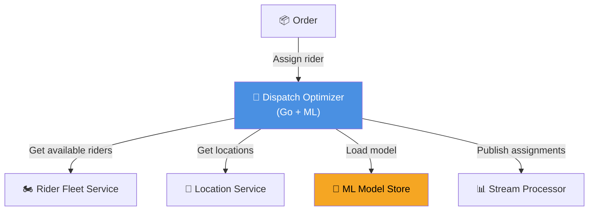
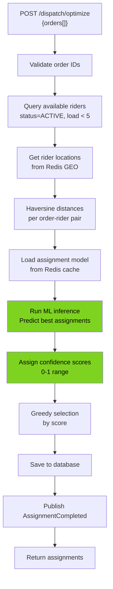
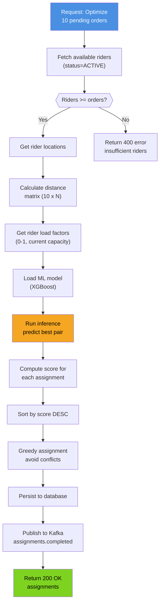
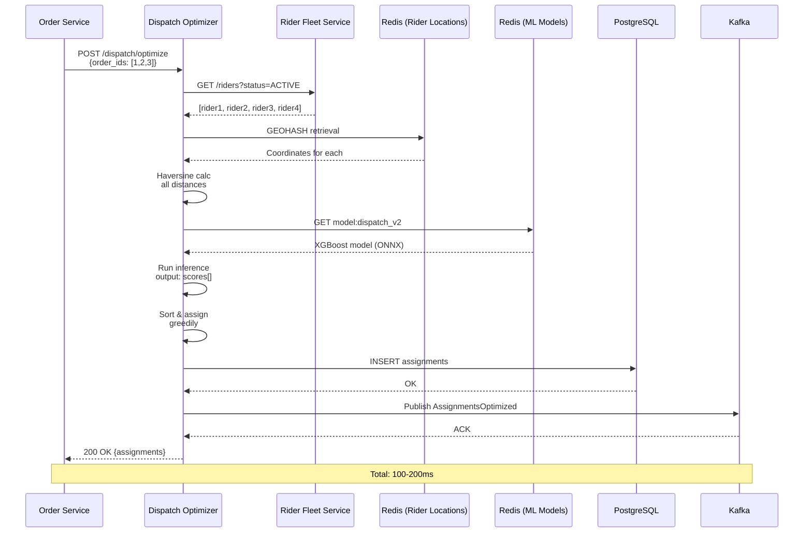
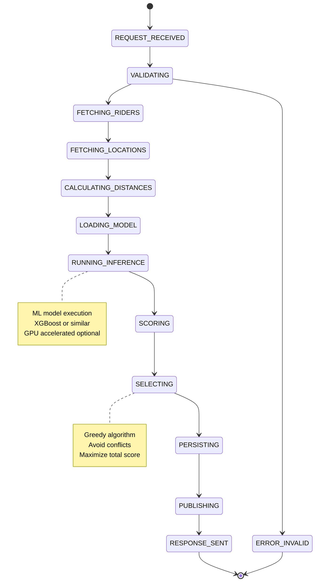
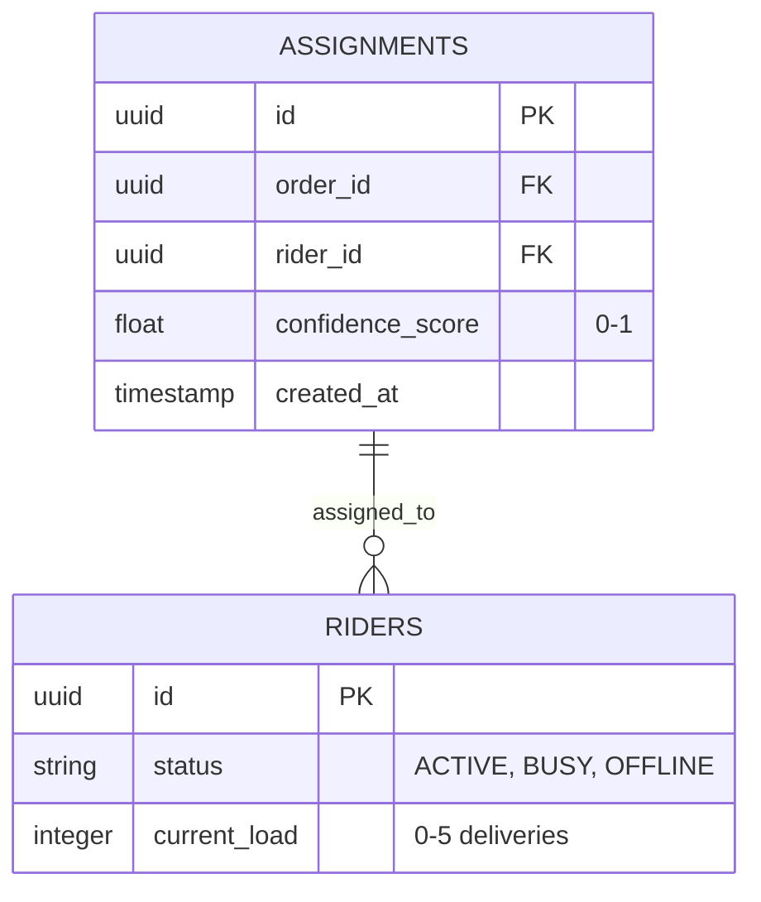
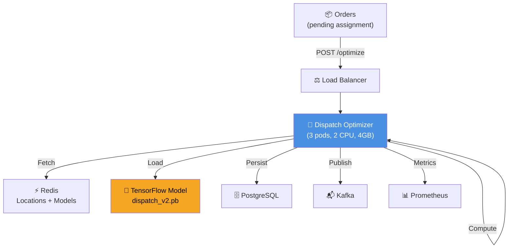

# Dispatch Optimizer Service - All 7 Diagrams

## 1. High-Level Design

## 2. Low-Level Design

## 3. Flowchart - Rider Assignment

## 4. Sequence - Assignment Flow

## 5. State Machine

## 6. ER - Assignment & Metrics

## 7. End-to-End

