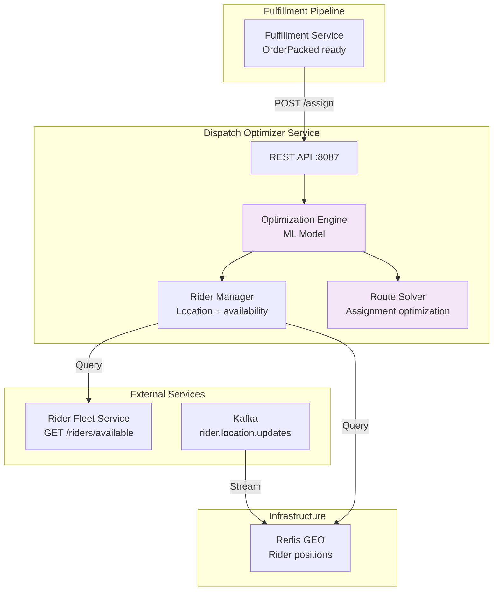

# Dispatch Optimizer Service - High-Level Design (HLD)

## Overview

Dispatch Optimizer assigns orders to riders using ML model that considers location, availability, capacity, and zone balance.

## ML Model Features

- Distance to rider
- Rider current load
- Zone balance
- Historical acceptance rate
- Delivery success rate

## SLO Targets

- Availability: 99%
- Assignment latency: <100ms
- Successful assignment rate: >95%

