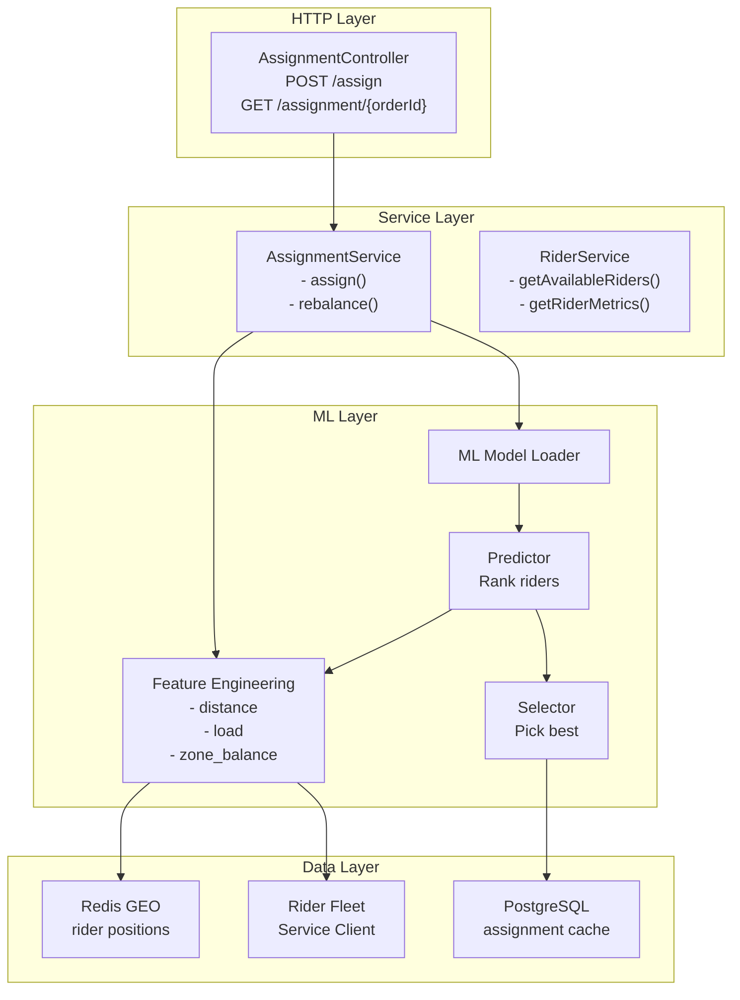
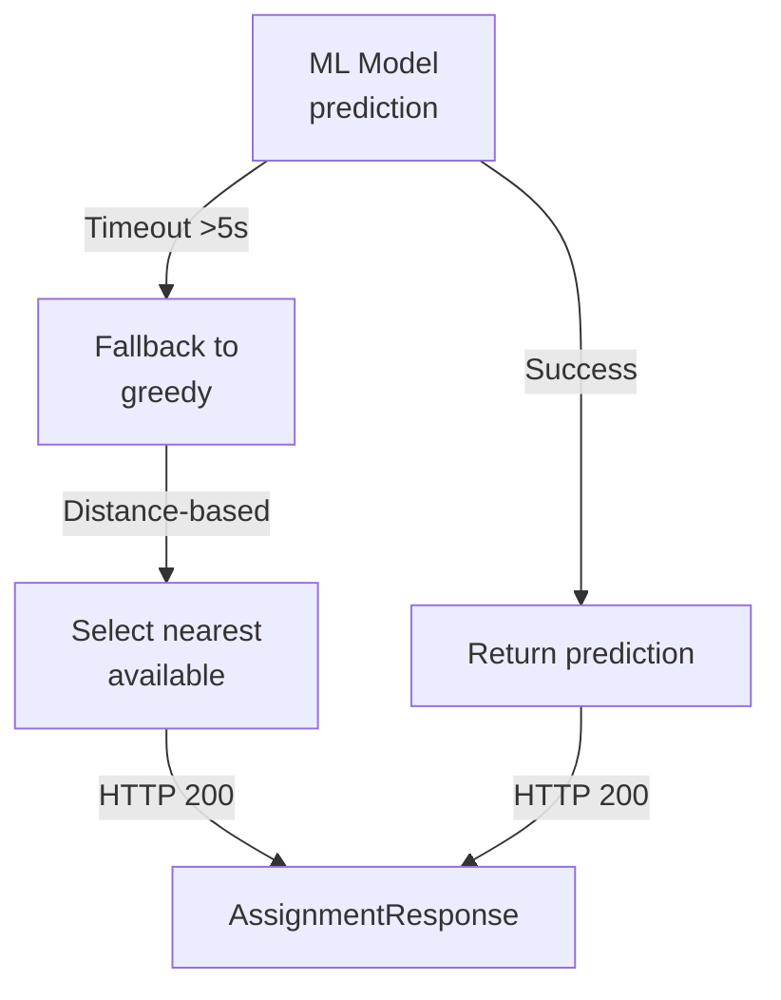

# Dispatch Optimizer Service - Low-Level Design (LLD)



## Assignment Algorithm

```markdown
## Score Calculation

Score(rider) = (
    Distance_weight * (1 / distance_km) +
    Load_weight * availability +
    Zone_balance_weight * zone_factor +
    Success_rate_weight * acceptance_rate
)

Steps:
1. Query Redis GEO for nearby riders
2. Fetch metrics from Rider Fleet Service
3. Calculate distance using Haversine
4. Generate feature vector
5. Run ML model prediction
6. Select top-ranked rider
7. Fallback to greedy if ML fails
```

## Fallback Strategy


