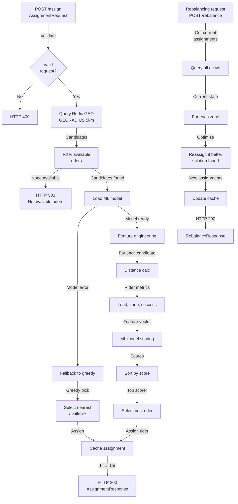
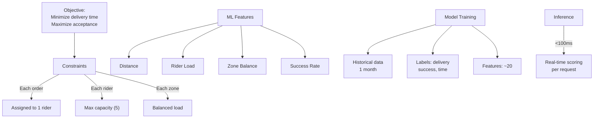

# Dispatch Optimizer Service - Flowchart

```mermaid
flowchart TD
    A["POST /assign<br/>AssignmentRequest"] -->|Validate| B{Valid<br/>request?}
    B -->|No| C["HTTP 400"]
    B -->|Yes| D["Query Redis GEO<br/>GEORADIUS 5km"]
    D -->|Candidates| E["Filter available<br/>riders"]
    E -->|None available| F["HTTP 503<br/>No available riders"]
    E -->|Candidates found| G["Load ML model"]
    G -->|Model error| H["Fallback to greedy"]
    G -->|Model ready| I["Feature engineering"]

    I -->|For each candidate| J["Distance calc"]
    J -->|Rider metrics| K["Load, zone, success"]
    K -->|Feature vector| L["ML model scoring"]
    L -->|Scores| M["Sort by score"]
    M -->|Top scorer| N["Select best rider"]

    N -->|Assign rider| O["Cache assignment"]
    O -->|TTL=1hr| P["HTTP 200<br/>AssignmentResponse"]

    H -->|Greedy pick| Q["Select nearest<br/>available"]
    Q -->|Assign| O

    R["Rebalancing request<br/>POST /rebalance"] -->|Get current<br/>assignments| S["Query all active"]
    S -->|Current state| T["For each zone"]
    T -->|Optimize| U["Reassign if better<br/>solution found"]
    U -->|New assignments| V["Update cache"]
    V -->|HTTP 200| W["RebalanceResponse"]
```

## ML Model Optimization

```mermaid
graph TD
    A["Objective:<br/>Minimize delivery time<br/>Maximize acceptance"] --> B["Constraints"]
    B -->|Each order| C["Assigned to 1 rider"]
    B -->|Each rider| D["Max capacity (5)"]
    B -->|Each zone| E["Balanced load"]

    F["ML Features"] --> G["Distance"]
    F --> H["Rider Load"]
    F --> I["Zone Balance"]
    F --> J["Success Rate"]

    K["Model Training"] --> L["Historical data<br/>1 month"]
    K --> M["Labels: delivery<br/>success, time"]
    K --> N["Features: ~20"]

    O["Inference"] -->|<100ms| P["Real-time scoring<br/>per request"]
```
