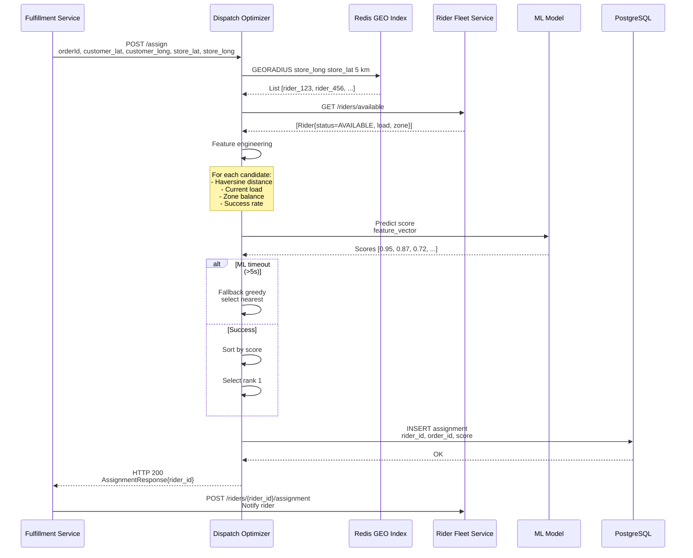
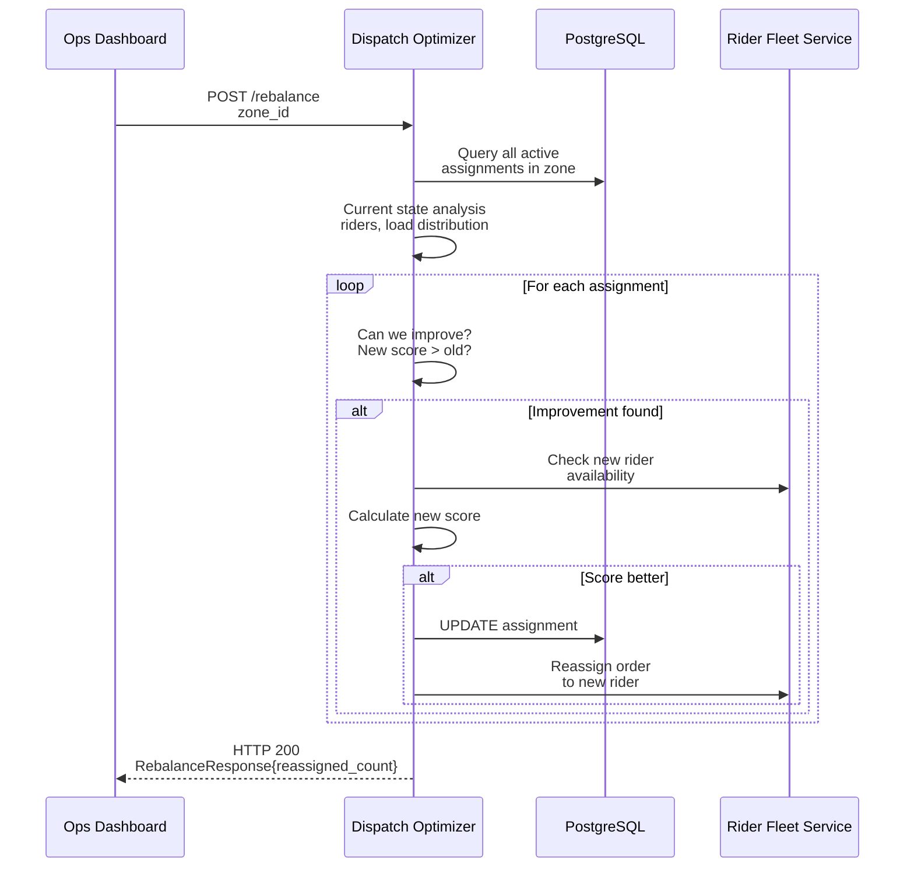

# Dispatch Optimizer Service - Sequence Diagram

```mermaid
sequenceDiagram
    participant Fulfillment as Fulfillment Service
    participant DispatchOpt as Dispatch Optimizer
    participant RedisGeo as Redis GEO Index
    participant RiderSvc as Rider Fleet Service
    participant MLModel as ML Model
    participant PostgreSQL as PostgreSQL

    Fulfillment->>DispatchOpt: POST /assign<br/>orderId, customer_lat, customer_long, store_lat, store_long

    DispatchOpt->>RedisGeo: GEORADIUS store_long store_lat 5 km
    RedisGeo-->>DispatchOpt: List [rider_123, rider_456, ...]

    DispatchOpt->>RiderSvc: GET /riders/available
    RiderSvc-->>DispatchOpt: [Rider{status=AVAILABLE, load, zone}]

    DispatchOpt->>DispatchOpt: Feature engineering
    Note over DispatchOpt: For each candidate:<br/>- Haversine distance<br/>- Current load<br/>- Zone balance<br/>- Success rate

    DispatchOpt->>MLModel: Predict score<br/>feature_vector
    MLModel-->>DispatchOpt: Scores [0.95, 0.87, 0.72, ...]

    alt ML timeout (>5s)
        DispatchOpt->>DispatchOpt: Fallback greedy<br/>select nearest
    else Success
        DispatchOpt->>DispatchOpt: Sort by score
        DispatchOpt->>DispatchOpt: Select rank 1
    end

    DispatchOpt->>PostgreSQL: INSERT assignment<br/>rider_id, order_id, score
    PostgreSQL-->>DispatchOpt: OK

    DispatchOpt-->>Fulfillment: HTTP 200<br/>AssignmentResponse{rider_id}

    Fulfillment->>RiderSvc: POST /riders/{rider_id}/assignment<br/>Notify rider
```

## Rebalancing Flow

```mermaid
sequenceDiagram
    participant OpsDashboard as Ops Dashboard
    participant DispatchOpt as Dispatch Optimizer
    participant PostgreSQL as PostgreSQL
    participant RiderSvc as Rider Fleet Service

    OpsDashboard->>DispatchOpt: POST /rebalance<br/>zone_id

    DispatchOpt->>PostgreSQL: Query all active<br/>assignments in zone

    DispatchOpt->>DispatchOpt: Current state analysis<br/>riders, load distribution

    loop For each assignment
        DispatchOpt->>DispatchOpt: Can we improve?<br/>New score > old?
        alt Improvement found
            DispatchOpt->>RiderSvc: Check new rider<br/>availability
            DispatchOpt->>DispatchOpt: Calculate new score
            alt Score better
                DispatchOpt->>PostgreSQL: UPDATE assignment
                DispatchOpt->>RiderSvc: Reassign order<br/>to new rider
            end
        end
    end

    DispatchOpt-->>OpsDashboard: HTTP 200<br/>RebalanceResponse{reassigned_count}
```
