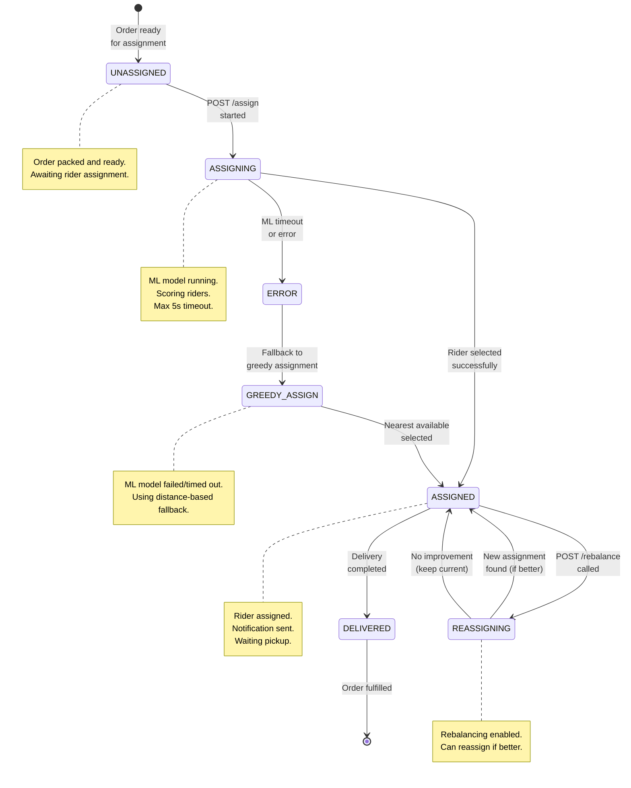
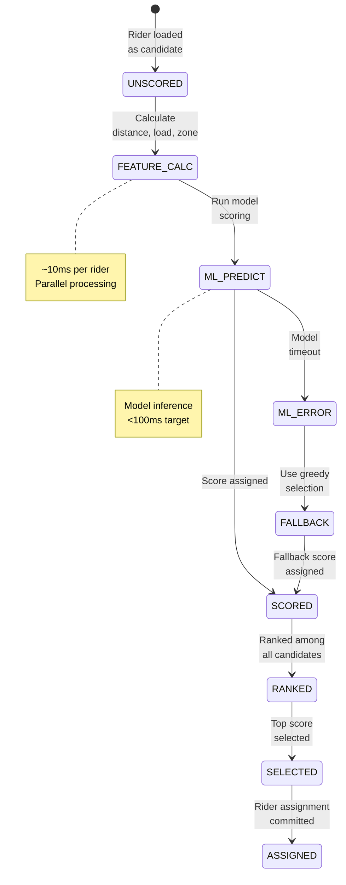

# Dispatch Optimizer Service - State Machine Diagram

```mermaid
stateDiagram-v2
    [*] --> UNASSIGNED: Order ready<br/>for assignment

    UNASSIGNED --> ASSIGNING: POST /assign<br/>started

    ASSIGNING --> ASSIGNED: Rider selected<br/>successfully

    ASSIGNED --> REASSIGNING: POST /rebalance<br/>called

    REASSIGNING --> ASSIGNED: New assignment<br/>found (if better)

    REASSIGNING --> ASSIGNED: No improvement<br/>(keep current)

    ASSIGNING --> ERROR: ML timeout<br/>or error

    ERROR --> GREEDY_ASSIGN: Fallback to<br/>greedy assignment

    GREEDY_ASSIGN --> ASSIGNED: Nearest available<br/>selected

    ASSIGNED --> DELIVERED: Delivery<br/>completed

    DELIVERED --> [*]: Order fulfilled

    note right of UNASSIGNED
        Order packed and ready.
        Awaiting rider assignment.
    end note

    note right of ASSIGNING
        ML model running.
        Scoring riders.
        Max 5s timeout.
    end note

    note right of ASSIGNED
        Rider assigned.
        Notification sent.
        Waiting pickup.
    end note

    note right of REASSIGNING
        Rebalancing enabled.
        Can reassign if better.
    end note

    note right of GREEDY_ASSIGN
        ML model failed/timed out.
        Using distance-based fallback.
    end note
```

## Scoring State Lifecycle

```mermaid
stateDiagram-v2
    [*] --> UNSCORED: Rider loaded<br/>as candidate

    UNSCORED --> FEATURE_CALC: Calculate<br/>distance, load, zone

    FEATURE_CALC --> ML_PREDICT: Run model<br/>scoring

    ML_PREDICT --> SCORED: Score assigned

    SCORED --> RANKED: Ranked among<br/>all candidates

    RANKED --> SELECTED: Top score<br/>selected

    SELECTED --> ASSIGNED: Rider assignment<br/>committed

    ML_PREDICT --> ML_ERROR: Model<br/>timeout

    ML_ERROR --> FALLBACK: Use greedy<br/>selection

    FALLBACK --> SCORED: Fallback score<br/>assigned

    note right of FEATURE_CALC
        ~10ms per rider
        Parallel processing
    end note

    note right of ML_PREDICT
        Model inference
        <100ms target
    end note
```
