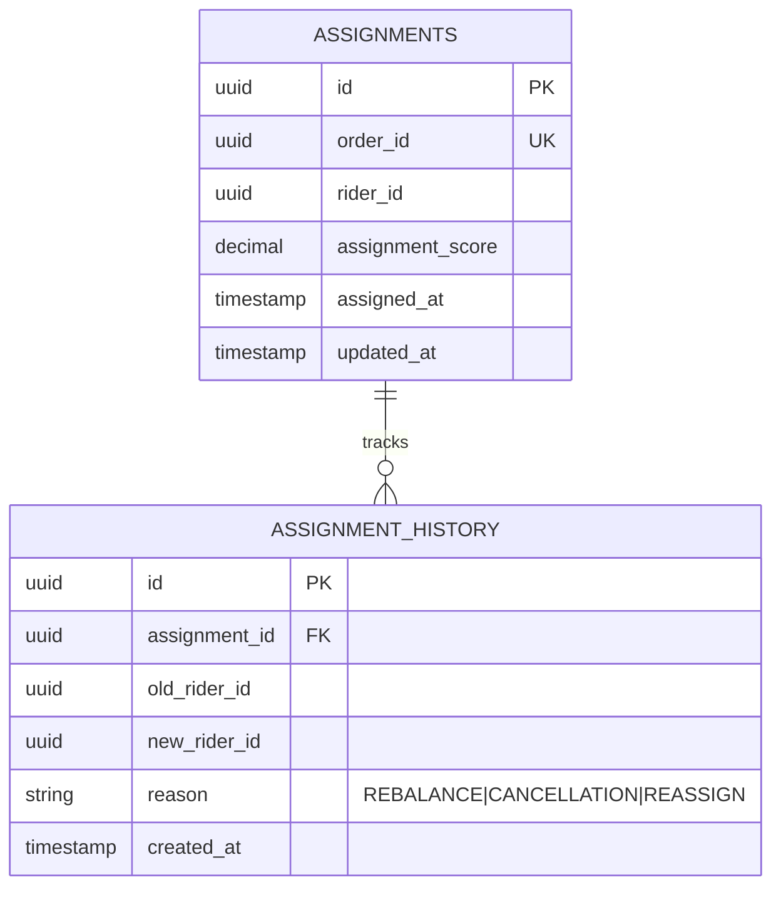
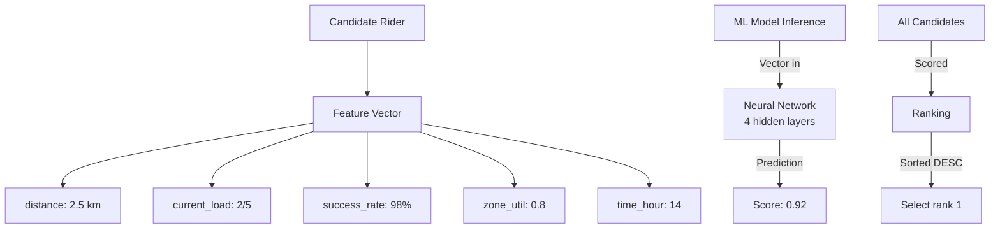

# Dispatch Optimizer Service - Entity-Relationship Diagram (ERD)



## Assignment Cache

```sql
CREATE TABLE assignments (
    id UUID PRIMARY KEY,
    order_id UUID NOT NULL UNIQUE,
    rider_id UUID NOT NULL,
    assignment_score DECIMAL(5, 2),  -- 0-1.0 score
    assigned_at TIMESTAMP DEFAULT NOW(),
    updated_at TIMESTAMP DEFAULT NOW()
);

CREATE TABLE assignment_history (
    id UUID PRIMARY KEY,
    assignment_id UUID NOT NULL REFERENCES assignments(id),
    old_rider_id UUID,
    new_rider_id UUID,
    reason VARCHAR(50),  -- REBALANCE, CANCELLATION
    created_at TIMESTAMP DEFAULT NOW()
);

CREATE INDEX idx_assignments_rider_id ON assignments(rider_id);
CREATE INDEX idx_assignments_assigned_at ON assignments(assigned_at DESC);
```

## ML Model Schema

```markdown
## Model Features

- distance_km: Haversine distance (0-10 km)
- rider_current_load: Orders on rider (0-5)
- rider_success_rate: Delivery success % (0-100)
- zone_utilization: Zone rider count vs capacity
- time_of_day: Hour (0-23) for traffic patterns
- delivery_distance: Distance to customer from store

## Model Output

- score: 0.0 to 1.0 ranking

## Training Data

- Historical assignments (1 month)
- Labels: delivery_time, success/failure
- Features: 20+ input signals
- Frozen at deploy time (no online learning)
```

## Scoring Data Structure


