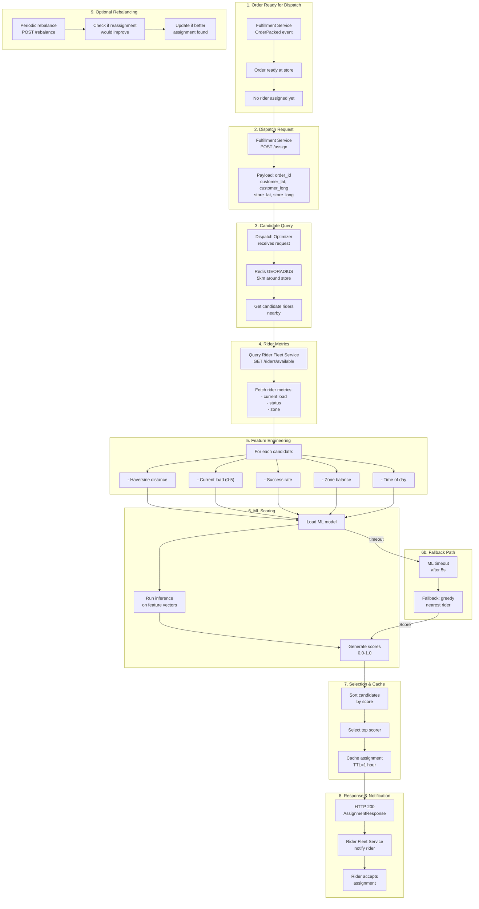
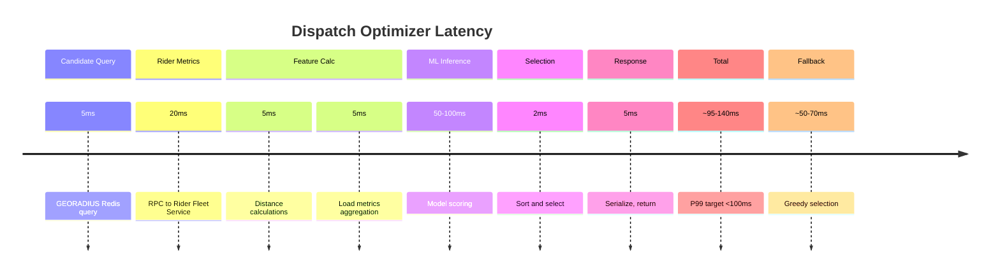
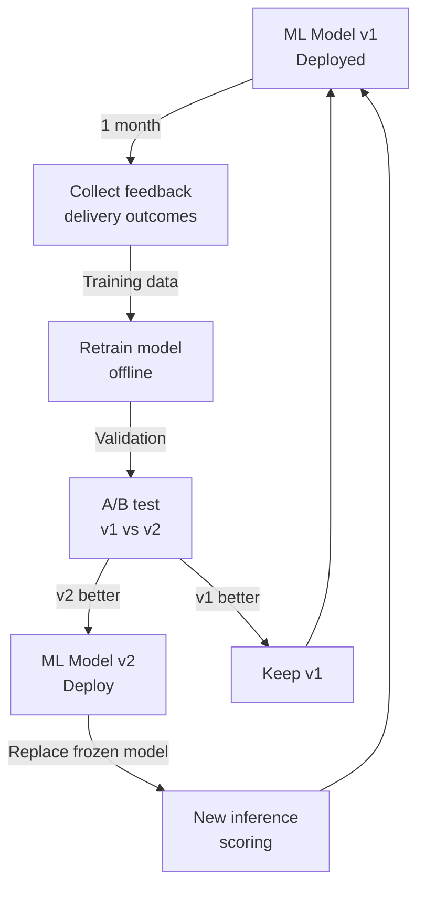

# Dispatch Optimizer Service - End-to-End Flow



## Performance & SLA



## Assignment Lifecycle

```mermaid
graph TD
    A["UNASSIGNED"] -->|POST /assign| B["ASSIGNING"]
    B -->|ML success| C["ASSIGNED"]
    B -->|ML timeout| D["GREEDY_ASSIGN"]
    D -->|Selected| C
    C -->|Rider pickup| E["IN_DELIVERY"]
    E -->|Delivery done| F["DELIVERED"]

    C -->|POST /rebalance| G["REASSIGNING"]
    G -->|Better found| H["REASSIGNED"]
    G -->|No improvement| C
    H --> E

    C -->|Order cancelled| I["CANCELLED"]
    I --> [*]
```

## Model Refresh Strategy


