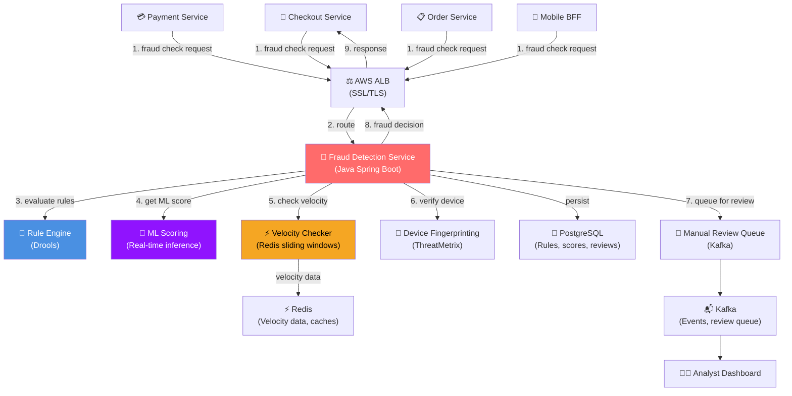
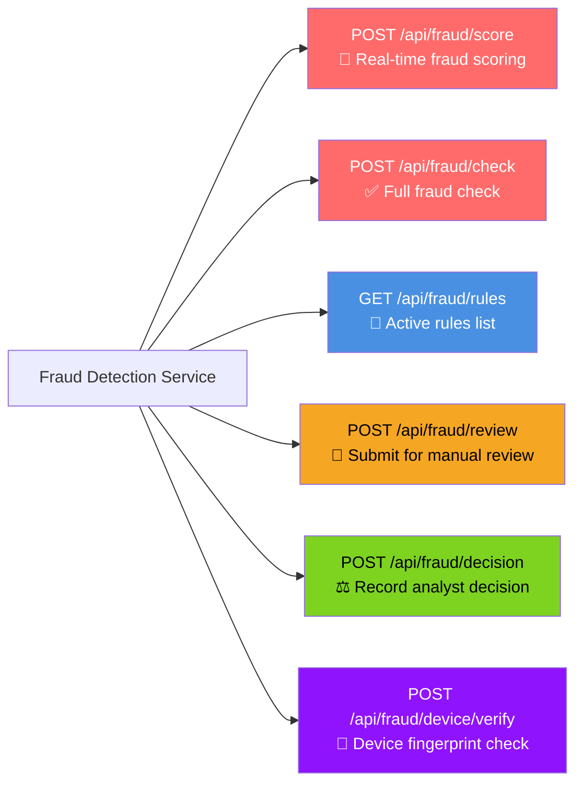
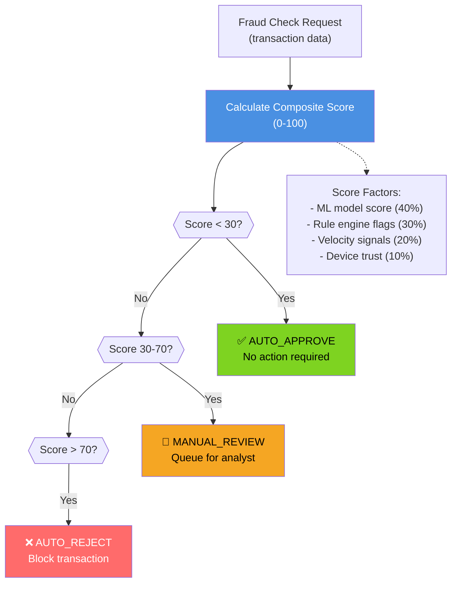
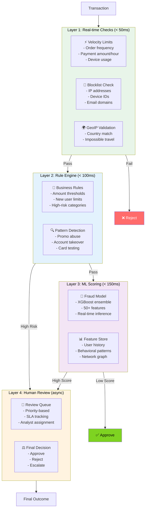

# Fraud Detection Service - High-Level Design

```mermaid
graph TB
    CheckoutService["🛒 Checkout Service"]
    PaymentService["💳 Payment Service"]
    OrderService["📋 Order Service"]
    MobileBFF["📱 Mobile BFF"]
    
    ALB["⚖️ AWS ALB<br/>(SSL/TLS)"]
    FraudService["🚨 Fraud Detection Service<br/>(Java Spring Boot)"]
    
    RuleEngine["📜 Rule Engine<br/>(Drools)"]
    MLScoring["🤖 ML Scoring<br/>(Real-time inference)"]
    VelocityChecker["⚡ Velocity Checker<br/>(Redis sliding windows)"]
    DeviceFingerprint["📱 Device Fingerprinting<br/>(ThreatMetrix)"]
    
    ReviewQueue["👥 Manual Review Queue<br/>(Kafka)"]
    AnalystDashboard["👨‍💼 Analyst Dashboard"]
    
    Redis["⚡ Redis<br/>(Velocity data, caches)"]
    PostgreSQL["🐘 PostgreSQL<br/>(Rules, scores, reviews)"]
    Kafka["📬 Kafka<br/>(Events, review queue)"]
    
    CheckoutService -->|1. fraud check request| ALB
    PaymentService -->|1. fraud check request| ALB
    OrderService -->|1. fraud check request| ALB
    MobileBFF -->|1. fraud check request| ALB
    
    ALB -->|2. route| FraudService
    
    FraudService -->|3. evaluate rules| RuleEngine
    FraudService -->|4. get ML score| MLScoring
    FraudService -->|5. check velocity| VelocityChecker
    FraudService -->|6. verify device| DeviceFingerprint
    
    VelocityChecker -->|velocity data| Redis
    FraudService -->|persist| PostgreSQL
    
    FraudService -->|7. queue for review| ReviewQueue
    ReviewQueue --> Kafka
    Kafka --> AnalystDashboard
    
    FraudService -->|8. fraud decision| ALB
    ALB -->|9. response| CheckoutService
    
    style FraudService fill:#FF6B6B,color:#fff
    style RuleEngine fill:#4A90E2,color:#fff
    style MLScoring fill:#9013FE,color:#fff
    style VelocityChecker fill:#F5A623,color:#000
```

## Fraud Detection API Endpoints

```mermaid
graph LR
    Gateway["Fraud Detection Service"]
    
    ScoreEP["POST /api/fraud/score<br/>🎯 Real-time fraud scoring"]
    CheckEP["POST /api/fraud/check<br/>✅ Full fraud check"]
    RulesEP["GET /api/fraud/rules<br/>📜 Active rules list"]
    ReviewEP["POST /api/fraud/review<br/>👥 Submit for manual review"]
    DecisionEP["POST /api/fraud/decision<br/>⚖️ Record analyst decision"]
    DeviceEP["POST /api/fraud/device/verify<br/>📱 Device fingerprint check"]
    
    Gateway --> ScoreEP
    Gateway --> CheckEP
    Gateway --> RulesEP
    Gateway --> ReviewEP
    Gateway --> DecisionEP
    Gateway --> DeviceEP
    
    style ScoreEP fill:#FF6B6B,color:#fff
    style CheckEP fill:#FF6B6B,color:#fff
    style RulesEP fill:#4A90E2,color:#fff
    style ReviewEP fill:#F5A623,color:#000
    style DecisionEP fill:#7ED321,color:#000
    style DeviceEP fill:#9013FE,color:#fff
```

## Fraud Check Decision Matrix

```mermaid
graph TD
    Request["Fraud Check Request<br/>(transaction data)"]
    
    ScoreCalc["Calculate Composite Score<br/>(0-100)"]
    
    LowRisk{{"Score < 30?"}}
    MedRisk{{"Score 30-70?"}}
    HighRisk{{"Score > 70?"}}
    
    AutoApprove["✅ AUTO_APPROVE<br/>No action required"]
    ManualReview["👥 MANUAL_REVIEW<br/>Queue for analyst"]
    AutoReject["❌ AUTO_REJECT<br/>Block transaction"]
    
    Factors["Score Factors:<br/>- ML model score (40%)<br/>- Rule engine flags (30%)<br/>- Velocity signals (20%)<br/>- Device trust (10%)"]
    
    Request --> ScoreCalc
    ScoreCalc --> LowRisk
    LowRisk -->|Yes| AutoApprove
    LowRisk -->|No| MedRisk
    MedRisk -->|Yes| ManualReview
    MedRisk -->|No| HighRisk
    HighRisk -->|Yes| AutoReject
    
    ScoreCalc -.-> Factors
    
    style AutoApprove fill:#7ED321,color:#000
    style ManualReview fill:#F5A623,color:#000
    style AutoReject fill:#FF6B6B,color:#fff
    style ScoreCalc fill:#4A90E2,color:#fff
```

## Multi-Layer Fraud Detection Architecture

```mermaid
graph TB
    subgraph layer1["Layer 1: Real-time Checks (< 50ms)"]
        L1_Velocity["⚡ Velocity Limits<br/>- Order frequency<br/>- Payment amount/hour<br/>- Device usage"]
        L1_Blocklist["🚫 Blocklist Check<br/>- IP addresses<br/>- Device IDs<br/>- Email domains"]
        L1_GeoIP["🌍 GeoIP Validation<br/>- Country match<br/>- Impossible travel"]
    end
    
    subgraph layer2["Layer 2: Rule Engine (< 100ms)"]
        L2_Rules["📜 Business Rules<br/>- Amount thresholds<br/>- New user limits<br/>- High-risk categories"]
        L2_Patterns["🔍 Pattern Detection<br/>- Promo abuse<br/>- Account takeover<br/>- Card testing"]
    end
    
    subgraph layer3["Layer 3: ML Scoring (< 150ms)"]
        L3_Model["🤖 Fraud Model<br/>- XGBoost ensemble<br/>- 50+ features<br/>- Real-time inference"]
        L3_Features["📊 Feature Store<br/>- User history<br/>- Behavioral patterns<br/>- Network graph"]
    end
    
    subgraph layer4["Layer 4: Human Review (async)"]
        L4_Queue["👥 Review Queue<br/>- Priority-based<br/>- SLA tracking<br/>- Analyst assignment"]
        L4_Decision["⚖️ Final Decision<br/>- Approve<br/>- Reject<br/>- Escalate"]
    end
    
    Request["Transaction"] --> layer1
    layer1 -->|Pass| layer2
    layer1 -->|Fail| Reject["❌ Reject"]
    
    layer2 -->|Pass| layer3
    layer2 -->|High Risk| layer4
    
    layer3 -->|Low Score| Approve["✅ Approve"]
    layer3 -->|High Score| layer4
    
    layer4 --> FinalDecision["Final Outcome"]
    
    style layer1 fill:#E8F5E9,color:#000
    style layer2 fill:#E3F2FD,color:#000
    style layer3 fill:#F3E5F5,color:#000
    style layer4 fill:#FFF3E0,color:#000
    style Approve fill:#7ED321,color:#000
    style Reject fill:#FF6B6B,color:#fff
```
