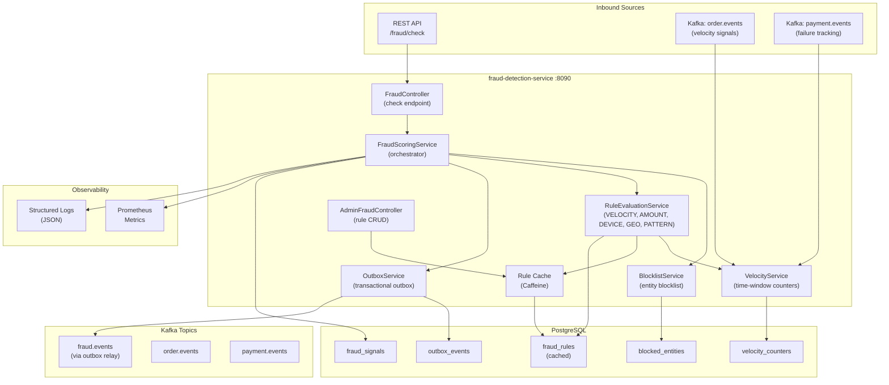

# Fraud Detection Service - High-Level Design

## Key Characteristics

- **Multi-Stage Pipeline**: Blocklist → Velocity → Rules → Score → Action
- **5 Rule Types**: VELOCITY (time windows), AMOUNT, DEVICE, GEO/Haversine, PATTERN
- **Risk Levels**: LOW (0-25) → MEDIUM (26-50) → HIGH (51-75) → CRITICAL (76-100)
- **Actions**: ALLOW, FLAG, REVIEW, BLOCK (from risk level)
- **Velocity Tracking**: UPSERT 1h/24h time-windowed counters
- **Rule Cache**: Caffeine in-memory with invalidation on admin updates
- **Outbox Pattern**: Transactional fraud.events publishing via CDC relay
- **Observability**: Prometheus per-rule metrics + structured JSON logging
