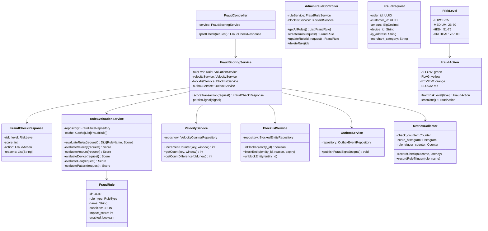

# Fraud Detection Service - Low-Level Design

## Component Responsibilities

| Component | Responsibility |
|-----------|-----------------|
| **FraudController** | HTTP POST /fraud/check endpoint |
| **AdminFraudController** | Rule CRUD operations (admin-only) |
| **FraudScoringService** | Orchestrate scoring pipeline |
| **RuleEvaluationService** | Evaluate all 5 rule types |
| **VelocityService** | UPSERT time-windowed counters |
| **BlocklistService** | Check/add/remove blocked entities |
| **OutboxService** | Transactional fraud.events publishing |
| **MetricsCollector** | Prometheus metrics emission |
