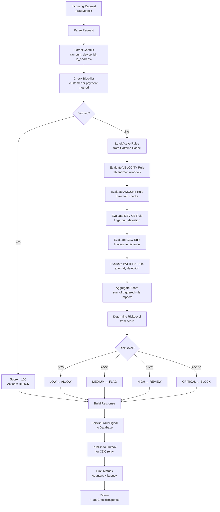

# Fraud Detection Service - Fraud Scoring Flowchart

## Flow Details

1. **Blocklist Check**: Early exit if customer/payment method blocked
2. **Rule Loading**: Fetch from Caffeine cache (invalidated on admin update)
3. **5-Stage Rule Evaluation**: VELOCITY → AMOUNT → DEVICE → GEO → PATTERN
4. **Score Aggregation**: Sum impact scores from triggered rules
5. **Risk Level Mapping**: Score → RiskLevel (LOW/MEDIUM/HIGH/CRITICAL)
6. **Action Determination**: RiskLevel → Action (ALLOW/FLAG/REVIEW/BLOCK)
7. **Signal Persistence**: Store fraud_signal for audit and trend analysis
8. **Outbox Publishing**: Transactional fraud.events for downstream
9. **Metrics Emission**: Per-rule triggers and overall scoring latency
