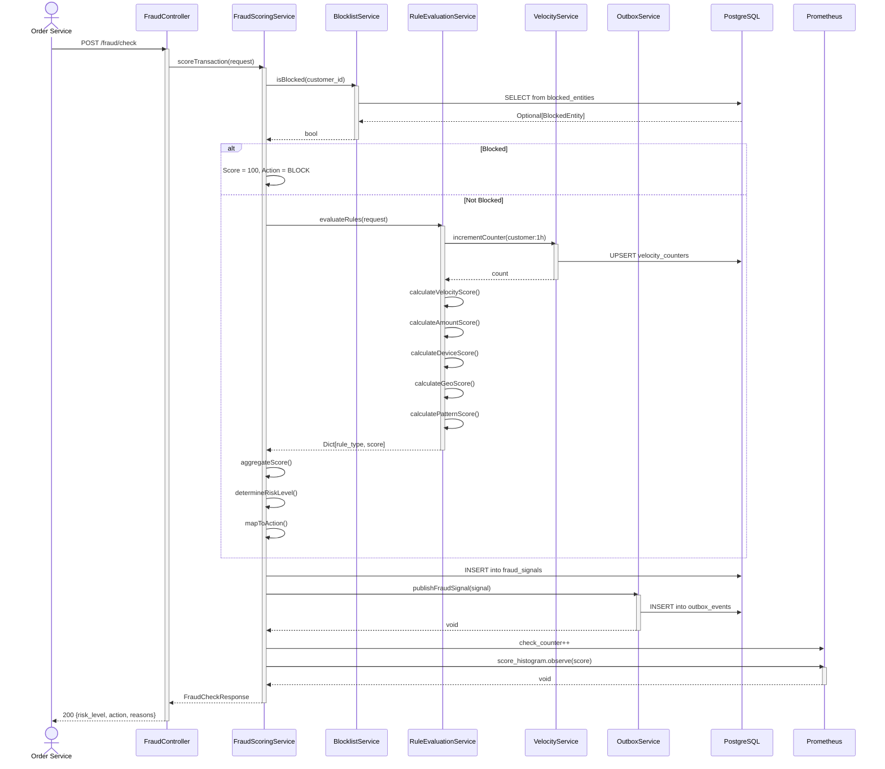

# Fraud Detection Service - Fraud Scoring Sequence

## Sequence Patterns

- **Blocklist Early Exit**: Immediate BLOCK if customer in list
- **Rule Evaluation**: Sequential evaluation of 5 rule types
- **Velocity UPSERT**: Increment time-windowed counters atomically
- **Score Aggregation**: Sum triggered rule impacts
- **Risk Level Mapping**: Deterministic mapping to RiskLevel
- **Transactional Outbox**: Fraud signal persisted atomically
- **Metrics Emission**: Per-rule triggers + overall latency
