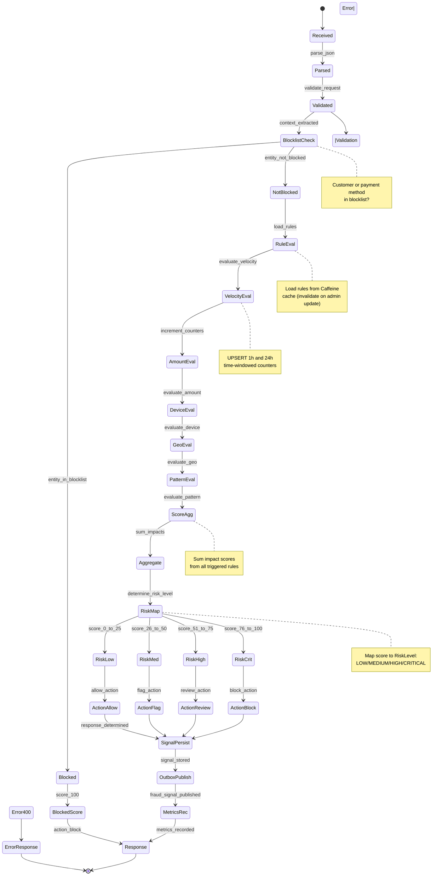

# Fraud Detection Service - Fraud Scoring State Machine

## State Transitions

- **Received→Parsed**: JSON parsing initiated
- **Parsed→Validated**: Request structure validation
- **Validated→BlocklistCheck**: Context extraction complete
- **BlocklistCheck→Blocked**: Customer/payment method in list
- **BlocklistCheck→NotBlocked**: Not in list, proceed to rules
- **NotBlocked→RuleEval**: Load rules from cache
- **RuleEval→VelocityEval**: Velocity rule evaluation
- **VelocityEval→AmountEval**: Amount rule evaluation
- **AmountEval→DeviceEval**: Device rule evaluation
- **DeviceEval→GeoEval**: GEO/Haversine rule evaluation
- **GeoEval→PatternEval**: Pattern rule evaluation
- **PatternEval→ScoreAgg**: All rules evaluated
- **ScoreAgg→RiskMap**: Score aggregated, map to RiskLevel
- **RiskMap→ActionXxx**: Action determined from RiskLevel
- **ActionXxx→SignalPersist**: Persist fraud_signal
- **SignalPersist→OutboxPublish**: Publish to outbox
- **OutboxPublish→Response**: Metrics recorded, return response
