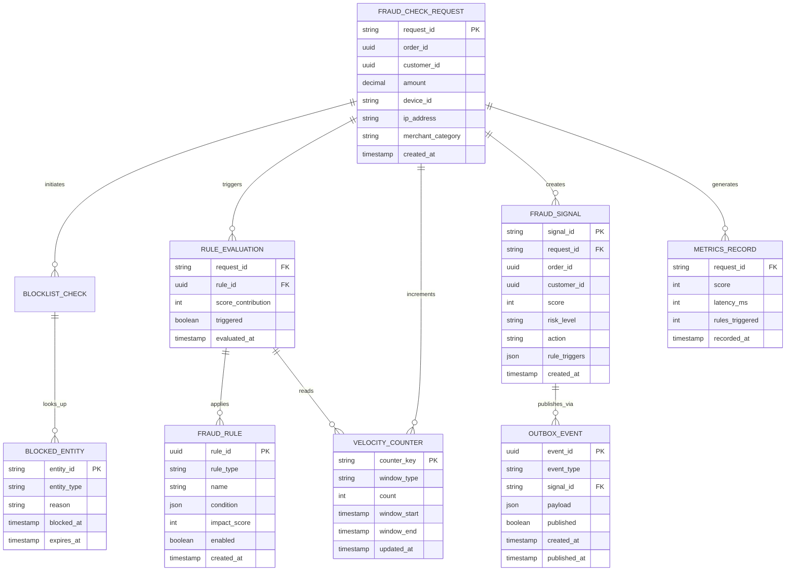

# Fraud Detection Service - Data Model

## Key Entities

| Entity | Purpose |
|--------|---------|
| **FRAUD_CHECK_REQUEST** | Incoming fraud check request |
| **BLOCKED_ENTITY** | Customer/payment method blocklist entry |
| **FRAUD_RULE** | Rule definition (cached in Caffeine) |
| **RULE_EVALUATION** | Per-rule scoring result |
| **VELOCITY_COUNTER** | Time-windowed transaction count (1h, 24h) |
| **FRAUD_SIGNAL** | Fraud check result + decision |
| **OUTBOX_EVENT** | Transactional fraud.events publishing |
| **METRICS_RECORD** | Latency and trigger metrics |
