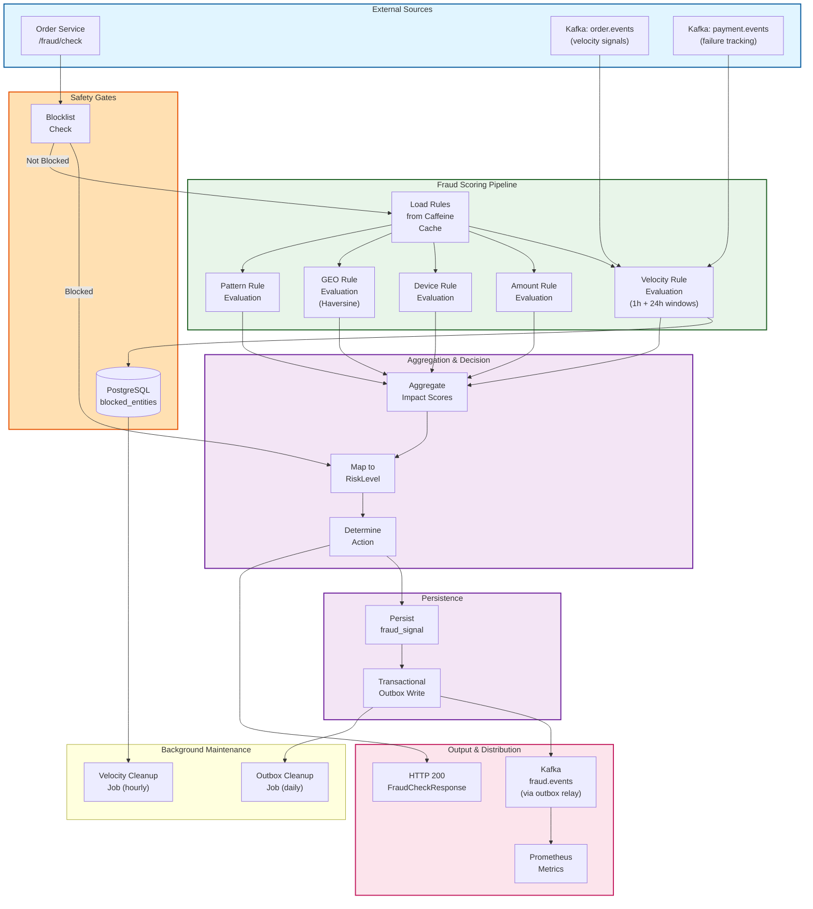

# Fraud Detection Service - End-to-End Fraud Scoring Flow

## E2E Fraud Scoring Latency

| Phase | Duration | Notes |
|-------|----------|-------|
| **Blocklist check** | 1-10 ms | DB lookup or cache hit |
| **Rule loading** | <1 ms | Caffeine in-memory cache |
| **Velocity evaluation** | 2-5 ms | UPSERT + window calculation |
| **Amount evaluation** | <1 ms | Threshold comparison |
| **Device evaluation** | <1 ms | Fingerprint deviation |
| **GEO evaluation** | 1-2 ms | Haversine distance calc |
| **Pattern evaluation** | 1-5 ms | Anomaly detection logic |
| **Score aggregation** | <1 ms | Sum of impacts |
| **Risk level mapping** | <1 ms | Deterministic mapping |
| **Signal persistence** | 1-5 ms | DB insert |
| **Outbox publish** | <1 ms | Transaction atomic |
| **Metrics emission** | <1 ms | Prometheus async |
| **Total (p99)** | **<50 ms** | Per-fraud check |

## Risk Level & Action Mapping

| Risk Level | Score | Action | Next Step |
|------------|-------|--------|-----------|
| LOW | 0-25 | ALLOW | Process order |
| MEDIUM | 26-50 | FLAG | Human review queue |
| HIGH | 51-75 | REVIEW | Escalate + require proof |
| CRITICAL | 76-100 | BLOCK | Reject order + blocklist |

## Rule Types & Evaluation

| Rule Type | Condition | Impact | Example |
|-----------|-----------|--------|---------|
| **VELOCITY** | Transactions in 1h/24h | +10-30 | >5 orders in 1h |
| **AMOUNT** | Order value vs baseline | +5-25 | >2x user average |
| **DEVICE** | Device fingerprint deviation | +5-20 | New device + high-risk country |
| **GEO** | Haversine distance impossible | +10-40 | 2 transactions 1000km apart <1h |
| **PATTERN** | ML anomaly detection | +5-30 | Unusual category/time pattern |

## Guarantees

✓ **Atomic fraud signals**: Persisted and published transactionally
✓ **Rule caching**: Caffeine invalidation on admin updates
✓ **Velocity accuracy**: UPSERT counters with explicit window management
✓ **Deterministic scoring**: Same inputs always produce same output
✓ **Audit trail**: All fraud_signals persisted for compliance review
