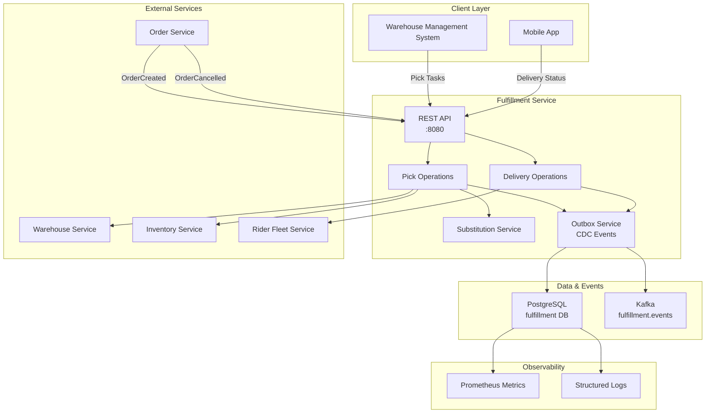
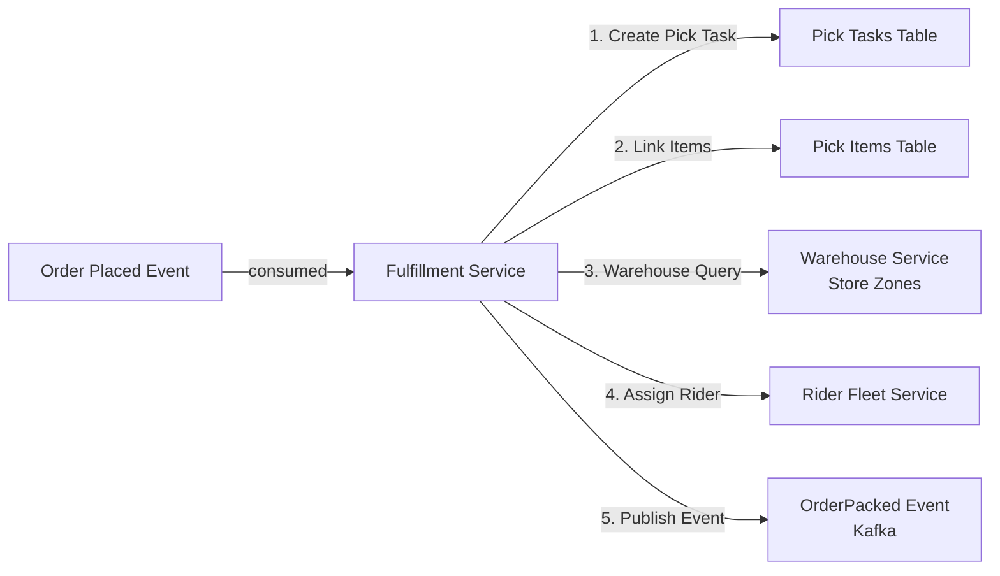

# Fulfillment Service - High-Level Design (HLD)

## Architecture Overview

## Data Flow

## Key Components

| Component | Responsibility | Technology |
|-----------|-----------------|------------|
| Pick Operations | Create tasks, track item picking | Java Spring, PostgreSQL |
| Delivery Operations | Assign riders, track delivery status | Java Spring, Kafka |
| Substitution Service | Handle out-of-stock items | Business Logic |
| Outbox Service | Event publishing (CDC pattern) | PostgreSQL Outbox |
| Cache Layer | Store zones, availability (optional) | Redis/Caffeine |

## Critical Paths

1. **Pick Path**: OrderCreated → Create PickTask → Mark Items → Publish OrderPacked
2. **Delivery Path**: OrderPacked → Assign Rider → Track Delivery → DeliveryCompleted
3. **Substitution Path**: ItemNotFound → Substitution Logic → Alternative Product

## SLO Targets

- **Availability**: 99.9%
- **P99 Latency**: < 1.2 seconds
- **Pick Task Creation**: < 500ms
- **Rider Assignment**: < 1000ms
