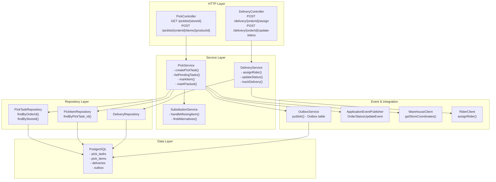
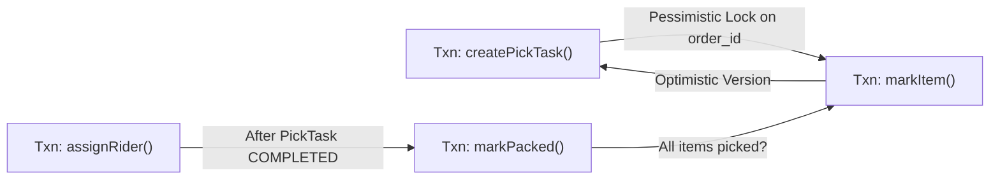
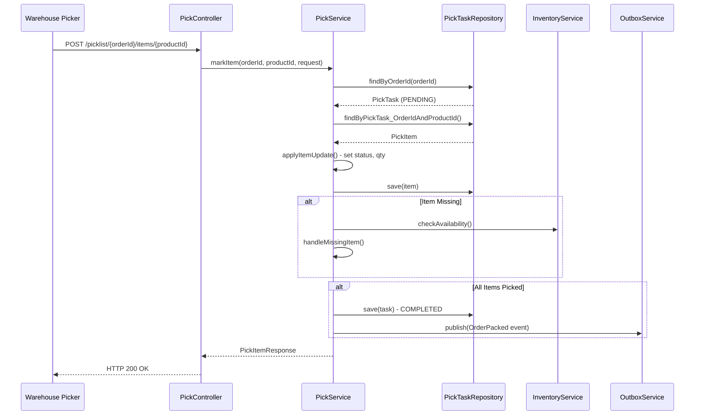

# Fulfillment Service - Low-Level Design (LLD)

## Component Architecture



## Database Schema Details

```sql
-- Pick Tasks (Core entity)
create table pick_tasks (
    id uuid primary key,
    order_id uuid not null unique,
    user_id uuid not null,
    user_erased boolean default false,
    store_id varchar not null,
    payment_id uuid,
    picker_id uuid,
    status varchar(20),  -- PENDING, IN_PROGRESS, COMPLETED, CANCELLED
    started_at timestamp,
    completed_at timestamp,
    created_at timestamp,
    version bigint  -- Optimistic locking
);

-- Pick Items (Detail)
create table pick_items (
    id uuid primary key,
    pick_task_id uuid references pick_tasks(id),
    order_item_id uuid,
    product_id uuid not null,
    product_name varchar,
    sku varchar,
    quantity integer,
    picked_qty integer,
    unit_price_cents bigint,
    line_total_cents bigint,
    status varchar(20),  -- PENDING, PICKED, NOT_AVAILABLE, SUBSTITUTED
    substitute_product_id uuid,
    note text,
    created_at timestamp
);

-- Deliveries
create table deliveries (
    id uuid primary key,
    order_id uuid not null,
    rider_id uuid,
    status varchar(20),  -- ASSIGNED, IN_PROGRESS, DELIVERED, FAILED
    eta_minutes integer,
    created_at timestamp,
    updated_at timestamp
);

-- Outbox (CDC Events)
create table fulfillment_outbox (
    id uuid primary key,
    aggregate_id varchar not null,
    event_type varchar not null,
    payload jsonb,
    created_at timestamp,
    published_at timestamp
);
```

## Transactional Boundaries



## Call Flow (Sequence Within Service)



## Error Handling

- **Optimistic Lock Conflict**: Retry on version mismatch (Circuit breaker after 3 attempts)
- **Invalid State Transition**: Throw InvalidPickTaskStateException
- **Missing Item**: Trigger substitution service or hold for manual review
- **Warehouse Service Down**: Log warning, use cached coordinates if available
