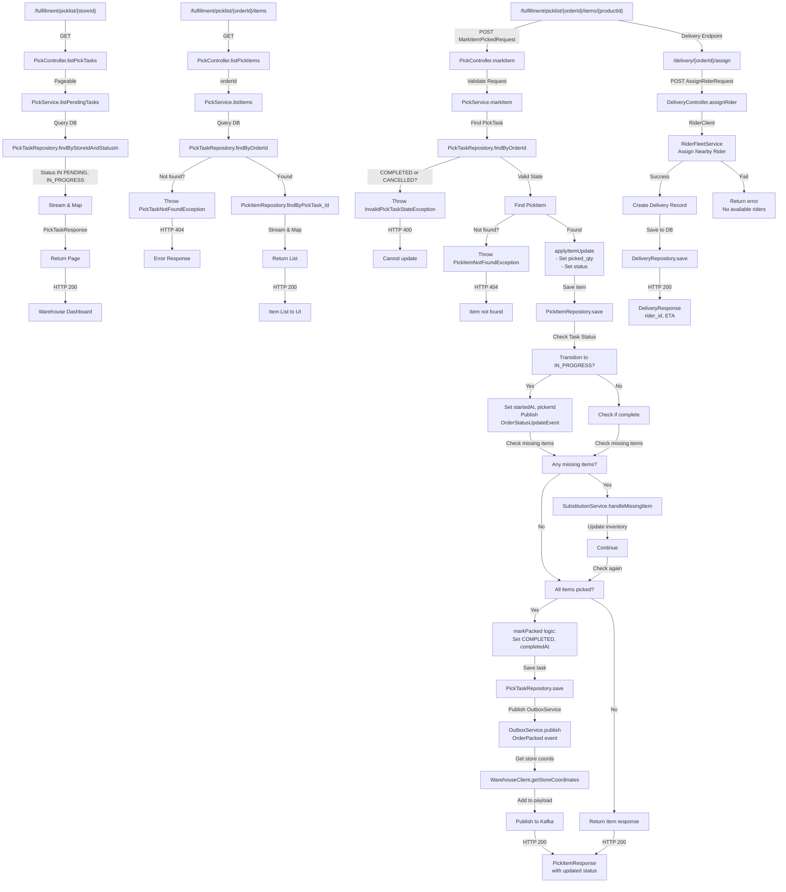
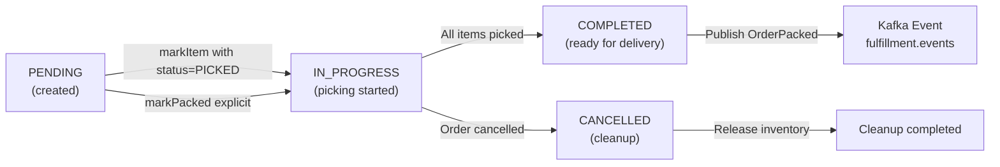
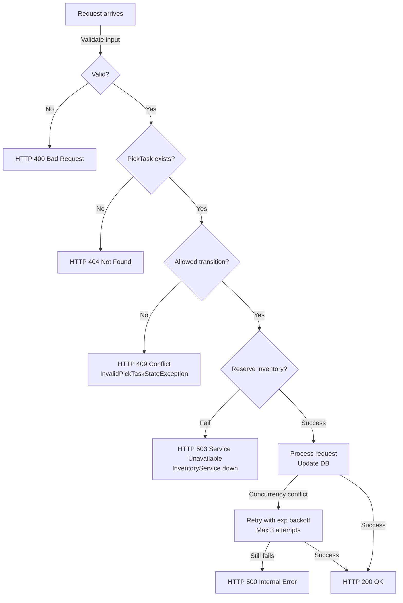
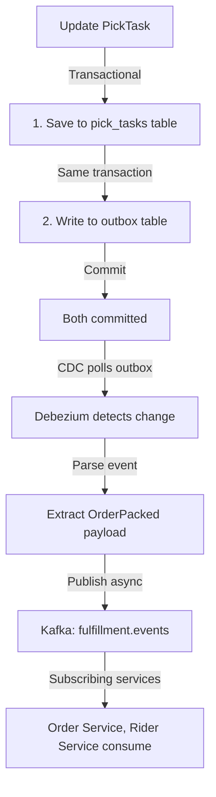

# Fulfillment Service - Flowchart (Request/Response Flows)

## Pick Flow

```mermaid
flowchart TD
    A["/fulfillment/picklist/{storeId}"] -->|GET| B["PickController.listPickTasks"]
    B -->|Pageable| C["PickService.listPendingTasks"]
    C -->|Query DB| D["PickTaskRepository.findByStoreIdAndStatusIn"]
    D -->|Status IN PENDING, IN_PROGRESS| E["Stream & Map"]
    E -->|PickTaskResponse| F["Return Page<PickTaskResponse>"]
    F -->|HTTP 200| G["Warehouse Dashboard"]

    H["/fulfillment/picklist/{orderId}/items"] -->|GET| I["PickController.listPickItems"]
    I -->|orderId| J["PickService.listItems"]
    J -->|Query DB| K["PickTaskRepository.findByOrderId"]
    K -->|Not found?| L["Throw PickTaskNotFoundException"]
    L -->|HTTP 404| M["Error Response"]
    K -->|Found| N["PickItemRepository.findByPickTask_Id"]
    N -->|Stream & Map| O["Return List<PickItemResponse>"]
    O -->|HTTP 200| P["Item List to UI"]

    Q["/fulfillment/picklist/{orderId}/items/{productId}"] -->|POST MarkItemPickedRequest| R["PickController.markItem"]
    R -->|Validate Request| S["PickService.markItem"]
    S -->|Find PickTask| T["PickTaskRepository.findByOrderId"]
    T -->|COMPLETED or CANCELLED?| U["Throw InvalidPickTaskStateException"]
    U -->|HTTP 400| V["Cannot update"]
    T -->|Valid State| W["Find PickItem"]
    W -->|Not found?| X["Throw PickItemNotFoundException"]
    X -->|HTTP 404| Y["Item not found"]
    W -->|Found| Z["applyItemUpdate<br/>- Set picked_qty<br/>- Set status"]
    Z -->|Save item| AA["PickItemRepository.save"]
    AA -->|Check Task Status| AB["Transition to IN_PROGRESS?"]
    AB -->|Yes| AC["Set startedAt, pickerId<br/>Publish OrderStatusUpdateEvent"]
    AB -->|No| AD["Check if complete"]
    AC -->|Check missing items| AE["Any missing items?"]
    AD -->|Check missing items| AE
    AE -->|Yes| AF["SubstitutionService.handleMissingItem"]
    AE -->|No| AG["All items picked?"]
    AF -->|Update inventory| AH["Continue"]
    AH -->|Check again| AG
    AG -->|Yes| AI["markPacked logic:<br/>Set COMPLETED, completedAt"]
    AG -->|No| AJ["Return item response"]
    AI -->|Save task| AK["PickTaskRepository.save"]
    AK -->|Publish OutboxService| AL["OutboxService.publish<br/>OrderPacked event"]
    AL -->|Get store coords| AM["WarehouseClient.getStoreCoordinates"]
    AM -->|Add to payload| AN["Publish to Kafka"]
    AN -->|HTTP 200| AO["PickItemResponse<br/>with updated status"]
    AJ -->|HTTP 200| AO

    Q -->|Delivery Endpoint| AP["/delivery/{orderId}/assign"]
    AP -->|POST AssignRiderRequest| AQ["DeliveryController.assignRider"]
    AQ -->|RiderClient| AR["RiderFleetService<br/>Assign Nearby Rider"]
    AR -->|Success| AS["Create Delivery Record"]
    AR -->|Fail| AT["Return error<br/>No available riders"]
    AS -->|Save to DB| AU["DeliveryRepository.save"]
    AU -->|HTTP 200| AV["DeliveryResponse<br/>rider_id, ETA"]
```

## Pick Task Lifecycle Transitions

```mermaid
flowchart LR
    A["PENDING<br/>(created)"] -->|markItem with status=PICKED| B["IN_PROGRESS<br/>(picking started)"]
    A -->|markPacked explicit| B
    B -->|All items picked| C["COMPLETED<br/>(ready for delivery)"]
    C -->|Publish OrderPacked| D["Kafka Event<br/>fulfillment.events"]
    B -->|Order cancelled| E["CANCELLED<br/>(cleanup)"]
    E -->|Release inventory| F["Cleanup completed"]
```

## Error Handling Flows

```mermaid
flowchart TD
    A["Request arrives"] -->|Validate input| B{Valid?}
    B -->|No| C["HTTP 400 Bad Request"]
    B -->|Yes| D{PickTask exists?}
    D -->|No| E["HTTP 404 Not Found"]
    D -->|Yes| F{Allowed transition?}
    F -->|No| G["HTTP 409 Conflict<br/>InvalidPickTaskStateException"]
    F -->|Yes| H{Reserve inventory?}
    H -->|Fail| I["HTTP 503 Service Unavailable<br/>InventoryService down"]
    H -->|Success| J["Process request<br/>Update DB"]
    J -->|Concurrency conflict| K["Retry with exp backoff<br/>Max 3 attempts"]
    K -->|Still fails| L["HTTP 500 Internal Error"]
    K -->|Success| M["HTTP 200 OK"]
    J -->|Success| M
```

## Data Consistency Pattern (Outbox + CDC)

```mermaid
flowchart TD
    A["Update PickTask"] -->|Transactional| B["1. Save to pick_tasks table"]
    B -->|Same transaction| C["2. Write to outbox table"]
    C -->|Commit| D["Both committed"]
    D -->|CDC polls outbox| E["Debezium detects change"]
    E -->|Parse event| F["Extract OrderPacked payload"]
    F -->|Publish async| G["Kafka: fulfillment.events"]
    G -->|Subscribing services| H["Order Service, Rider Service consume"]
```
