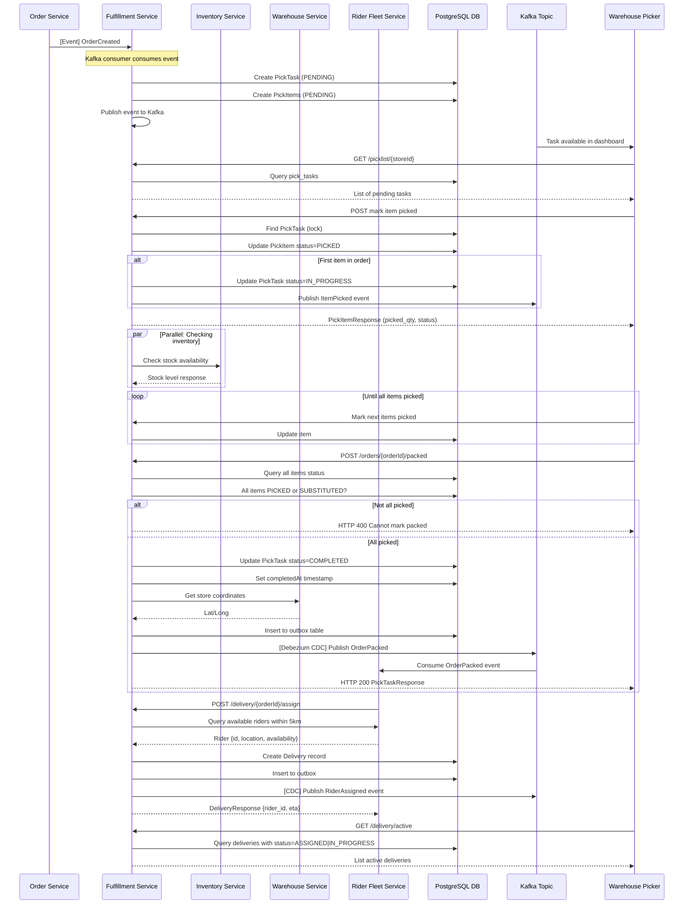
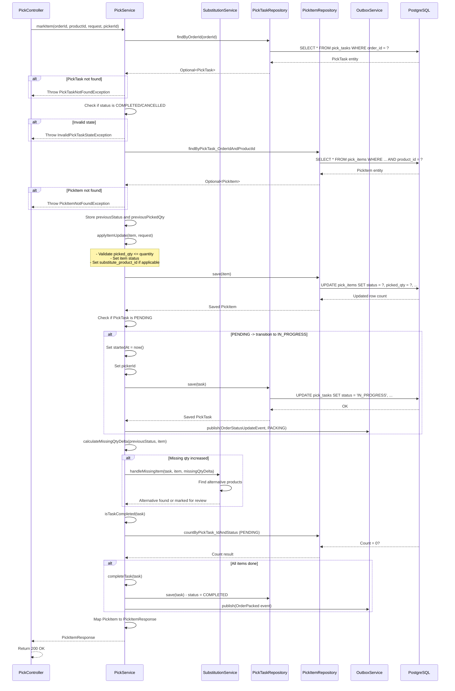
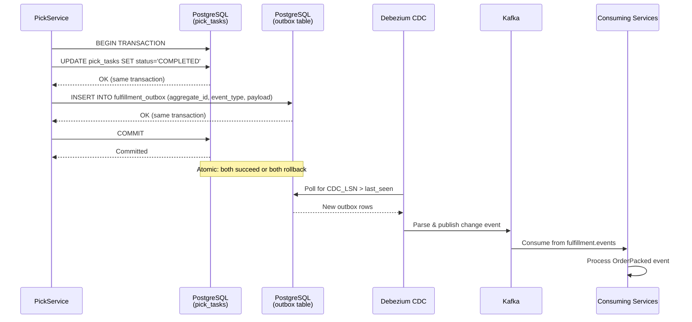

# Fulfillment Service - Sequence Diagram

## Complete Pick-to-Delivery Flow

```mermaid
sequenceDiagram
    participant OrderSvc as Order Service
    participant FulfillmentSvc as Fulfillment Service
    participant InventorySvc as Inventory Service
    participant WarehouseSvc as Warehouse Service
    participant RiderSvc as Rider Fleet Service
    participant PostgreSQL as PostgreSQL DB
    participant Kafka as Kafka Topic
    participant Picker as Warehouse Picker

    OrderSvc->>FulfillmentSvc: [Event] OrderCreated
    Note over FulfillmentSvc: Kafka consumer consumes event
    FulfillmentSvc->>PostgreSQL: Create PickTask (PENDING)
    FulfillmentSvc->>PostgreSQL: Create PickItems (PENDING)
    FulfillmentSvc->>FulfillmentSvc: Publish event to Kafka
    Kafka->>Picker: Task available in dashboard

    Picker->>FulfillmentSvc: GET /picklist/{storeId}
    FulfillmentSvc->>PostgreSQL: Query pick_tasks
    FulfillmentSvc-->>Picker: List of pending tasks

    Picker->>FulfillmentSvc: POST mark item picked
    FulfillmentSvc->>PostgreSQL: Find PickTask (lock)
    FulfillmentSvc->>PostgreSQL: Update PickItem status=PICKED
    alt First item in order
        FulfillmentSvc->>PostgreSQL: Update PickTask status=IN_PROGRESS
        FulfillmentSvc->>Kafka: Publish ItemPicked event
    end
    FulfillmentSvc-->>Picker: PickItemResponse (picked_qty, status)

    par Parallel: Checking inventory
        FulfillmentSvc->>InventorySvc: Check stock availability
        InventorySvc-->>FulfillmentSvc: Stock level response
    end

    loop Until all items picked
        Picker->>FulfillmentSvc: Mark next items picked
        FulfillmentSvc->>PostgreSQL: Update item
    end

    Picker->>FulfillmentSvc: POST /orders/{orderId}/packed
    FulfillmentSvc->>PostgreSQL: Query all items status
    FulfillmentSvc->>PostgreSQL: All items PICKED or SUBSTITUTED?
    alt Not all picked
        FulfillmentSvc-->>Picker: HTTP 400 Cannot mark packed
    else All picked
        FulfillmentSvc->>PostgreSQL: Update PickTask status=COMPLETED
        FulfillmentSvc->>PostgreSQL: Set completedAt timestamp
        FulfillmentSvc->>WarehouseSvc: Get store coordinates
        WarehouseSvc-->>FulfillmentSvc: Lat/Long
        FulfillmentSvc->>PostgreSQL: Insert to outbox table
        FulfillmentSvc->>Kafka: [Debezium CDC] Publish OrderPacked
        Kafka->>RiderSvc: Consume OrderPacked event
        FulfillmentSvc-->>Picker: HTTP 200 PickTaskResponse
    end

    RiderSvc->>FulfillmentSvc: POST /delivery/{orderId}/assign
    FulfillmentSvc->>RiderSvc: Query available riders within 5km
    RiderSvc-->>FulfillmentSvc: Rider {id, location, availability}
    FulfillmentSvc->>PostgreSQL: Create Delivery record
    FulfillmentSvc->>PostgreSQL: Insert to outbox
    FulfillmentSvc->>Kafka: [CDC] Publish RiderAssigned event
    FulfillmentSvc-->>RiderSvc: DeliveryResponse {rider_id, eta}

    Picker->>FulfillmentSvc: GET /delivery/active
    FulfillmentSvc->>PostgreSQL: Query deliveries with status=ASSIGNED|IN_PROGRESS
    FulfillmentSvc-->>Picker: List active deliveries
```

## PickService.markItem() - Detailed Sequence

```mermaid
sequenceDiagram
    participant PickCtrl as PickController
    participant PickSvc as PickService
    participant SubstSvc as SubstitutionService
    participant PickTaskRepo as PickTaskRepository
    participant PickItemRepo as PickItemRepository
    participant OutboxSvc as OutboxService
    participant PostgreSQL as PostgreSQL

    PickCtrl->>PickSvc: markItem(orderId, productId, request, pickerId)
    PickSvc->>PickTaskRepo: findByOrderId(orderId)
    PickTaskRepo->>PostgreSQL: SELECT * FROM pick_tasks WHERE order_id = ?
    PostgreSQL-->>PickTaskRepo: PickTask entity
    PickTaskRepo-->>PickSvc: Optional<PickTask>
    alt PickTask not found
        PickSvc-->>PickCtrl: Throw PickTaskNotFoundException
    end

    PickSvc->>PickSvc: Check if status is COMPLETED/CANCELLED
    alt Invalid state
        PickSvc-->>PickCtrl: Throw InvalidPickTaskStateException
    end

    PickSvc->>PickItemRepo: findByPickTask_OrderIdAndProductId
    PickItemRepo->>PostgreSQL: SELECT * FROM pick_items WHERE ... AND product_id = ?
    PostgreSQL-->>PickItemRepo: PickItem entity
    PickItemRepo-->>PickSvc: Optional<PickItem>
    alt PickItem not found
        PickSvc-->>PickCtrl: Throw PickItemNotFoundException
    end

    PickSvc->>PickSvc: Store previousStatus and previousPickedQty
    PickSvc->>PickSvc: applyItemUpdate(item, request)
    Note over PickSvc: - Validate picked_qty <= quantity<br/>- Set item status<br/>- Set substitute_product_id if applicable

    PickSvc->>PickItemRepo: save(item)
    PickItemRepo->>PostgreSQL: UPDATE pick_items SET status = ?, picked_qty = ?, ...
    PostgreSQL-->>PickItemRepo: Updated row count
    PickItemRepo-->>PickSvc: Saved PickItem

    PickSvc->>PickSvc: Check if PickTask is PENDING
    alt PENDING -> transition to IN_PROGRESS
        PickSvc->>PickSvc: Set startedAt = now()
        PickSvc->>PickSvc: Set pickerId
        PickSvc->>PickTaskRepo: save(task)
        PickTaskRepo->>PostgreSQL: UPDATE pick_tasks SET status = 'IN_PROGRESS', ...
        PostgreSQL-->>PickTaskRepo: OK
        PickTaskRepo-->>PickSvc: Saved PickTask
        PickSvc->>OutboxSvc: publish(OrderStatusUpdateEvent, PACKING)
    end

    PickSvc->>PickSvc: calculateMissingQtyDelta(previousStatus, item)
    alt Missing qty increased
        PickSvc->>SubstSvc: handleMissingItem(task, item, missingQtyDelta)
        SubstSvc->>SubstSvc: Find alternative products
        SubstSvc-->>PickSvc: Alternative found or marked for review
    end

    PickSvc->>PickSvc: isTaskCompleted(task)
    PickSvc->>PickItemRepo: countByPickTask_IdAndStatus (PENDING)
    PostgreSQL-->>PickItemRepo: Count = 0?
    PickItemRepo-->>PickSvc: Count result

    alt All items done
        PickSvc->>PickSvc: completeTask(task)
        PickSvc->>PickTaskRepo: save(task) - status = COMPLETED
        PickSvc->>OutboxSvc: publish(OrderPacked event)
    end

    PickSvc->>PickSvc: Map PickItem to PickItemResponse
    PickSvc-->>PickCtrl: PickItemResponse
    PickCtrl-->>PickCtrl: Return 200 OK
```

## Event Publishing via Outbox (CDC)

```mermaid
sequenceDiagram
    participant PickSvc as PickService
    participant PostgreSQL as PostgreSQL<br/>(pick_tasks)
    participant OutboxTbl as PostgreSQL<br/>(outbox table)
    participant Debezium as Debezium CDC
    participant Kafka as Kafka
    participant Subscribers as Consuming Services

    PickSvc->>PostgreSQL: BEGIN TRANSACTION
    PickSvc->>PostgreSQL: UPDATE pick_tasks SET status='COMPLETED'
    PostgreSQL-->>PickSvc: OK (same transaction)
    PickSvc->>OutboxTbl: INSERT INTO fulfillment_outbox (aggregate_id, event_type, payload)
    OutboxTbl-->>PickSvc: OK (same transaction)
    PickSvc->>PostgreSQL: COMMIT
    PostgreSQL-->>PickSvc: Committed
    Note over PostgreSQL,OutboxTbl: Atomic: both succeed or both rollback

    Debezium->>OutboxTbl: Poll for CDC_LSN > last_seen
    OutboxTbl-->>Debezium: New outbox rows
    Debezium->>Kafka: Parse & publish change event
    Kafka->>Subscribers: Consume from fulfillment.events
    Subscribers->>Subscribers: Process OrderPacked event
```
