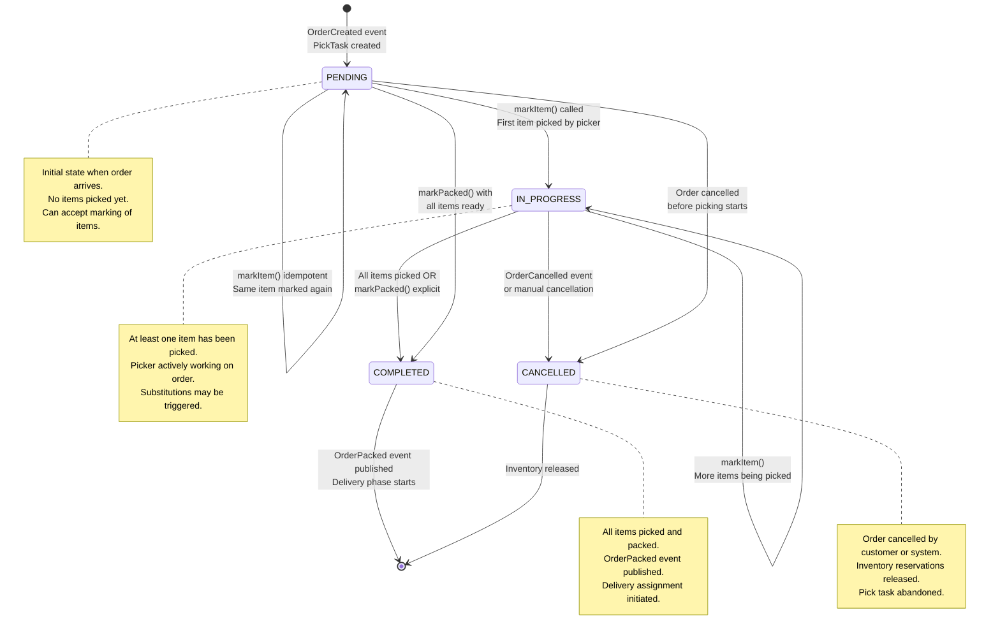
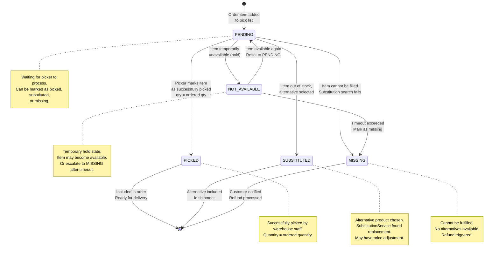
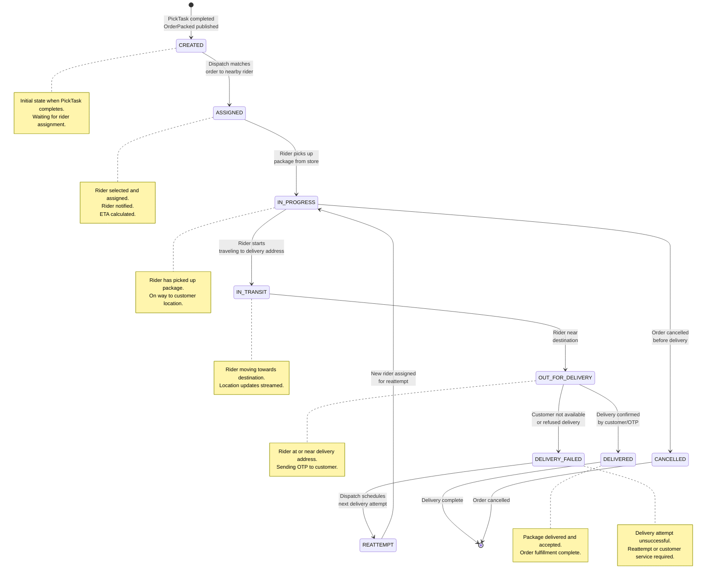
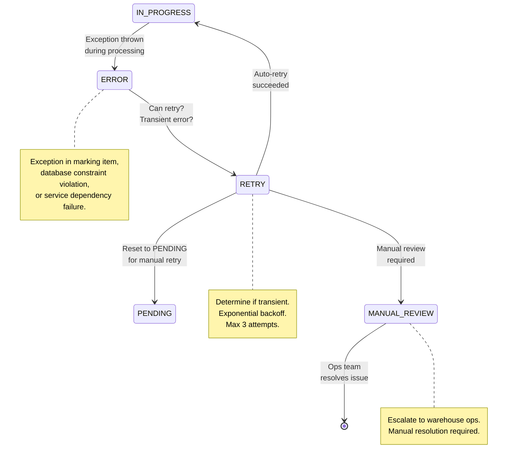

# Fulfillment Service - State Machine Diagram

## PickTask State Machine



## PickItem State Machine



## Delivery State Machine



## Concurrent PickItem Processing

```mermaid
stateDiagram-v2
    state "PickTask IN_PROGRESS" as task_in_progress {
        [*] --> item1["Item 1: PENDING"]
        [*] --> item2["Item 2: PENDING"]
        [*] --> item3["Item 3: PENDING"]

        item1 --> item1_picked["Item 1: PICKED"]
        item2 --> item2_sub["Item 2: SUBSTITUTED"]
        item3 --> item3_missing["Item 3: MISSING"]

        item1_picked --> check1{"All PICKED<br/>or SUBSTITUTED<br/>or MISSING?"}
        item2_sub --> check1
        item3_missing --> check1

        check1 -->|Yes| [*]
        check1 -->|No| waiting["Waiting for<br/>remaining items"]
        waiting --> item1["Item 1 already done"]
    }

    task_in_progress --> task_completed["PickTask: COMPLETED"]
```

## Error State Recovery


