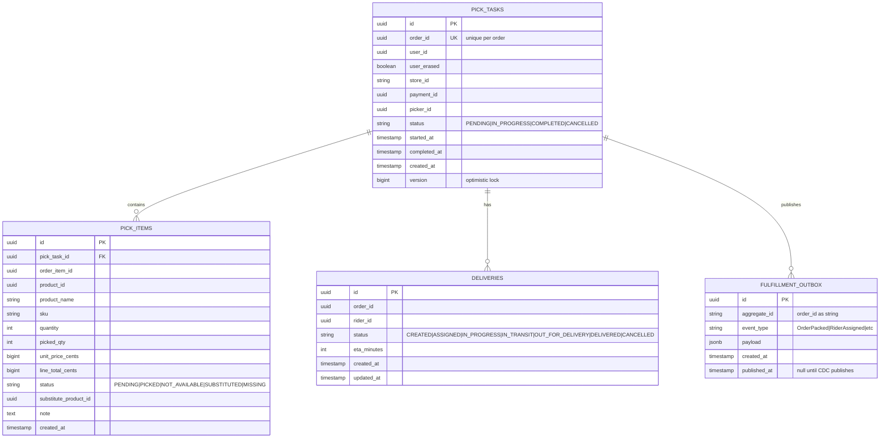
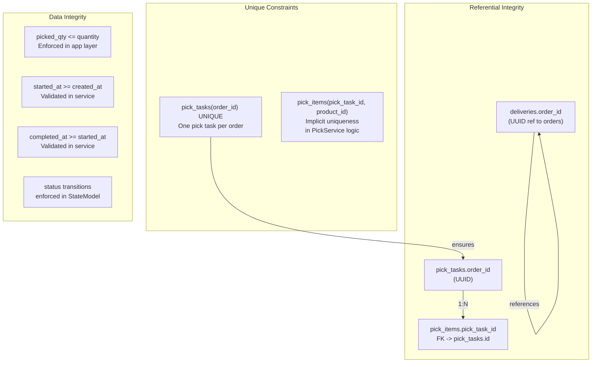
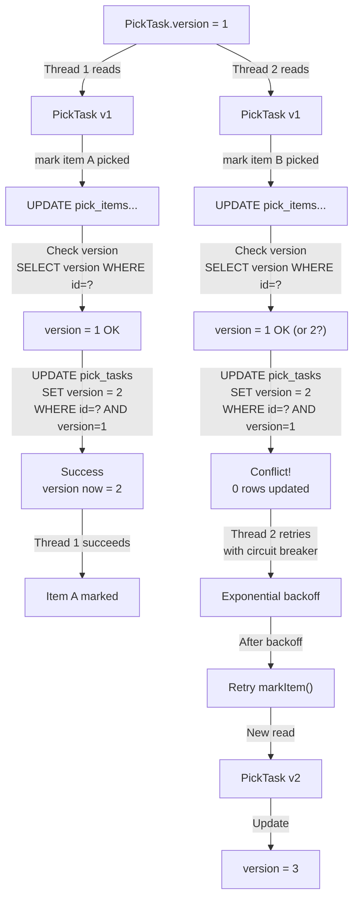
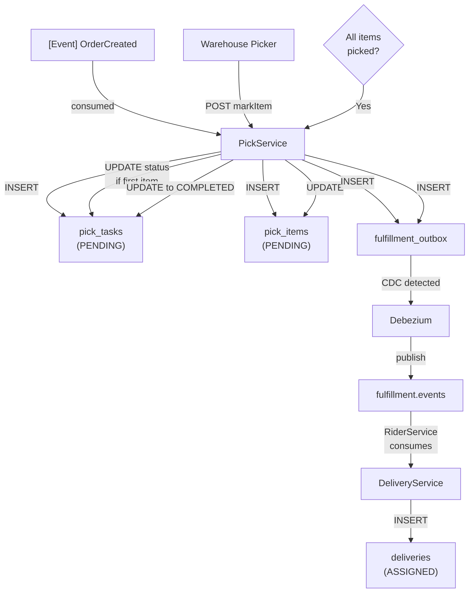

# Fulfillment Service - Entity-Relationship Diagram (ERD)

## Database Schema



## Indexes

```sql
-- Performance optimizations
CREATE INDEX idx_pick_tasks_order_id ON pick_tasks(order_id) WHERE status != 'CANCELLED';
CREATE INDEX idx_pick_tasks_store_status ON pick_tasks(store_id, status);
CREATE INDEX idx_pick_tasks_created_at ON pick_tasks(created_at DESC);
CREATE INDEX idx_pick_items_pick_task_id ON pick_items(pick_task_id);
CREATE INDEX idx_pick_items_product_id ON pick_items(product_id);
CREATE INDEX idx_deliveries_rider_id ON deliveries(rider_id);
CREATE INDEX idx_deliveries_order_id ON deliveries(order_id);
CREATE INDEX idx_deliveries_status_created ON deliveries(status, created_at DESC);
CREATE INDEX idx_outbox_published_at ON fulfillment_outbox(published_at NULLS FIRST);
CREATE INDEX idx_outbox_created_at ON fulfillment_outbox(created_at DESC);

-- PostGIS index for geo queries (if used)
CREATE INDEX idx_stores_location_gist ON stores USING GIST(location);
```

## Constraints & Relationships



## Version Control (Optimistic Locking)



## Data Flow Through Tables



## Column Encoding Notes

```markdown
## Enums Stored as VARCHAR

- pick_task_status: 'PENDING' | 'IN_PROGRESS' | 'COMPLETED' | 'CANCELLED'
- pick_item_status: 'PENDING' | 'PICKED' | 'NOT_AVAILABLE' | 'SUBSTITUTED' | 'MISSING'
- delivery_status: 'CREATED' | 'ASSIGNED' | 'IN_PROGRESS' | 'IN_TRANSIT' | 'OUT_FOR_DELIVERY' | 'DELIVERED' | 'CANCELLED'

## JSON Storage

- fulfillment_outbox.payload: Full event JSON
  - { "orderId": "...", "userId": "...", "items": [...], "pickupLat": 12.34, ... }

## Currency Fields

- unit_price_cents: bigint representing price in cents (INR * 100)
- line_total_cents: bigint (quantity * unit_price)
```
