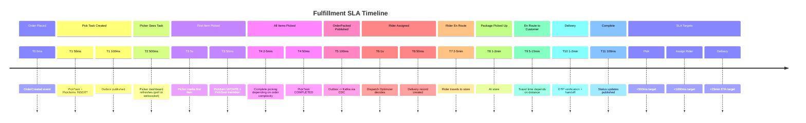
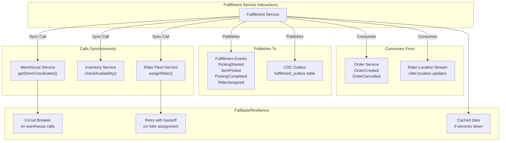
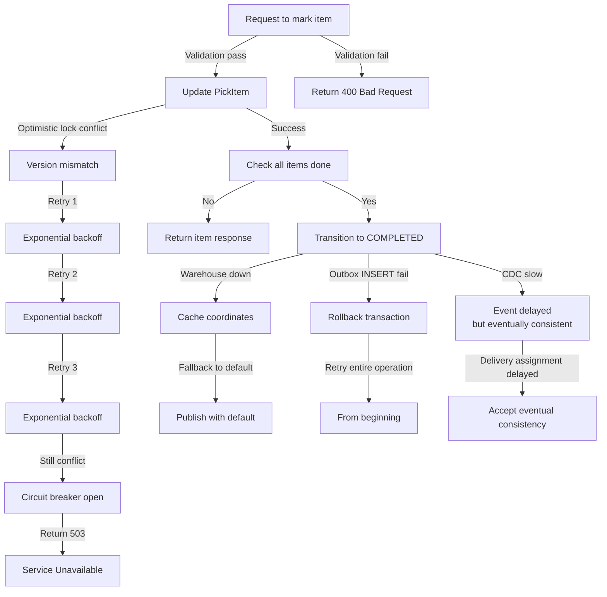
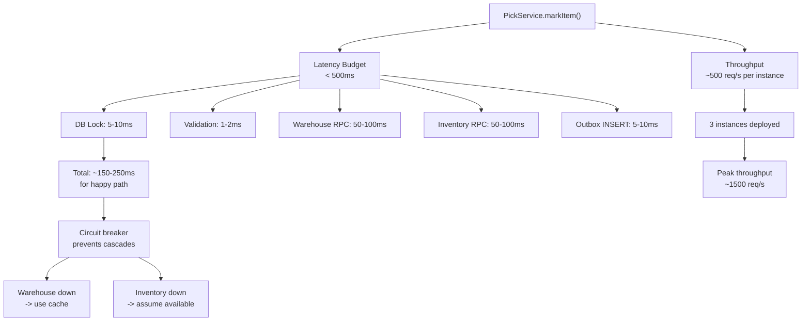

# Fulfillment Service - End-to-End Flow

## Complete Order Fulfillment Journey

```mermaid
graph TB
    subgraph "1. Order Placement"
        A["Customer places order<br/>via mobile app"]
        B["Order Service<br/>creates Order"]
        C["Payment Service<br/>processes payment"]
    end

    subgraph "2. Pick Phase"
        D["Order Service<br/>publishes OrderCreated"]
        E["Fulfillment Service<br/>consumes event"]
        F["Create PickTask<br/>(PENDING)"]
        G["Create PickItems<br/>(PENDING)"]
        H["Query Warehouse<br/>for store location<br/>and zones"]
        I["Warehouse picker<br/>sees task<br/>in dashboard"]
    end

    subgraph "3. Picking Operations"
        J["Picker marks<br/>Item 1 PICKED"]
        K["PickTask transitions<br/>IN_PROGRESS"]
        L["Picker marks<br/>Item 2 PICKED"]
        M["Inventory Service<br/>updated<br/>via CDC"]
        N["Check if all<br/>items done"]
    end

    subgraph "4. Item Substitution"
        O{"Item out<br/>of stock?"}
        P["SubstitutionService<br/>finds alternative"]
        Q["Picker marks<br/>Item SUBSTITUTED"]
    end

    subgraph "5. Packing"
        R["Picker marks<br/>Order PACKED"]
        S["PickTask transitions<br/>COMPLETED"]
        T["Publish OrderPacked<br/>to outbox"]
        U["Debezium CDC<br/>detects change"]
        V["Kafka publishes<br/>fulfillment.events"]
    end

    subgraph "6. Delivery Assignment"
        W["Dispatch Optimizer<br/>receives event"]
        X["Query Rider Fleet<br/>for available riders<br/>within 5km"]
        Y["Select optimal rider<br/>based on location<br/>& capacity"]
        Z["Create Delivery<br/>record"]
        AA["Assign Rider"]
    end

    subgraph "7. Delivery Execution"
        AB["Rider accepts<br/>delivery"]
        AC["Navigate to store<br/>pickup location"]
        AD["Pick up package"]
        AE["Navigate to<br/>customer location"]
        AF["Rider sends OTP<br/>to customer"]
        AG["Customer provides<br/>OTP"]
        AH["Delivery confirmed"]
        AI["Update Delivery<br/>status DELIVERED"]
    end

    subgraph "8. Completion"
        AJ["Order Service<br/>updates order<br/>status DELIVERED"]
        AK["Customer receives<br/>notification"]
        AL["Fulfillment<br/>complete"]
    end

    A --> B
    B --> C
    C --> D

    D --> E
    E --> F
    F --> G
    G --> H
    H --> I

    I --> J
    J --> K
    K --> L
    L --> M
    M --> N

    N --> O
    O -->|Yes| P
    P --> Q
    O -->|No| N

    Q --> N
    N -->|All done| R
    R --> S
    S --> T
    T --> U
    U --> V

    V --> W
    W --> X
    X --> Y
    Y --> Z
    Z --> AA

    AA --> AB
    AB --> AC
    AC --> AD
    AD --> AE
    AE --> AF
    AF --> AG
    AG --> AH
    AH --> AI

    AI --> AJ
    AJ --> AK
    AK --> AL

    style A fill:#e1f5ff
    style AJ fill:#c8e6c9
    style AL fill:#fff9c4
```

## Timeline & Latencies

```mermaid
timeline
    title Fulfillment SLA Timeline
    section Order Placed
        T0 0ms : OrderCreated event
    section Pick Task Created
        T1 50ms : PickTask + PickItems INSERT
        T1 100ms : Outbox published
    section Picker Sees Task
        T2 500ms : Picker dashboard refreshes (poll or websocket)
    section First Item Picked
        T3 5s : Picker marks first item
        T3 50ms : PickItem UPDATE + PickTask transition
    section All Items Picked
        T4 2-5min : Complete picking depending on order complexity
        T4 50ms : PickTask COMPLETED
    section OrderPacked Published
        T5 100ms : Outbox -> Kafka via CDC
    section Rider Assigned
        T6 1s : Dispatch Optimizer decides
        T6 50ms : Delivery record created
    section Rider En Route
        T7 2-5min : Rider travels to store
    section Package Picked Up
        T8 1-2min : At store
    section En Route to Customer
        T9 5-15min : Travel time depends on distance
    section Delivery
        T10 1-2min : OTP verification + handoff
    section Complete
        T11 100ms : Status updates published

    section SLA Targets
        Pick : <500ms target
        Assign Rider : <1000ms target
        Delivery : <15min ETA target
```

## System Interactions

```mermaid
graph TB
    subgraph "Fulfillment Service Interactions"
        FS["Fulfillment Service"]
    end

    subgraph "Consumes From"
        C1["Order Service<br/>OrderCreated<br/>OrderCancelled"]
        C2["Rider Location Stream<br/>rider.location.updates"]
    end

    subgraph "Publishes To"
        P1["Fulfillment Events<br/>PickingStarted<br/>ItemPicked<br/>PickingCompleted<br/>RiderAssigned"]
        P2["CDC Outbox<br/>fulfillment_outbox table"]
    end

    subgraph "Calls Synchronously"
        S1["Warehouse Service<br/>getStoreCoordinates()"]
        S2["Inventory Service<br/>checkAvailability()"]
        S3["Rider Fleet Service<br/>assignRider()"]
    end

    subgraph "Fallback/Resilience"
        R1["Circuit Breaker<br/>on warehouse calls"]
        R2["Retry with backoff<br/>on rider assignment"]
        R3["Cached data<br/>if services down"]
    end

    FS -->|Consumes| C1
    FS -->|Consumes| C2
    FS -->|Publishes| P1
    FS -->|Publishes| P2
    FS -->|Sync Call| S1
    FS -->|Sync Call| S2
    FS -->|Sync Call| S3
    S1 --> R1
    S3 --> R2
    FS --> R3
```

## Error Scenarios & Recovery

```mermaid
graph TD
    A["Request to mark item"] -->|Validation pass| B["Update PickItem"]
    A -->|Validation fail| C["Return 400 Bad Request"]

    B -->|Optimistic lock conflict| D["Version mismatch"]
    D -->|Retry 1| E["Exponential backoff"]
    E -->|Retry 2| F["Exponential backoff"]
    F -->|Retry 3| G["Exponential backoff"]
    G -->|Still conflict| H["Circuit breaker open"]
    H -->|Return 503| I["Service Unavailable"]

    B -->|Success| J["Check all items done"]
    J -->|No| K["Return item response"]
    J -->|Yes| L["Transition to COMPLETED"]

    L -->|Warehouse down| M["Cache coordinates"]
    M -->|Fallback to default| N["Publish with default"]

    L -->|Outbox INSERT fail| O["Rollback transaction"]
    O -->|Retry entire operation| P["From beginning"]

    L -->|CDC slow| Q["Event delayed<br/>but eventually consistent"]
    Q -->|Delivery assignment delayed| R["Accept eventual consistency"]
```

## Performance Characteristics

```mermaid
graph TD
    A["PickService.markItem()"] --> B["Latency Budget<br/>< 500ms"]
    B --> B1["DB Lock: 5-10ms"]
    B --> B2["Validation: 1-2ms"]
    B --> B3["Warehouse RPC: 50-100ms"]
    B --> B4["Inventory RPC: 50-100ms"]
    B --> B5["Outbox INSERT: 5-10ms"]
    B1 --> C["Total: ~150-250ms<br/>for happy path"]

    C --> D["Circuit breaker<br/>prevents cascades"]
    D --> D1["Warehouse down<br/>-> use cache"]
    D --> D2["Inventory down<br/>-> assume available"]

    A --> E["Throughput<br/>~500 req/s per instance"]
    E --> E1["3 instances deployed"]
    E1 --> E2["Peak throughput<br/>~1500 req/s"]
```
