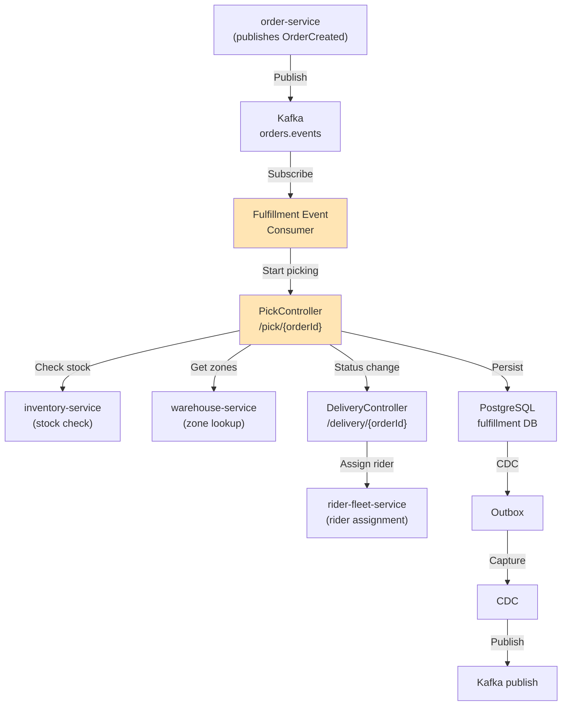

# Fulfillment Service - HLD & LLD

## High-Level Design



## Components

### Pick Job Management
- **PickJob**: Tracks picking process (PENDING → IN_PROGRESS → COMPLETED)
- **PickItem**: Line items from order (PENDING → PICKED or NOT_AVAILABLE)
- **Zone Mapping**: Items assigned to warehouse zones for efficient picking

**Flow**:
1. OrderCreated event arrives
2. Create PickJob from order_items
3. Query zones from warehouse-service
4. Assign items to zones
5. Warehouse team picks items
6. POST /pick/{orderId}/complete when done

### Delivery Management
- **Delivery**: Tracks delivery assignment (ASSIGNED → IN_PROGRESS → DELIVERED)
- **Rider Assignment**: Queries rider-fleet-service for available riders
- **ETA Calculation**: Default 15 minutes, updated by routing service

**Flow**:
1. Picking complete → trigger delivery assignment
2. Query nearby riders via rider-fleet-service
3. Assign to closest available rider
4. Publish DeliveryAssigned event
5. Monitor delivery status updates

### Event Consumer (Choreography)
- Consumes `orders.events` (OrderCreated, OrderCancelled)
- Consumes `orders.events` for compensation flows

**OrderCreated** → Start picking
**OrderCancelled** → Cancel picking, release inventory reservation

---

## Database Schema

```sql
CREATE TABLE pick_jobs (
    id UUID PRIMARY KEY,
    order_id UUID NOT NULL UNIQUE,
    status VARCHAR(20) NOT NULL DEFAULT 'PENDING',
    created_at TIMESTAMPTZ NOT NULL DEFAULT now(),
    completed_at TIMESTAMPTZ
);

CREATE TABLE pick_items (
    id UUID PRIMARY KEY,
    pick_job_id UUID NOT NULL REFERENCES pick_jobs(id),
    order_item_id UUID NOT NULL,
    product_id UUID NOT NULL,
    quantity INT NOT NULL,
    status VARCHAR(20) NOT NULL DEFAULT 'PENDING',
    zone_code VARCHAR(20),
    picked_at TIMESTAMPTZ
);

CREATE TABLE deliveries (
    id UUID PRIMARY KEY,
    order_id UUID NOT NULL,
    rider_id UUID,
    status VARCHAR(20) NOT NULL DEFAULT 'ASSIGNED',
    eta_minutes INT,
    assigned_at TIMESTAMPTZ NOT NULL DEFAULT now(),
    started_at TIMESTAMPTZ,
    completed_at TIMESTAMPTZ
);

CREATE TABLE outbox_events (
    id UUID PRIMARY KEY,
    aggregate_type VARCHAR(50) NOT NULL,
    aggregate_id VARCHAR(255) NOT NULL,
    event_type VARCHAR(50) NOT NULL,
    payload JSONB NOT NULL,
    created_at TIMESTAMPTZ NOT NULL DEFAULT now(),
    sent BOOLEAN NOT NULL DEFAULT false
);

CREATE INDEX idx_pick_jobs_order ON pick_jobs(order_id);
CREATE INDEX idx_pick_items_job ON pick_items(pick_job_id);
CREATE INDEX idx_deliveries_order ON deliveries(order_id);
CREATE INDEX idx_outbox_unsent ON outbox_events(sent) WHERE sent = false;
```

---

## API Examples

### Start Picking
```bash
POST /pick/{orderId}
{}

Response (201):
{
  "pickJobId": "pj-550e8400-...",
  "status": "PENDING",
  "items": [
    { "productId": "PROD-001", "quantity": 2, "zone": "A1" }
  ]
}
```

### Complete Picking
```bash
POST /pick/{orderId}/complete
{
  "items": [
    { "orderItemId": "oi-1", "status": "PICKED", "quantity": 2 }
  ]
}

Response (200):
{
  "pickJobId": "pj-550e8400-...",
  "status": "COMPLETED"
}
```

### Assign Delivery
```bash
POST /delivery/{orderId}/assign
{}

Response (201):
{
  "deliveryId": "del-550e8400-...",
  "riderId": "rider-550e8400-...",
  "etaMinutes": 15,
  "status": "ASSIGNED"
}
```

---

## Kafka Events

**Consumes**: orders.events
**Produces**: fulfillment.events

### Events Published
- PickingStarted
- ItemPicked
- ItemNotAvailable (if inventory check fails)
- PickingCompleted
- DeliveryAssigned
- DeliveryInProgress
- DeliveryCompleted

---

## Resilience

**Circuit Breakers** (for inventory, warehouse, order, payment services):
- failureRateThreshold: 50%
- waitDurationInOpenState: 30s
- slidingWindowSize: 20

**Retry**:
- maxAttempts: 3
- waitDuration: 500ms
