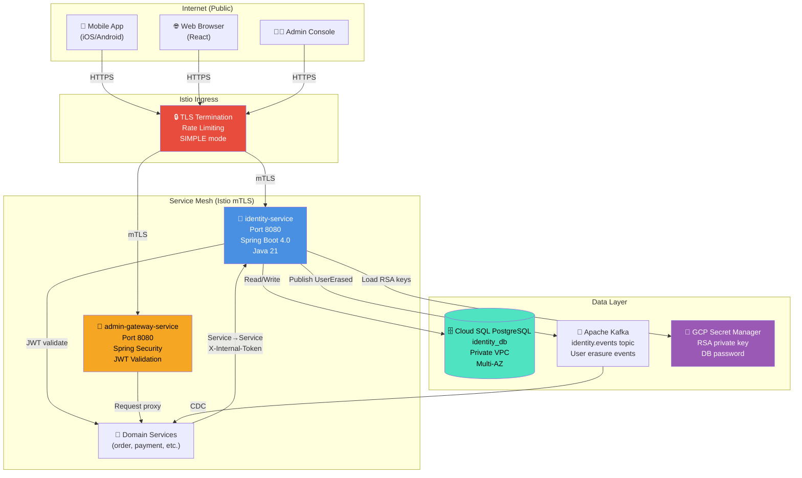
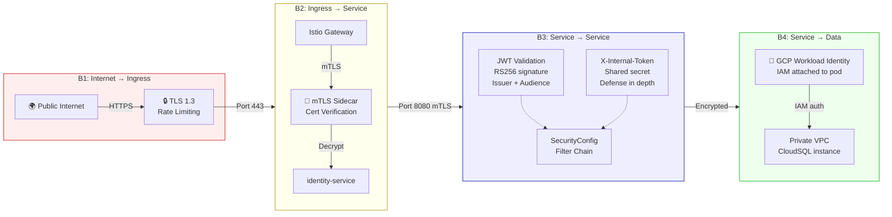
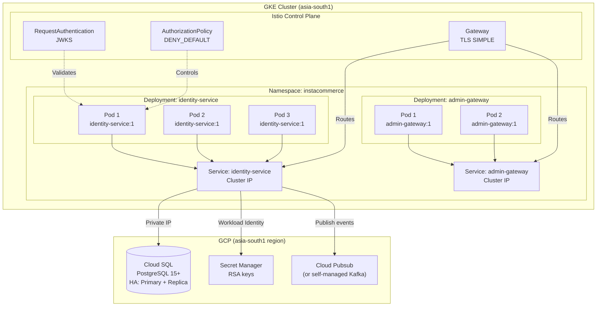
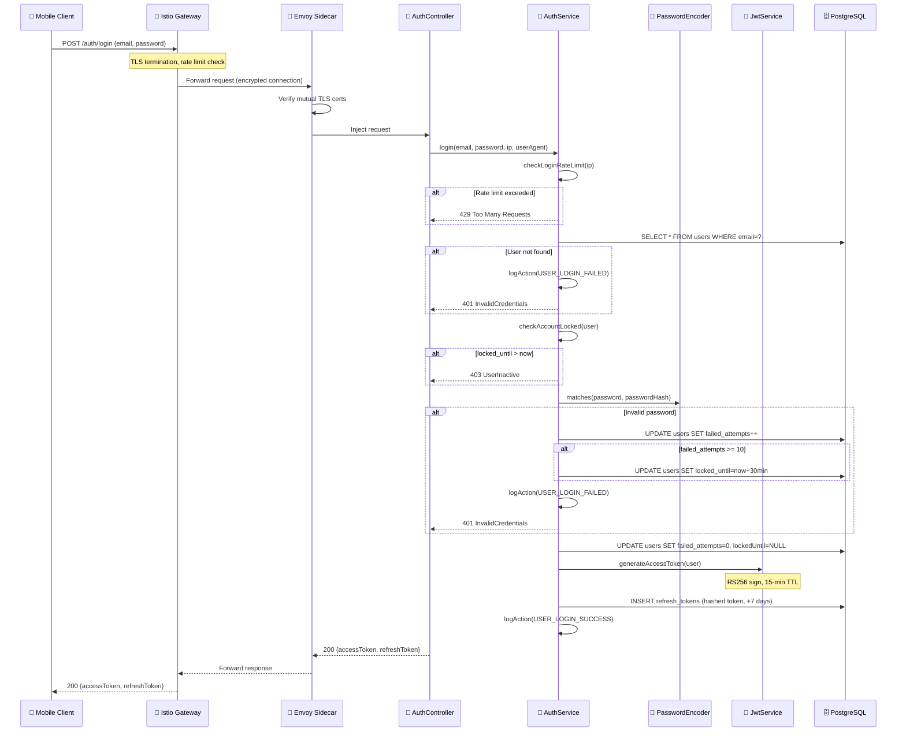
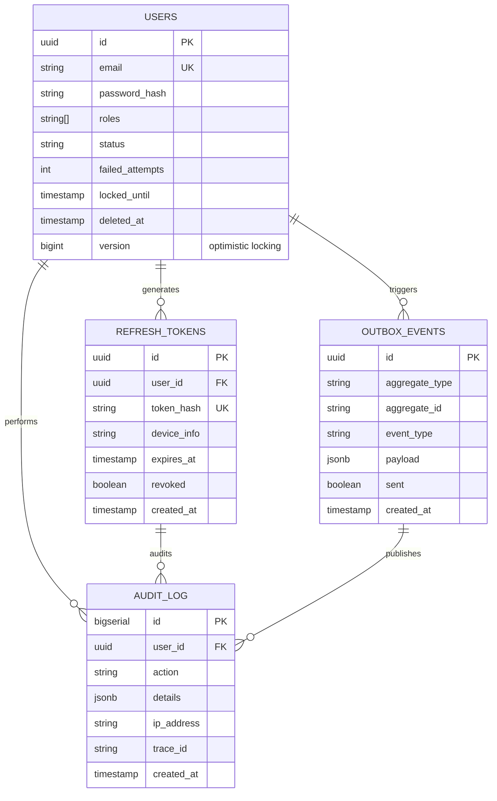
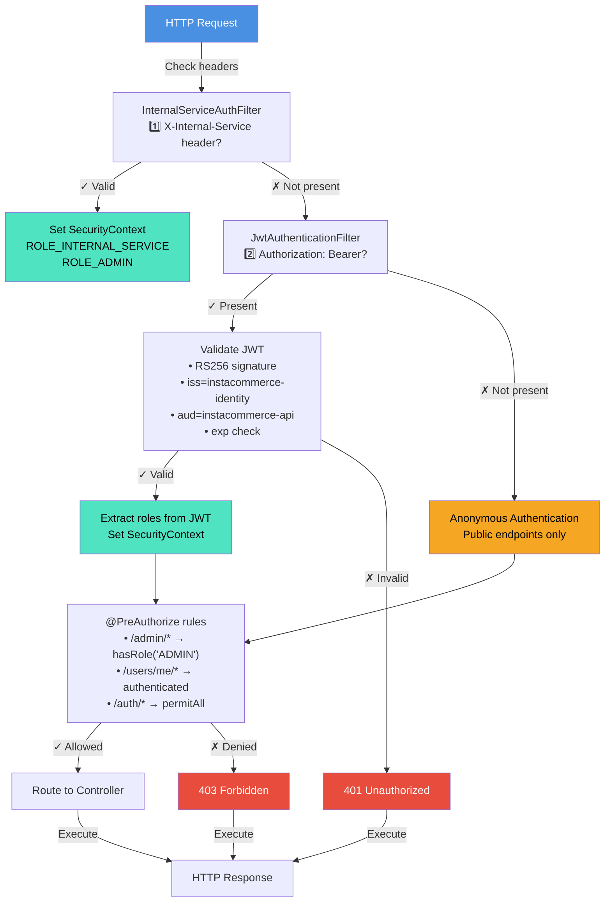
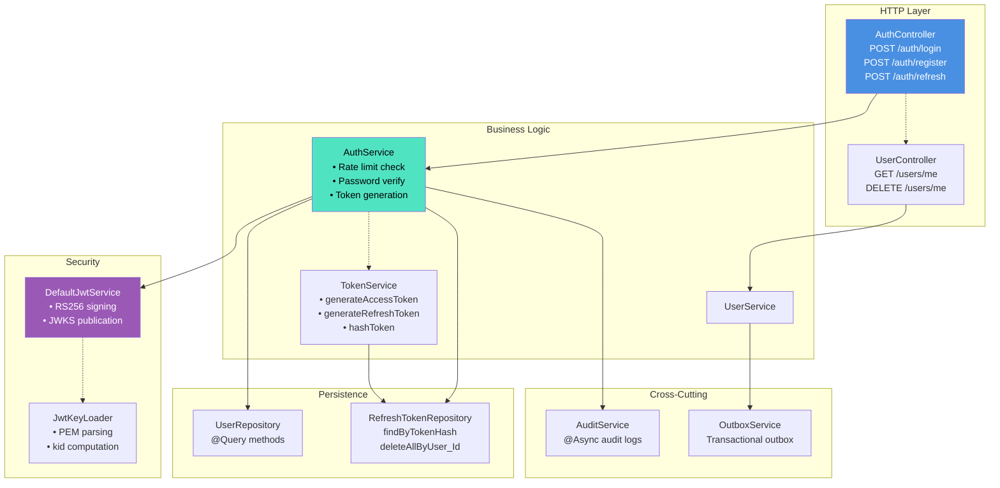

# Identity Cluster - High-Level Design Diagrams

## System Context Diagram

## Trust Boundaries & Security Layers

## Deployment Topology (Kubernetes)

## Request Flow: User Login

## Data Model Relationships

## Authentication Filter Chain

## Component Interaction Diagram

This concludes the Identity & Admin Gateway cluster documentation.
