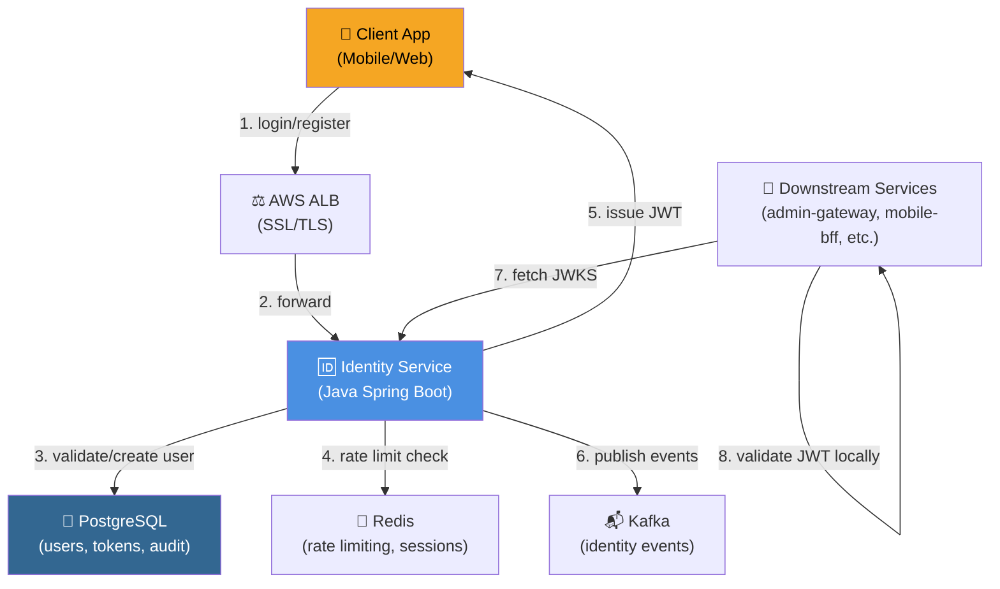
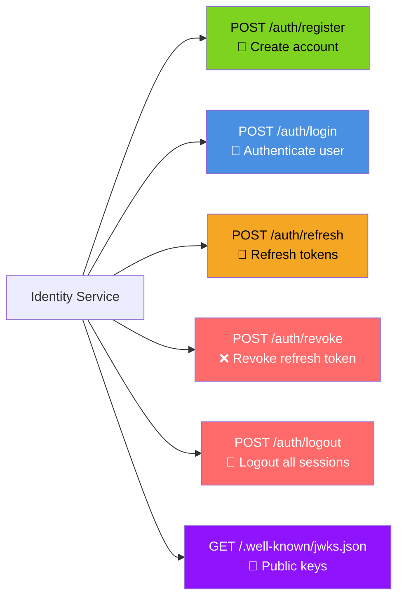
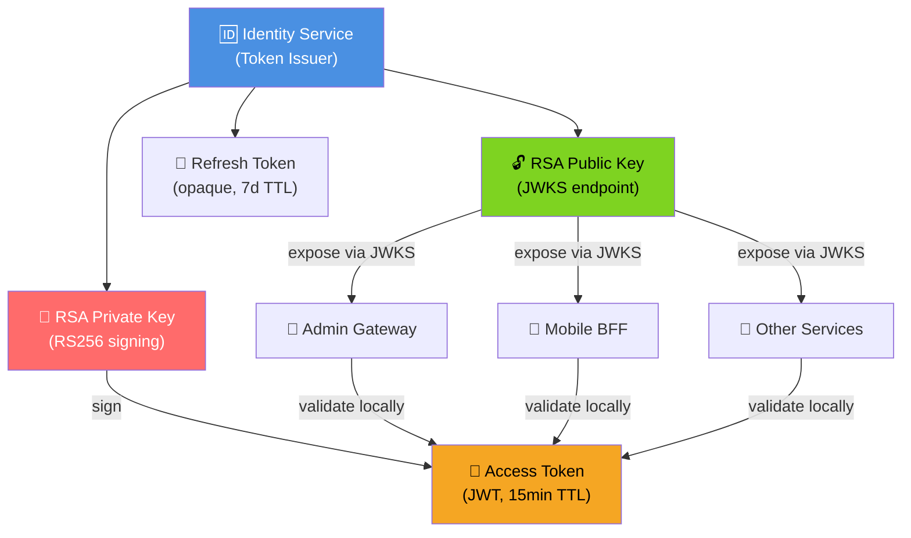
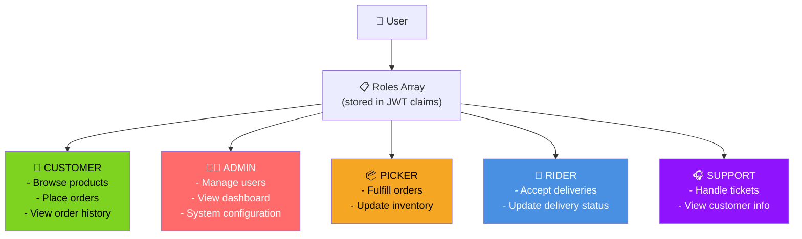
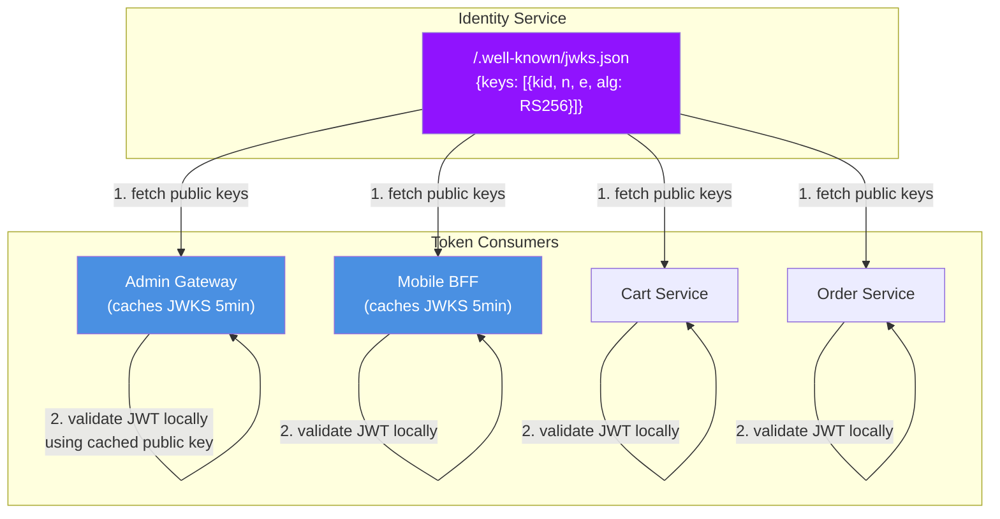

# Identity Service - High-Level Design

```mermaid
graph TB
    Client["👤 Client App<br/>(Mobile/Web)"]
    ALB["⚖️ AWS ALB<br/>(SSL/TLS)"]
    IdentityService["🆔 Identity Service<br/>(Java Spring Boot)"]
    PostgreSQL["🐘 PostgreSQL<br/>(users, tokens, audit)"]
    Redis["🔴 Redis<br/>(rate limiting, sessions)"]
    Kafka["📬 Kafka<br/>(identity events)"]
    DownstreamServices["🔗 Downstream Services<br/>(admin-gateway, mobile-bff, etc.)"]

    Client -->|1. login/register| ALB
    ALB -->|2. forward| IdentityService
    IdentityService -->|3. validate/create user| PostgreSQL
    IdentityService -->|4. rate limit check| Redis
    IdentityService -->|5. issue JWT| Client
    IdentityService -->|6. publish events| Kafka
    DownstreamServices -->|7. fetch JWKS| IdentityService
    DownstreamServices -->|8. validate JWT locally| DownstreamServices

    style IdentityService fill:#4A90E2,color:#fff
    style PostgreSQL fill:#336791,color:#fff
    style Client fill:#F5A623,color:#000
```

## Authentication API Endpoints

```mermaid
graph LR
    IdentityService["Identity Service"]

    RegisterEP["POST /auth/register<br/>📝 Create account"]
    LoginEP["POST /auth/login<br/>🔐 Authenticate user"]
    RefreshEP["POST /auth/refresh<br/>🔄 Refresh tokens"]
    RevokeEP["POST /auth/revoke<br/>❌ Revoke refresh token"]
    LogoutEP["POST /auth/logout<br/>🚪 Logout all sessions"]
    JwksEP["GET /.well-known/jwks.json<br/>🔑 Public keys"]

    IdentityService --> RegisterEP
    IdentityService --> LoginEP
    IdentityService --> RefreshEP
    IdentityService --> RevokeEP
    IdentityService --> LogoutEP
    IdentityService --> JwksEP

    style RegisterEP fill:#7ED321,color:#000
    style LoginEP fill:#4A90E2,color:#fff
    style RefreshEP fill:#F5A623,color:#000
    style RevokeEP fill:#FF6B6B,color:#fff
    style LogoutEP fill:#FF6B6B,color:#fff
    style JwksEP fill:#9013FE,color:#fff
```

## JWT Token Architecture

```mermaid
graph TD
    IdentityService["🆔 Identity Service<br/>(Token Issuer)"]
    PrivateKey["🔐 RSA Private Key<br/>(RS256 signing)"]
    PublicKey["🔓 RSA Public Key<br/>(JWKS endpoint)"]
    
    AccessToken["🎫 Access Token<br/>(JWT, 15min TTL)"]
    RefreshToken["🔄 Refresh Token<br/>(opaque, 7d TTL)"]
    
    AdminGateway["🔐 Admin Gateway"]
    MobileBFF["📱 Mobile BFF"]
    OtherServices["🔗 Other Services"]
    
    IdentityService --> PrivateKey
    PrivateKey -->|sign| AccessToken
    IdentityService --> RefreshToken
    
    IdentityService --> PublicKey
    PublicKey -->|expose via JWKS| AdminGateway
    PublicKey -->|expose via JWKS| MobileBFF
    PublicKey -->|expose via JWKS| OtherServices
    
    AdminGateway -->|validate locally| AccessToken
    MobileBFF -->|validate locally| AccessToken
    OtherServices -->|validate locally| AccessToken

    style IdentityService fill:#4A90E2,color:#fff
    style PrivateKey fill:#FF6B6B,color:#fff
    style PublicKey fill:#7ED321,color:#000
    style AccessToken fill:#F5A623,color:#000
```

## Role-Based Access Control (RBAC)

```mermaid
graph TD
    User["👤 User"]
    Roles["📋 Roles Array<br/>(stored in JWT claims)"]
    
    CUSTOMER["🛒 CUSTOMER<br/>- Browse products<br/>- Place orders<br/>- View order history"]
    ADMIN["👨‍💼 ADMIN<br/>- Manage users<br/>- View dashboard<br/>- System configuration"]
    PICKER["📦 PICKER<br/>- Fulfill orders<br/>- Update inventory"]
    RIDER["🚴 RIDER<br/>- Accept deliveries<br/>- Update delivery status"]
    SUPPORT["🎧 SUPPORT<br/>- Handle tickets<br/>- View customer info"]
    
    User --> Roles
    Roles --> CUSTOMER
    Roles --> ADMIN
    Roles --> PICKER
    Roles --> RIDER
    Roles --> SUPPORT

    style CUSTOMER fill:#7ED321,color:#000
    style ADMIN fill:#FF6B6B,color:#fff
    style PICKER fill:#F5A623,color:#000
    style RIDER fill:#4A90E2,color:#fff
    style SUPPORT fill:#9013FE,color:#fff
```

## Service-to-Service Authentication

```mermaid
graph TB
    subgraph Identity["Identity Service"]
        JWKS["/.well-known/jwks.json<br/>{keys: [{kid, n, e, alg: RS256}]}"]
    end
    
    subgraph Consumers["Token Consumers"]
        AdminGW["Admin Gateway<br/>(caches JWKS 5min)"]
        MobileBFF["Mobile BFF<br/>(caches JWKS 5min)"]
        CartService["Cart Service"]
        OrderService["Order Service"]
    end
    
    JWKS -->|1. fetch public keys| AdminGW
    JWKS -->|1. fetch public keys| MobileBFF
    JWKS -->|1. fetch public keys| CartService
    JWKS -->|1. fetch public keys| OrderService
    
    AdminGW -->|2. validate JWT locally<br/>using cached public key| AdminGW
    MobileBFF -->|2. validate JWT locally| MobileBFF
    CartService -->|2. validate JWT locally| CartService
    OrderService -->|2. validate JWT locally| OrderService

    style JWKS fill:#9013FE,color:#fff
    style AdminGW fill:#4A90E2,color:#fff
    style MobileBFF fill:#4A90E2,color:#fff
```
