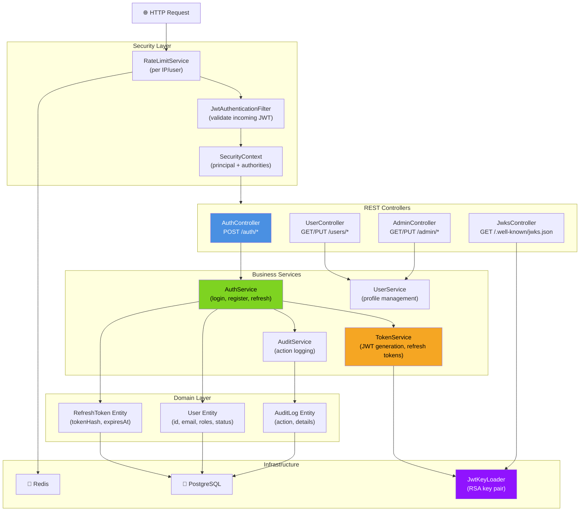
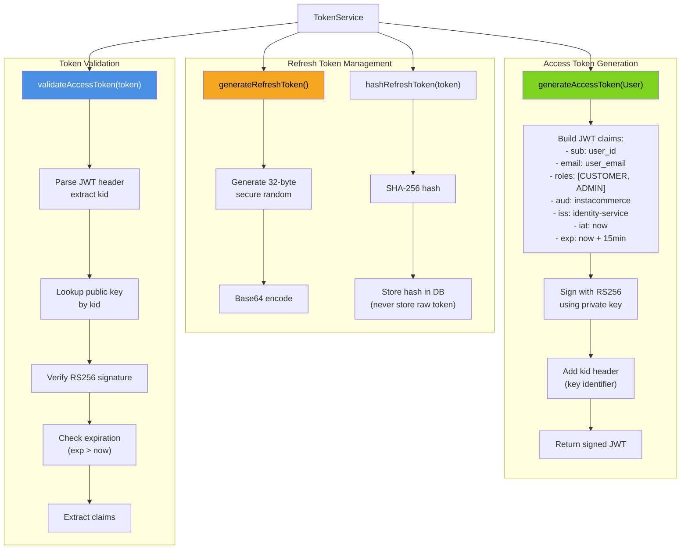
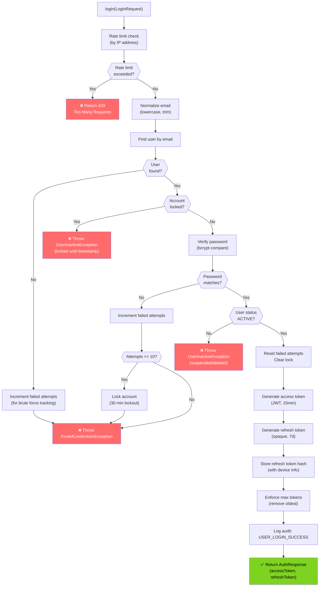
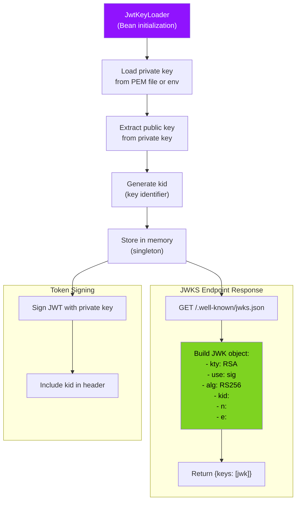
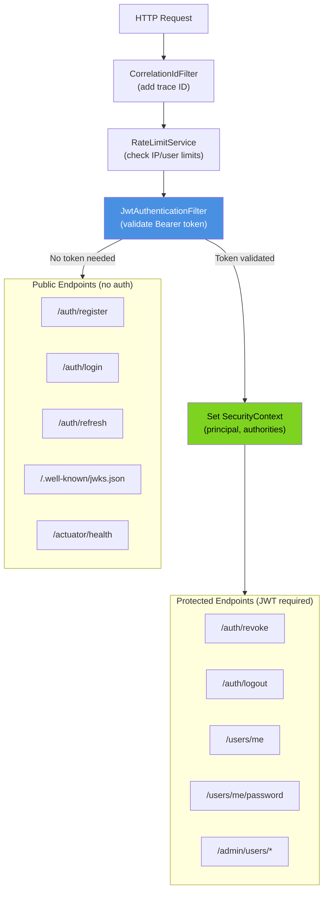
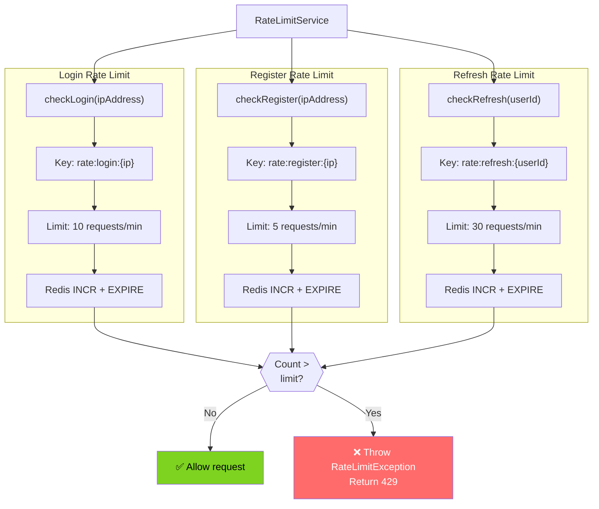
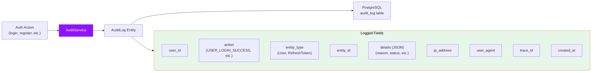
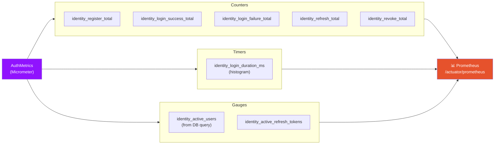
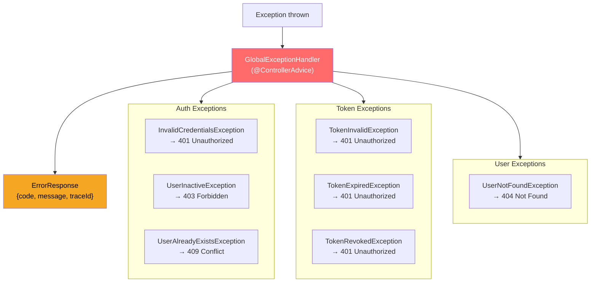

# Identity Service - Low-Level Design

## Component Architecture

## TokenService Implementation

## AuthService - Login Flow

## JwtKeyLoader - RSA Key Management

## SecurityConfig - Filter Chain

## RateLimitService Implementation

## AuditService - Action Logging

## Metrics Collection

## Error Handling

