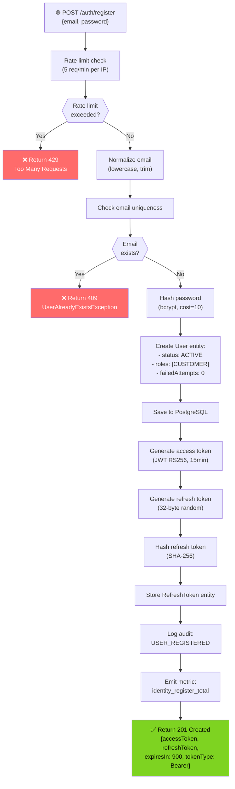
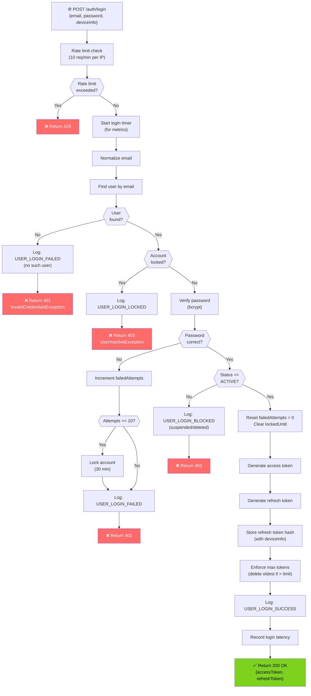
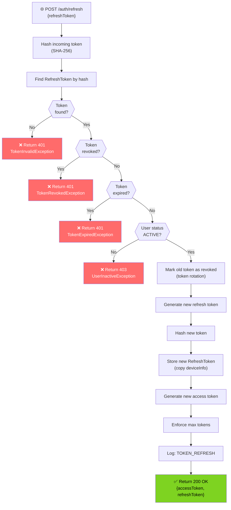
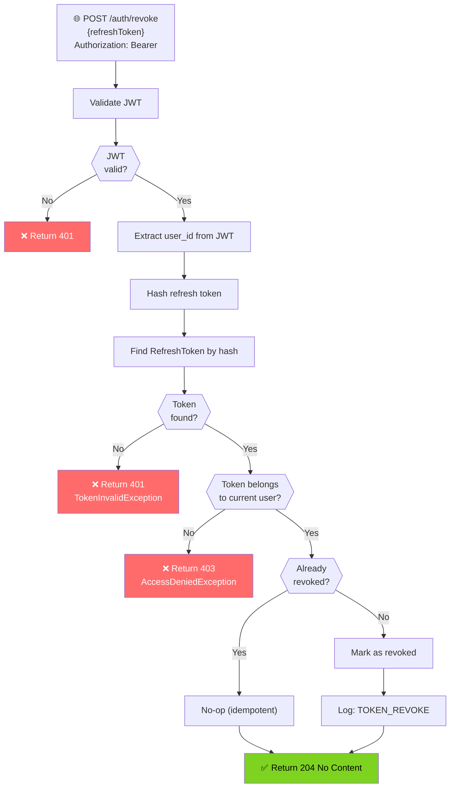
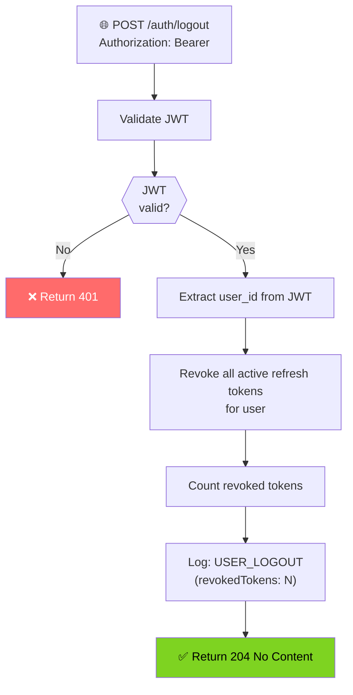
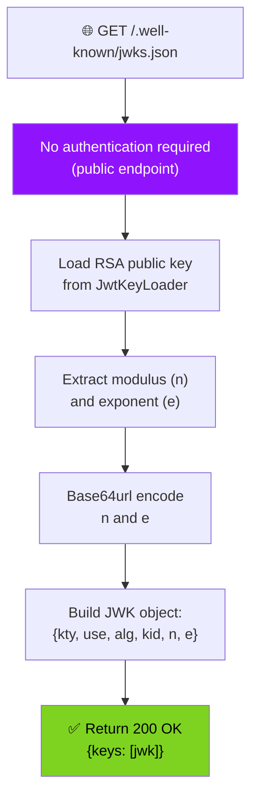
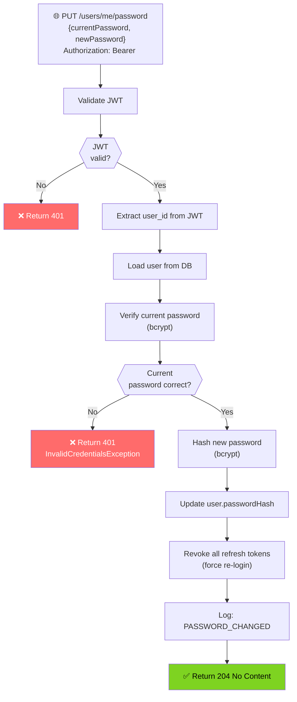
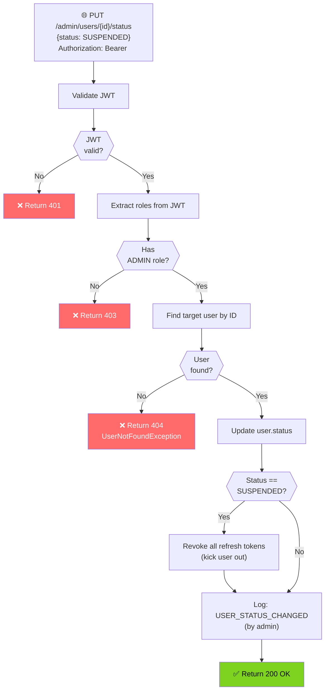

# Identity Service - Request Flowcharts

## User Registration Flow

## User Login Flow

## Token Refresh Flow

## Token Revocation Flow

## Logout Flow (Revoke All Tokens)

## JWKS Endpoint Flow

## Password Change Flow

## Admin User Status Update Flow

