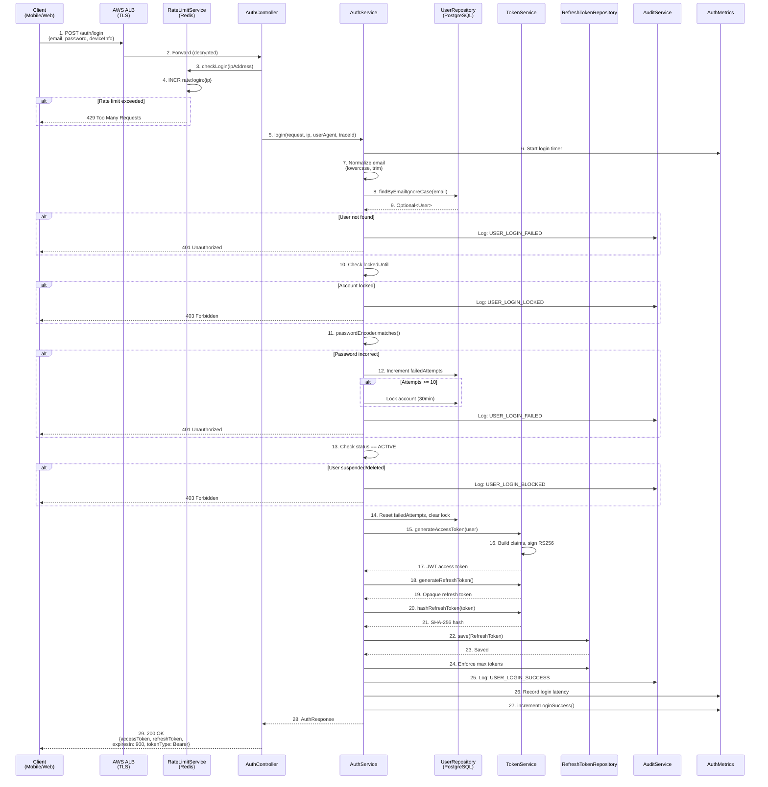
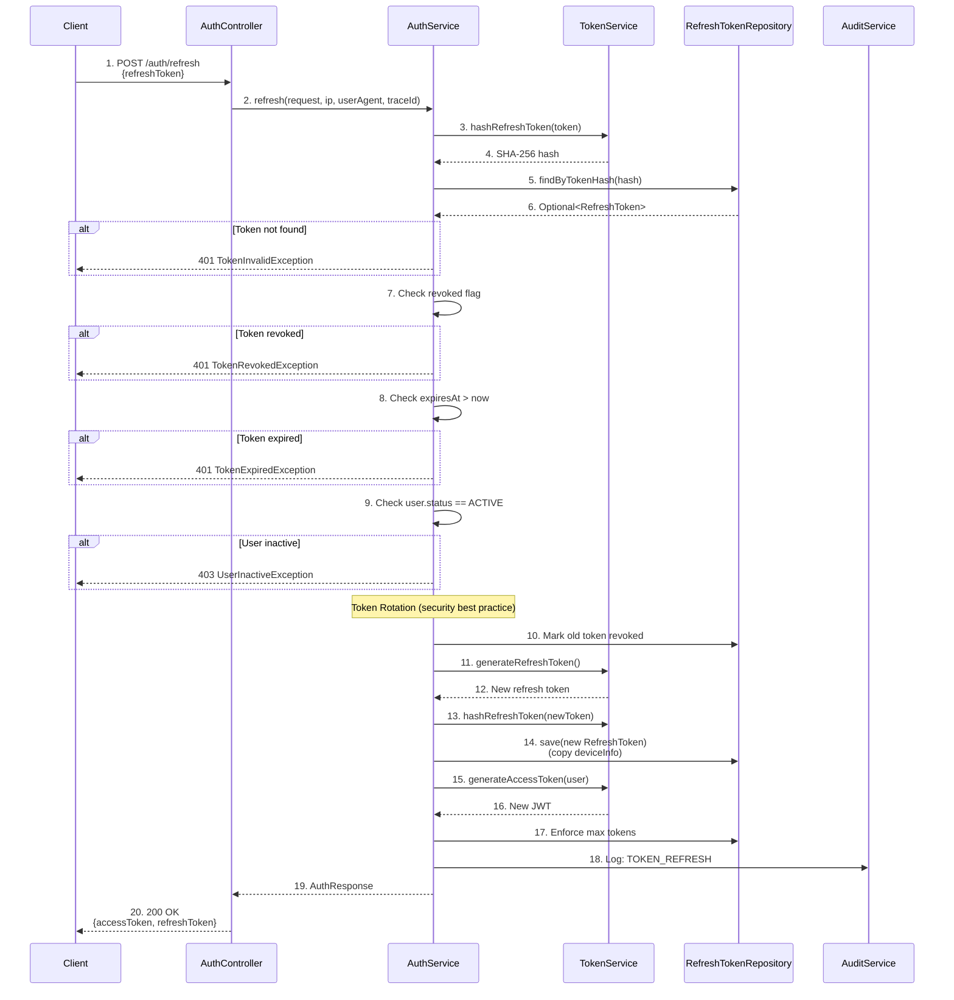
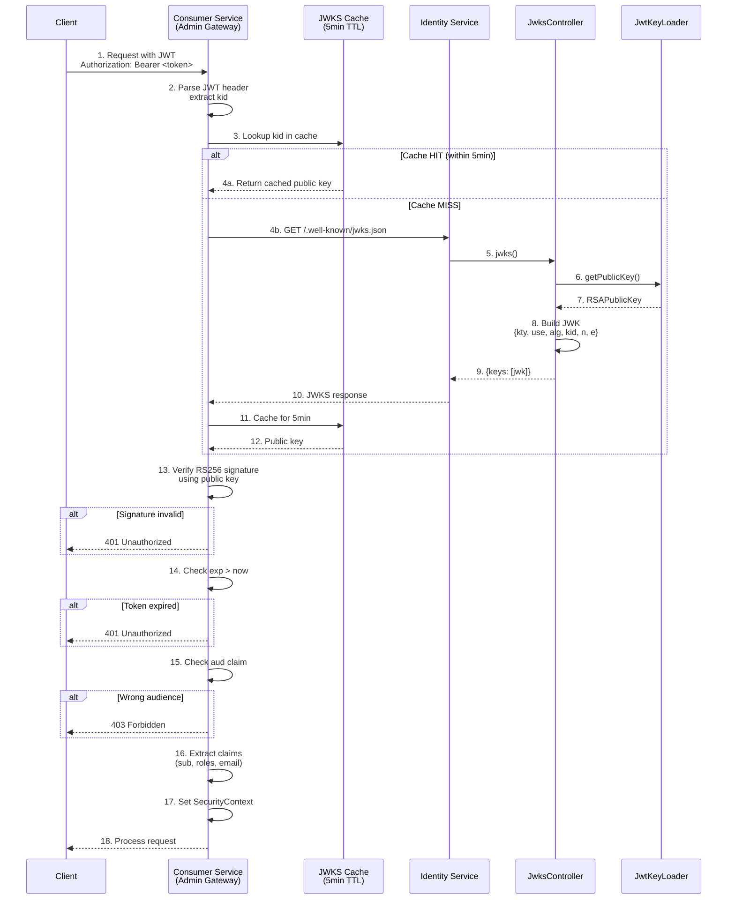
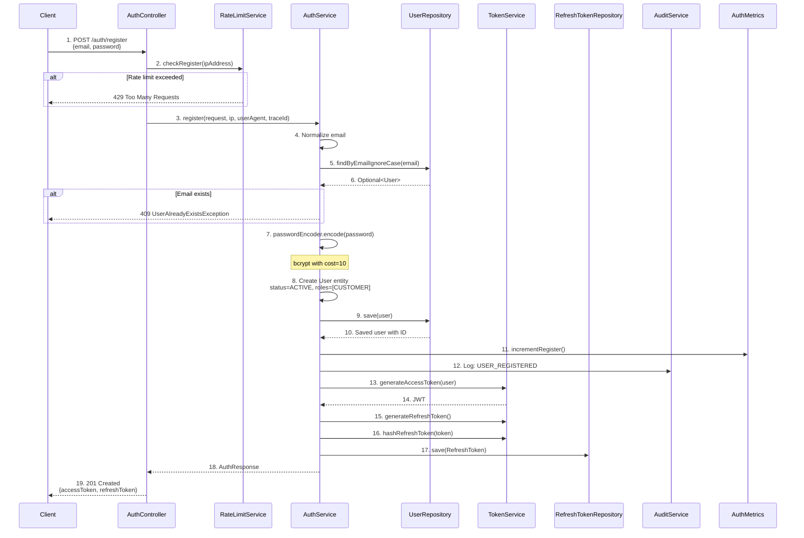
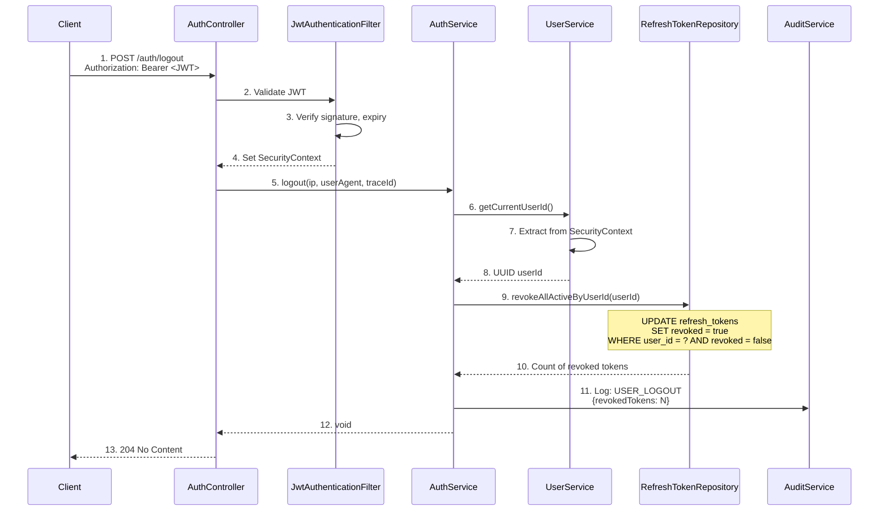
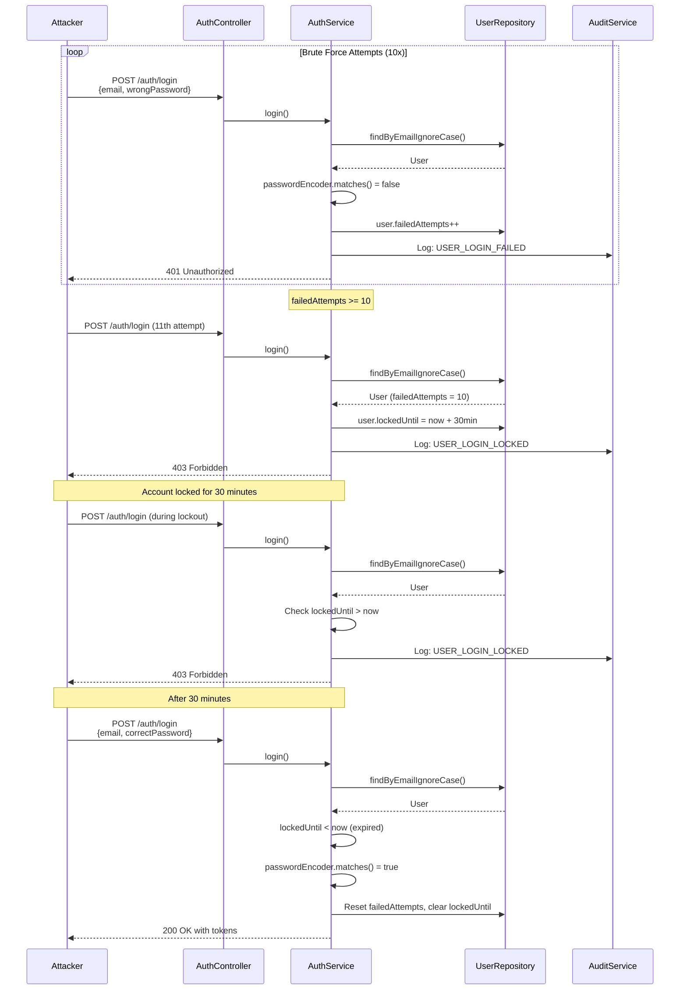
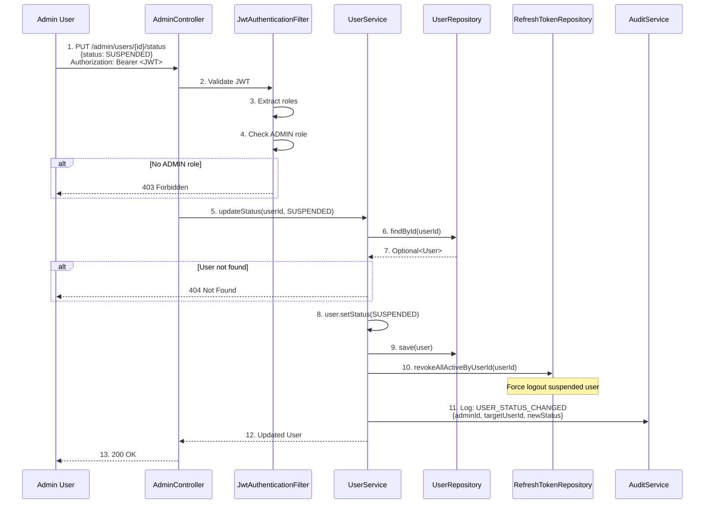

# Identity Service - Sequence Diagrams

## Complete Login Sequence

## Token Refresh Sequence

## JWKS Validation Sequence (Consumer Service)

## User Registration Sequence

## Logout Sequence (Revoke All Sessions)

## Account Lockout Sequence

## Admin User Suspension Sequence

