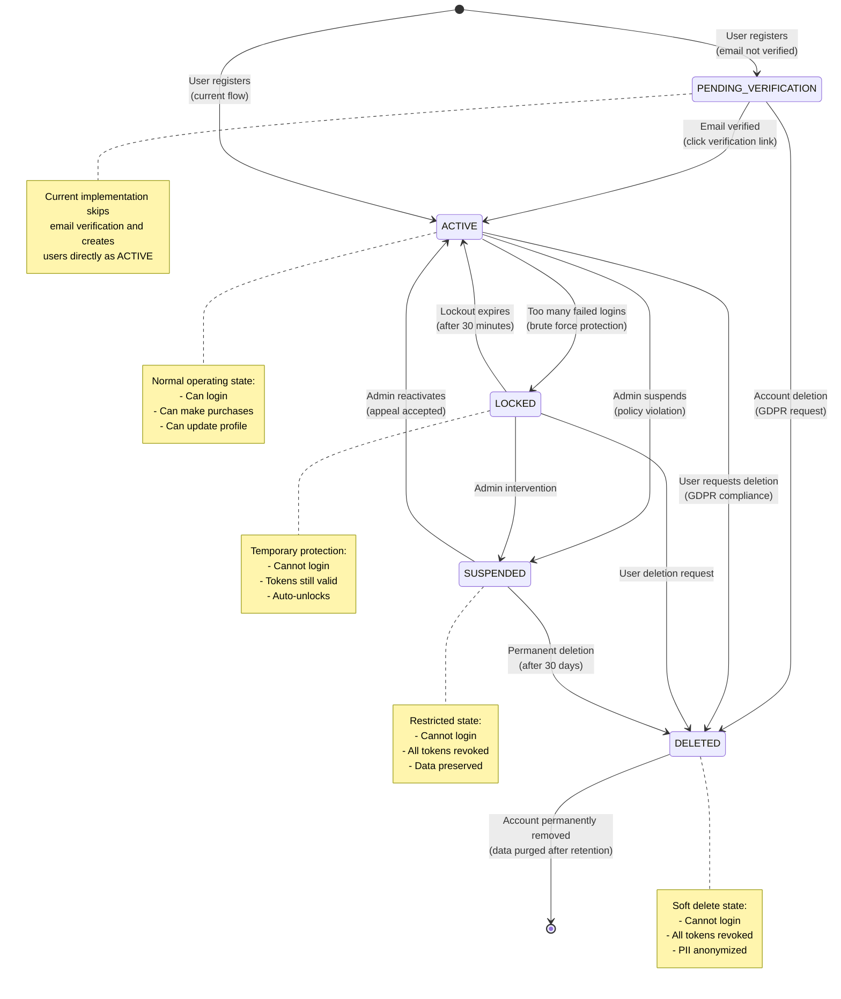
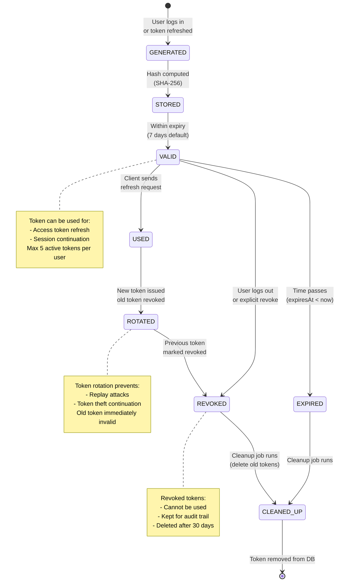
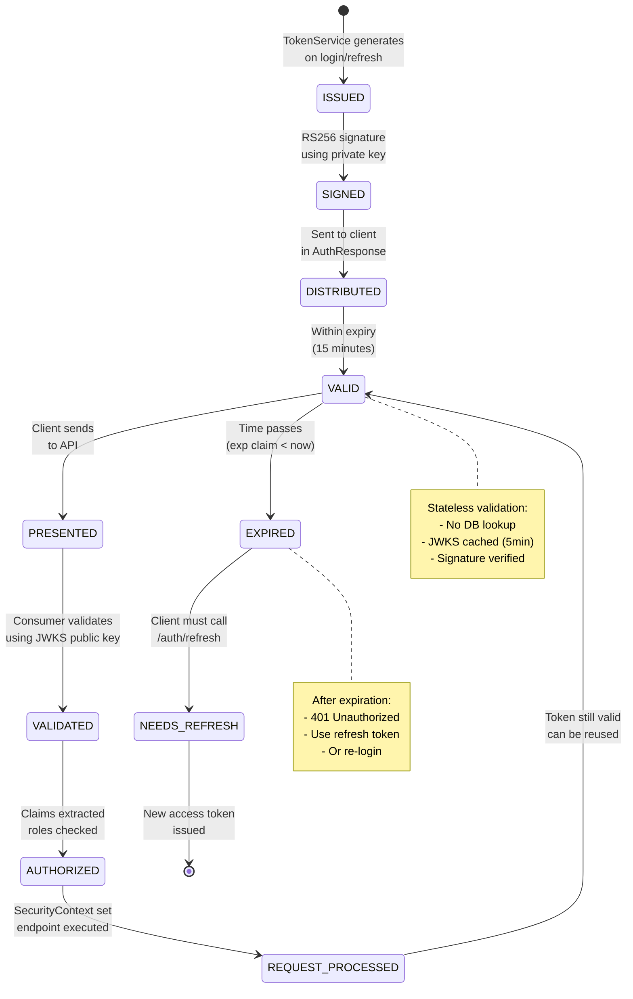
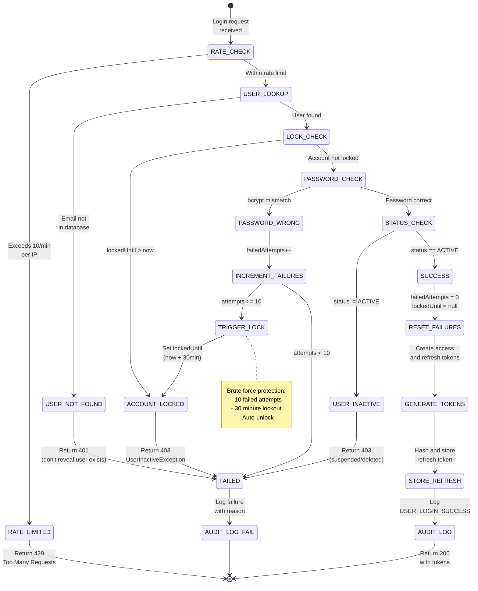
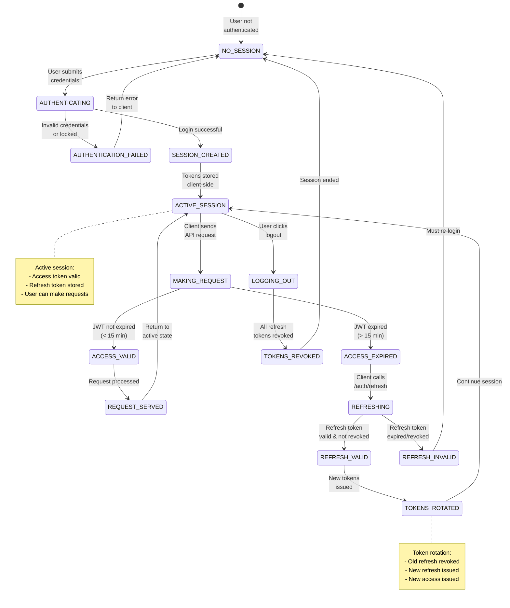
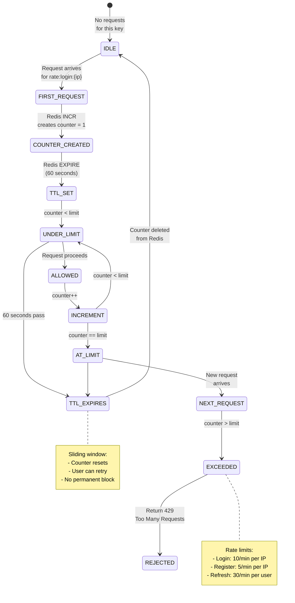
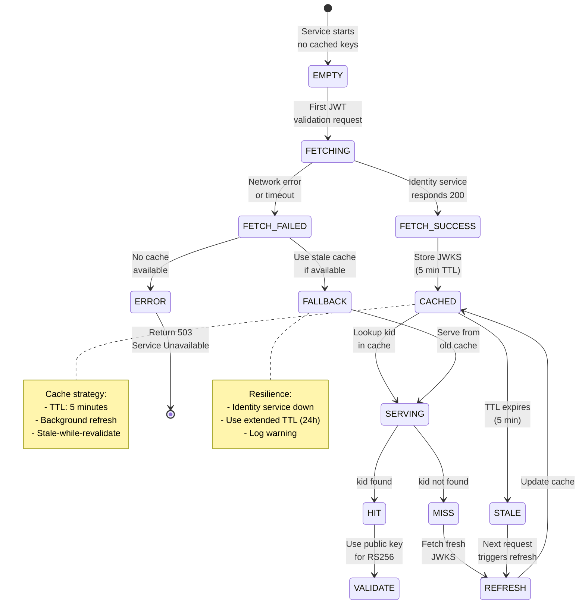
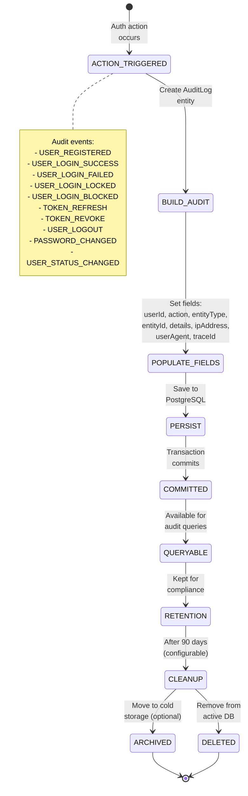

# Identity Service - State Machine Diagrams

## User Account State Machine

## Refresh Token Lifecycle

## JWT Access Token Lifecycle

## Login Attempt State Machine

## User Session State Machine

## Rate Limiter State Machine

## JWKS Cache State Machine

## Audit Log Event Flow

