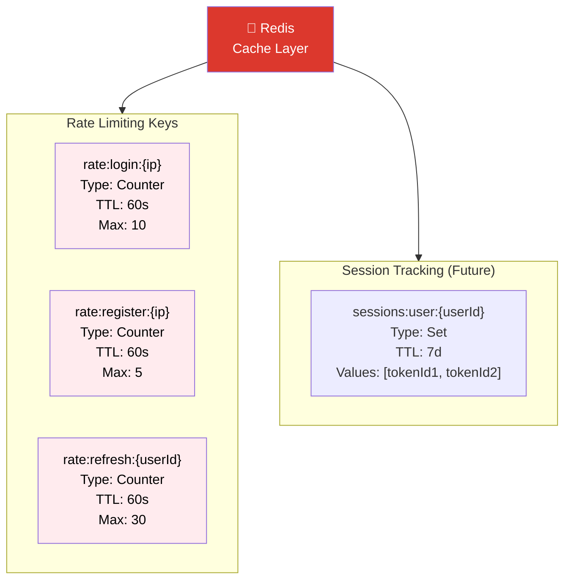
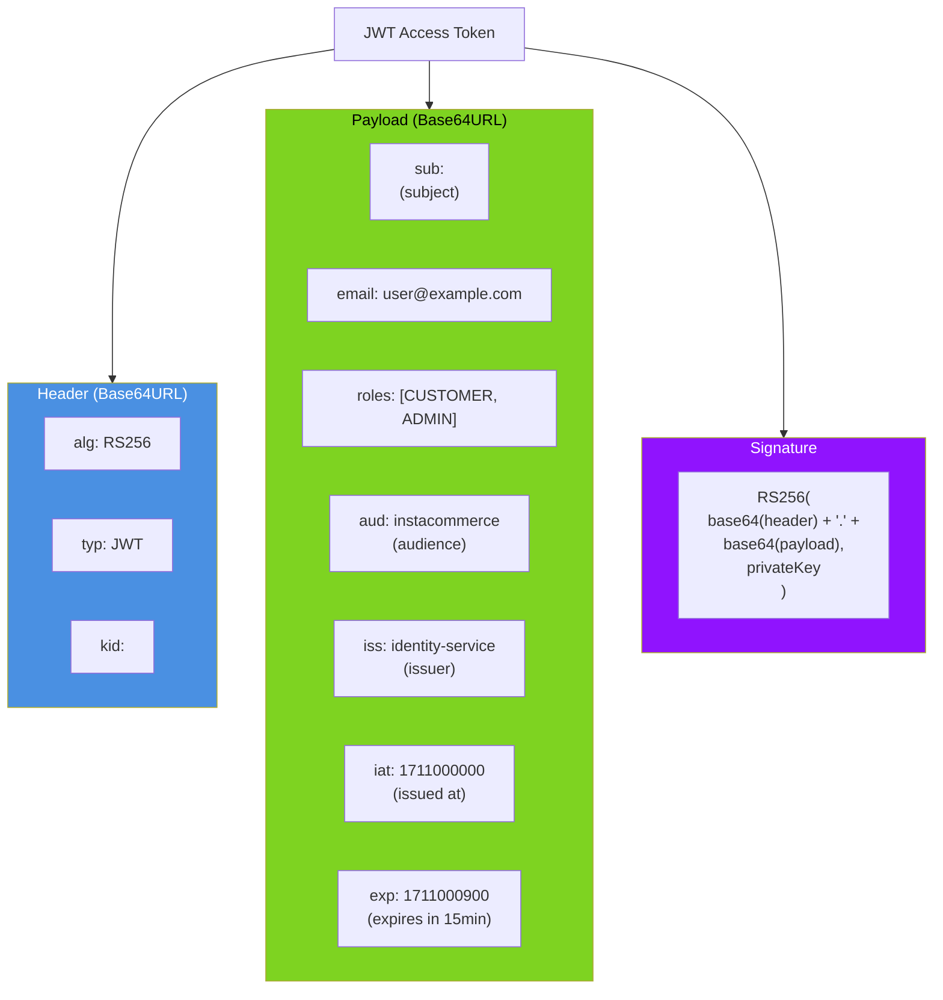
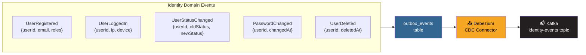
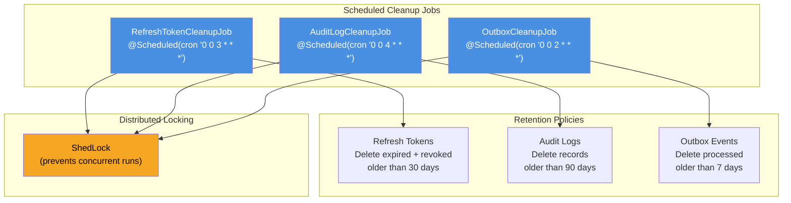

# Identity Service - ER Diagram & Storage Schema

## Core Domain Entities

```mermaid
erDiagram
    USERS ||--o{ REFRESH_TOKENS : "has"
    USERS ||--o{ AUDIT_LOG : "generates"
    USERS ||--o{ NOTIFICATION_PREFERENCES : "configures"
    USERS ||--o{ OUTBOX_EVENTS : "triggers"

    USERS {
        uuid id PK "Primary key (UUID v4)"
        varchar email UK "Unique, lowercase, max 255"
        varchar first_name "Optional, max 100"
        varchar last_name "Optional, max 100"
        varchar phone "Optional, max 30"
        varchar password_hash "bcrypt, 72 chars"
        varchar_array roles "Array: [CUSTOMER, ADMIN, etc.]"
        enum status "ACTIVE, SUSPENDED, DELETED"
        timestamp created_at "Auto-set on insert"
        timestamp updated_at "Auto-set on update"
        timestamp deleted_at "Soft delete marker"
        int failed_attempts "Brute force counter"
        timestamp locked_until "Account lockout expiry"
        bigint version "Optimistic locking"
    }

    REFRESH_TOKENS {
        uuid id PK "Primary key (UUID v4)"
        uuid user_id FK "References users.id"
        varchar token_hash UK "SHA-256 hash, 64 chars"
        varchar device_info "Browser/device description"
        timestamp expires_at "Token expiration (7 days)"
        boolean revoked "Revocation flag"
        timestamp created_at "Token issue time"
    }

    AUDIT_LOG {
        bigint id PK "Auto-increment"
        uuid user_id FK "Nullable (failed logins)"
        varchar action "Event type, max 100"
        varchar entity_type "Target entity type"
        varchar entity_id "Target entity ID"
        jsonb details "Additional context"
        varchar ip_address "Client IP (v4/v6)"
        text user_agent "Browser/client info"
        varchar trace_id "Distributed tracing ID"
        timestamp created_at "Event timestamp"
    }

    NOTIFICATION_PREFERENCES {
        uuid id PK "Primary key (UUID v4)"
        uuid user_id FK UK "References users.id"
        boolean email_enabled "Email notifications"
        boolean sms_enabled "SMS notifications"
        boolean push_enabled "Push notifications"
        timestamp updated_at "Last update time"
    }

    OUTBOX_EVENTS {
        uuid id PK "Primary key (UUID v4)"
        varchar aggregate_type "Entity type (User)"
        varchar aggregate_id "Entity ID"
        varchar event_type "Event name"
        jsonb payload "Event data"
        timestamp created_at "Event creation time"
        timestamp processed_at "Debezium pickup time"
    }
```

## PostgreSQL Schema Details

```sql
-- Users Table
CREATE TABLE users (
    id UUID PRIMARY KEY DEFAULT gen_random_uuid(),
    email VARCHAR(255) NOT NULL UNIQUE,
    first_name VARCHAR(100),
    last_name VARCHAR(100),
    phone VARCHAR(30),
    password_hash VARCHAR(72) NOT NULL,
    roles VARCHAR[] NOT NULL DEFAULT '{CUSTOMER}',
    status VARCHAR(20) NOT NULL DEFAULT 'ACTIVE',
    created_at TIMESTAMP NOT NULL DEFAULT NOW(),
    updated_at TIMESTAMP NOT NULL DEFAULT NOW(),
    deleted_at TIMESTAMP,
    failed_attempts INT NOT NULL DEFAULT 0,
    locked_until TIMESTAMP,
    version BIGINT NOT NULL DEFAULT 0,
    
    CONSTRAINT chk_status CHECK (status IN ('ACTIVE', 'SUSPENDED', 'DELETED'))
);

CREATE INDEX idx_users_email ON users(email);
CREATE INDEX idx_users_status ON users(status);

-- Refresh Tokens Table
CREATE TABLE refresh_tokens (
    id UUID PRIMARY KEY DEFAULT gen_random_uuid(),
    user_id UUID NOT NULL REFERENCES users(id) ON DELETE CASCADE,
    token_hash VARCHAR(64) NOT NULL UNIQUE,
    device_info VARCHAR(255),
    expires_at TIMESTAMP NOT NULL,
    revoked BOOLEAN NOT NULL DEFAULT FALSE,
    created_at TIMESTAMP NOT NULL DEFAULT NOW()
);

CREATE INDEX idx_refresh_tokens_user_id ON refresh_tokens(user_id);
CREATE INDEX idx_refresh_tokens_hash ON refresh_tokens(token_hash);
CREATE INDEX idx_refresh_tokens_expires ON refresh_tokens(expires_at) 
    WHERE revoked = FALSE;

-- Audit Log Table
CREATE TABLE audit_log (
    id BIGSERIAL PRIMARY KEY,
    user_id UUID,
    action VARCHAR(100) NOT NULL,
    entity_type VARCHAR(50),
    entity_id VARCHAR(100),
    details JSONB,
    ip_address VARCHAR(45),
    user_agent TEXT,
    trace_id VARCHAR(32),
    created_at TIMESTAMP NOT NULL DEFAULT NOW()
);

CREATE INDEX idx_audit_log_user_id ON audit_log(user_id);
CREATE INDEX idx_audit_log_action ON audit_log(action);
CREATE INDEX idx_audit_log_created_at ON audit_log(created_at);
CREATE INDEX idx_audit_log_trace_id ON audit_log(trace_id);

-- Notification Preferences Table
CREATE TABLE notification_preferences (
    id UUID PRIMARY KEY DEFAULT gen_random_uuid(),
    user_id UUID NOT NULL UNIQUE REFERENCES users(id) ON DELETE CASCADE,
    email_enabled BOOLEAN NOT NULL DEFAULT TRUE,
    sms_enabled BOOLEAN NOT NULL DEFAULT FALSE,
    push_enabled BOOLEAN NOT NULL DEFAULT TRUE,
    updated_at TIMESTAMP NOT NULL DEFAULT NOW()
);

-- Outbox Events Table (CDC pattern)
CREATE TABLE outbox_events (
    id UUID PRIMARY KEY DEFAULT gen_random_uuid(),
    aggregate_type VARCHAR(100) NOT NULL,
    aggregate_id VARCHAR(100) NOT NULL,
    event_type VARCHAR(100) NOT NULL,
    payload JSONB NOT NULL,
    created_at TIMESTAMP NOT NULL DEFAULT NOW(),
    processed_at TIMESTAMP
);

CREATE INDEX idx_outbox_events_created ON outbox_events(created_at)
    WHERE processed_at IS NULL;

-- ShedLock Table (distributed locking)
CREATE TABLE shedlock (
    name VARCHAR(64) NOT NULL PRIMARY KEY,
    lock_until TIMESTAMP NOT NULL,
    locked_at TIMESTAMP NOT NULL,
    locked_by VARCHAR(255) NOT NULL
);
```

## Redis Cache Schema



## JWT Token Structure



## Outbox Event Schema



## Prometheus Metrics Schema

```
Identity Service Metrics
├─ identity_register_total
│  └ Counter: Total registrations
│
├─ identity_login_success_total
│  └ Counter: Successful logins
│
├─ identity_login_failure_total
│  └ Counter: Failed logins
│     - reason: invalid_credentials, locked, inactive
│
├─ identity_login_duration_ms
│  └ Histogram: Login latency
│     - p50: ~100ms
│     - p99: ~500ms
│
├─ identity_refresh_total
│  └ Counter: Token refreshes
│
├─ identity_revoke_total
│  └ Counter: Token revocations
│
├─ identity_rate_limit_exceeded_total{endpoint}
│  └ Counter: Rate limit hits
│     - endpoint: login, register, refresh
│
├─ identity_active_users
│  └ Gauge: Users with status=ACTIVE
│
├─ identity_active_refresh_tokens
│  └ Gauge: Non-revoked, non-expired tokens
│
└─ identity_jwks_requests_total
   └ Counter: JWKS endpoint hits
```

## Data Retention & Cleanup



## Entity Relationships Summary

```
┌─────────────────────────────────────────────────────────────────────┐
│                    Identity Service Data Model                       │
├─────────────────────────────────────────────────────────────────────┤
│                                                                      │
│  ┌──────────┐                                                        │
│  │  users   │ ──────── 1:N ──────── refresh_tokens                  │
│  │          │                       (token_hash, expires_at)         │
│  │  - id    │                                                        │
│  │  - email │ ──────── 1:N ──────── audit_log                       │
│  │  - roles │                       (action, details, ip)            │
│  │  - status│                                                        │
│  │          │ ──────── 1:1 ──────── notification_preferences        │
│  │          │                       (email, sms, push flags)         │
│  │          │                                                        │
│  │          │ ──────── 1:N ──────── outbox_events                   │
│  └──────────┘                       (CDC for domain events)          │
│                                                                      │
│  Independent Tables:                                                 │
│  - shedlock (distributed job locking)                               │
│                                                                      │
│  Cardinality Notes:                                                  │
│  - User : RefreshTokens = 1:N (max 5 active per user)               │
│  - User : AuditLog = 1:N (unbounded, cleaned after 90 days)         │
│  - User : NotificationPrefs = 1:1                                    │
│  - User : OutboxEvents = 1:N (transient, processed by CDC)          │
│                                                                      │
└─────────────────────────────────────────────────────────────────────┘
```
