# Identity Service - End-to-End Flows

## Complete User Journey: Registration to Authenticated Request

```mermaid
graph TB
    User["👤 New User"]
    MobileApp["📱 Mobile App"]
    ALB["⚖️ AWS ALB<br/>(TLS termination)"]

    subgraph IdentityService["Identity Service"]
        AuthController["AuthController"]
        RateLimitSvc["RateLimitService<br/>(Redis)"]
        AuthService["AuthService"]
        TokenService["TokenService"]
        UserRepo["UserRepository"]
        RefreshRepo["RefreshTokenRepository"]
        AuditSvc["AuditService"]
    end

    subgraph Storage["Data Stores"]
        PostgreSQL["🐘 PostgreSQL<br/>(users, tokens, audit)"]
        Redis["🔴 Redis<br/>(rate limiting)"]
    end

    subgraph ConsumerService["Consumer Service (Mobile BFF)"]
        BFFController["API Controller"]
        JwtFilter["JwtAuthenticationFilter"]
        JwksCache["JWKS Cache<br/>(5min TTL)"]
    end

    Kafka["📬 Kafka<br/>(identity-events)"]

    %% Registration Flow
    User -->|1. Open app,<br/>tap 'Sign Up'| MobileApp
    MobileApp -->|2. POST /auth/register<br/>{email, password}| ALB
    ALB -->|3. Forward| AuthController

    AuthController -->|4. Check rate limit| RateLimitSvc
    RateLimitSvc -->|5. INCR rate:register:{ip}| Redis
    Redis -->|6. Counter OK| RateLimitSvc

    AuthController -->|7. register()| AuthService
    AuthService -->|8. Check email unique| UserRepo
    UserRepo -->|9. Query| PostgreSQL
    PostgreSQL -->|10. Not found| UserRepo

    AuthService -->|11. Hash password<br/>(bcrypt)| AuthService
    AuthService -->|12. Create user| UserRepo
    UserRepo -->|13. INSERT| PostgreSQL

    AuthService -->|14. Generate JWT| TokenService
    TokenService -->|15. Sign RS256| TokenService

    AuthService -->|16. Generate refresh| TokenService
    AuthService -->|17. Store hash| RefreshRepo
    RefreshRepo -->|18. INSERT| PostgreSQL

    AuthService -->|19. Log audit| AuditSvc
    AuditSvc -->|20. INSERT| PostgreSQL

    AuthService -->|21. Publish event| Kafka

    AuthController -->|22. Return 201| ALB
    ALB -->|23. AuthResponse<br/>{accessToken, refreshToken}| MobileApp
    MobileApp -->|24. Store tokens<br/>securely| MobileApp

    %% Authenticated Request Flow
    User -->|25. Browse products| MobileApp
    MobileApp -->|26. GET /products<br/>Authorization: Bearer JWT| ALB
    ALB -->|27. Forward to BFF| BFFController

    BFFController -->|28. Filter chain| JwtFilter
    JwtFilter -->|29. Check JWKS cache| JwksCache

    JwksCache -->|30. Cache miss?<br/>Fetch from identity| IdentityService
    IdentityService -->|31. Return JWKS| JwksCache

    JwtFilter -->|32. Verify RS256<br/>using public key| JwtFilter
    JwtFilter -->|33. Check exp, aud| JwtFilter
    JwtFilter -->|34. Set SecurityContext| JwtFilter

    BFFController -->|35. Process request| BFFController
    BFFController -->|36. Return products| ALB
    ALB -->|37. 200 OK| MobileApp
    MobileApp -->|38. Display| User

    style User fill:#F5A623,color:#000
    style IdentityService fill:#4A90E2,color:#fff
    style ConsumerService fill:#7ED321,color:#000
    style PostgreSQL fill:#336791,color:#fff
    style Redis fill:#DC382D,color:#fff
    style Kafka fill:#231F20,color:#fff
```

## Token Refresh Journey

```mermaid
graph TB
    User["👤 User"]
    MobileApp["📱 Mobile App"]
    ALB["⚖️ AWS ALB"]

    subgraph IdentityService["Identity Service"]
        AuthController["AuthController"]
        AuthService["AuthService"]
        TokenService["TokenService"]
        RefreshRepo["RefreshTokenRepository"]
    end

    PostgreSQL["🐘 PostgreSQL"]

    subgraph ConsumerService["Consumer Service"]
        JwtFilter["JwtAuthenticationFilter"]
    end

    %% Access Token Expires
    User -->|1. Continue using app<br/>(15+ minutes later)| MobileApp
    MobileApp -->|2. GET /orders<br/>Authorization: Bearer <expired JWT>| ALB
    ALB -->|3. Forward| ConsumerService
    JwtFilter -->|4. Validate JWT| JwtFilter
    JwtFilter -->|5. exp < now()<br/>Token expired!| JwtFilter
    JwtFilter -->|6. Return 401| ALB
    ALB -->|7. 401 Unauthorized| MobileApp

    %% Refresh Flow
    MobileApp -->|8. Detect 401,<br/>initiate refresh| MobileApp
    MobileApp -->|9. POST /auth/refresh<br/>{refreshToken}| ALB
    ALB -->|10. Forward| AuthController

    AuthController -->|11. refresh()| AuthService
    AuthService -->|12. Hash token| TokenService
    AuthService -->|13. Find by hash| RefreshRepo
    RefreshRepo -->|14. Query| PostgreSQL
    PostgreSQL -->|15. Return token| RefreshRepo

    AuthService -->|16. Validate:<br/>- not revoked<br/>- not expired<br/>- user active| AuthService

    AuthService -->|17. Revoke old token<br/>(rotation)| RefreshRepo
    RefreshRepo -->|18. UPDATE revoked=true| PostgreSQL

    AuthService -->|19. Generate new tokens| TokenService
    AuthService -->|20. Store new refresh| RefreshRepo
    RefreshRepo -->|21. INSERT| PostgreSQL

    AuthController -->|22. Return 200| ALB
    ALB -->|23. New tokens| MobileApp
    MobileApp -->|24. Update stored tokens| MobileApp

    %% Retry Original Request
    MobileApp -->|25. Retry GET /orders<br/>Authorization: Bearer <new JWT>| ALB
    ALB -->|26. Forward| ConsumerService
    JwtFilter -->|27. Validate OK| JwtFilter
    JwtFilter -->|28. Return orders| ALB
    ALB -->|29. 200 OK| MobileApp
    MobileApp -->|30. Display orders| User

    style User fill:#F5A623,color:#000
    style IdentityService fill:#4A90E2,color:#fff
    style ConsumerService fill:#7ED321,color:#000
```

## Multi-Device Session Management

```mermaid
graph TB
    User["👤 User"]
    Mobile["📱 Mobile App<br/>(iPhone)"]
    Tablet["📱 Tablet<br/>(iPad)"]
    Web["🌐 Web Browser<br/>(Chrome)"]

    subgraph IdentityService["Identity Service"]
        AuthService["AuthService"]
        RefreshRepo["RefreshTokenRepository"]
    end

    PostgreSQL["🐘 PostgreSQL"]

    %% Login from Multiple Devices
    User -->|1. Login on mobile| Mobile
    Mobile -->|2. POST /auth/login<br/>deviceInfo: 'iPhone 15'| AuthService
    AuthService -->|3. Create refresh token #1| RefreshRepo
    RefreshRepo -->|4. INSERT| PostgreSQL

    User -->|5. Login on tablet| Tablet
    Tablet -->|6. POST /auth/login<br/>deviceInfo: 'iPad Pro'| AuthService
    AuthService -->|7. Create refresh token #2| RefreshRepo
    RefreshRepo -->|8. INSERT| PostgreSQL

    User -->|9. Login on web| Web
    Web -->|10. POST /auth/login<br/>deviceInfo: 'Chrome/Windows'| AuthService
    AuthService -->|11. Create refresh token #3| RefreshRepo
    RefreshRepo -->|12. INSERT| PostgreSQL

    %% Max Tokens Enforcement
    User -->|13. Login on another device| Mobile
    Mobile -->|14. POST /auth/login<br/>deviceInfo: 'Android Phone'| AuthService
    AuthService -->|15. Create refresh token #4| RefreshRepo
    AuthService -->|16. Check max tokens (5)| AuthService
    AuthService -->|17. Under limit, keep all| RefreshRepo

    User -->|18. Login 6th device| Web
    Web -->|19. POST /auth/login| AuthService
    AuthService -->|20. Create refresh token #6| RefreshRepo
    AuthService -->|21. Enforce max 5 tokens<br/>Delete oldest (#1)| RefreshRepo
    RefreshRepo -->|22. DELETE oldest| PostgreSQL

    Note1["📋 Active Sessions:<br/>#2 iPad Pro<br/>#3 Chrome/Windows<br/>#4 Android Phone<br/>#5 ...<br/>#6 Latest"]

    %% Logout All
    User -->|23. Tap 'Logout All Devices'| Mobile
    Mobile -->|24. POST /auth/logout| AuthService
    AuthService -->|25. Revoke all tokens<br/>for user| RefreshRepo
    RefreshRepo -->|26. UPDATE revoked=true<br/>WHERE user_id=?| PostgreSQL

    Note2["📋 All sessions terminated<br/>User must re-login<br/>on each device"]

    style User fill:#F5A623,color:#000
    style IdentityService fill:#4A90E2,color:#fff
```

## Security: Brute Force Attack Mitigation

```mermaid
graph TB
    Attacker["🦹 Attacker"]
    ALB["⚖️ AWS ALB"]

    subgraph IdentityService["Identity Service"]
        RateLimitSvc["RateLimitService"]
        AuthService["AuthService"]
        UserRepo["UserRepository"]
        AuditSvc["AuditService"]
    end

    Redis["🔴 Redis"]
    PostgreSQL["🐘 PostgreSQL"]
    AlertSystem["🚨 Alert System<br/>(PagerDuty)"]

    %% Phase 1: Rate Limiting (IP-based)
    Attacker -->|1. Rapid login attempts<br/>(10+ per minute)| ALB
    ALB -->|2. Forward| RateLimitSvc
    RateLimitSvc -->|3. INCR rate:login:{ip}| Redis
    Redis -->|4. Counter = 11| RateLimitSvc
    RateLimitSvc -->|5. Exceeds limit (10/min)| RateLimitSvc
    RateLimitSvc -->|6. Return 429| ALB
    ALB -->|7. Too Many Requests| Attacker

    Note1["🛡️ Layer 1: IP Rate Limiting<br/>10 requests/minute per IP<br/>Blocks automated tools"]

    %% Phase 2: Account Lockout (User-based)
    Attacker -->|8. Slow down attacks<br/>(below rate limit)| ALB
    ALB -->|9. Forward| AuthService
    AuthService -->|10. Wrong password| AuthService
    AuthService -->|11. failedAttempts++| UserRepo
    UserRepo -->|12. UPDATE| PostgreSQL
    AuthService -->|13. Log attempt| AuditSvc
    AuditSvc -->|14. INSERT| PostgreSQL

    loop 10 Failed Attempts
        Attacker -->|15. Try again| AuthService
        AuthService -->|16. Increment counter| UserRepo
    end

    AuthService -->|17. failedAttempts >= 10| AuthService
    AuthService -->|18. Lock account<br/>lockedUntil = now + 30min| UserRepo
    UserRepo -->|19. UPDATE| PostgreSQL
    AuthService -->|20. Log: USER_LOGIN_LOCKED| AuditSvc
    AuthService -->|21. Return 403| ALB
    ALB -->|22. Forbidden| Attacker

    Note2["🛡️ Layer 2: Account Lockout<br/>10 failed attempts = 30min lock<br/>Prevents credential stuffing"]

    %% Phase 3: Alerting
    AuditSvc -->|23. Emit metric:<br/>login_failure_total++| AlertSystem
    AlertSystem -->|24. Threshold exceeded<br/>(>100 failures in 5min)| AlertSystem
    AlertSystem -->|25. Page security team| AlertSystem

    Note3["🛡️ Layer 3: Monitoring & Alerts<br/>Detect attack patterns<br/>Notify security team"]

    style Attacker fill:#FF6B6B,color:#fff
    style IdentityService fill:#4A90E2,color:#fff
    style AlertSystem fill:#9013FE,color:#fff
```

## Service-to-Service JWT Validation Flow

```mermaid
graph TB
    subgraph Client["Client Request"]
        MobileApp["📱 Mobile App"]
    end

    subgraph EdgeLayer["Edge Layer"]
        ALB["⚖️ AWS ALB"]
        MobileBFF["📱 Mobile BFF"]
    end

    subgraph BackendServices["Backend Services"]
        CartService["🛒 Cart Service"]
        OrderService["📦 Order Service"]
        PaymentService["💳 Payment Service"]
    end

    subgraph IdentityService["Identity Service"]
        JwksEndpoint["/.well-known/jwks.json"]
    end

    %% Initial Request
    MobileApp -->|1. Add to cart<br/>Authorization: Bearer JWT| ALB
    ALB -->|2. Forward| MobileBFF

    %% BFF Validates JWT
    MobileBFF -->|3. Validate JWT| MobileBFF
    MobileBFF -->|4. Check JWKS cache| MobileBFF
    MobileBFF -->|5. Cache miss?<br/>GET JWKS| JwksEndpoint
    JwksEndpoint -->|6. Return public keys| MobileBFF
    MobileBFF -->|7. Verify signature<br/>Extract claims| MobileBFF

    %% BFF Calls Backend
    MobileBFF -->|8. Forward request<br/>+ user context headers| CartService
    CartService -->|9. Trust BFF<br/>(internal network)| CartService
    CartService -->|10. Add item to cart| CartService
    CartService -->|11. Return success| MobileBFF

    %% Alternative: Backend Validates
    MobileBFF -->|12. Some APIs:<br/>Pass JWT to backend| OrderService
    OrderService -->|13. Validate JWT<br/>independently| OrderService
    OrderService -->|14. Check JWKS cache| OrderService
    OrderService -->|15. Cache miss?<br/>GET JWKS| JwksEndpoint
    JwksEndpoint -->|16. Return public keys| OrderService
    OrderService -->|17. Process order| OrderService

    Note1["🔑 JWKS Caching:<br/>Each service caches public keys<br/>5 minute TTL<br/>Reduces load on identity-service"]

    Note2["🔐 Trust Model:<br/>Option A: BFF validates, backends trust<br/>Option B: Each service validates JWT<br/>InstaCommerce uses both patterns"]

    style MobileBFF fill:#7ED321,color:#000
    style IdentityService fill:#4A90E2,color:#fff
    style CartService fill:#F5A623,color:#000
    style OrderService fill:#F5A623,color:#000
```

## Observability: Request Tracing

```mermaid
graph LR
    Client["📱 Client"]

    subgraph Tracing["Distributed Tracing"]
        TraceId["trace_id: abc123"]
    end

    subgraph IdentityService["Identity Service"]
        CorrelationFilter["CorrelationIdFilter<br/>(extract/generate trace_id)"]
        AuthController["AuthController"]
        AuthService["AuthService"]
        AuditLog["AuditLog<br/>(includes trace_id)"]
    end

    subgraph Observability["Observability Stack"]
        Jaeger["📈 Jaeger<br/>(distributed traces)"]
        ELK["📝 ELK<br/>(structured logs)"]
        Prometheus["📊 Prometheus<br/>(metrics)"]
        Grafana["📉 Grafana<br/>(dashboards)"]
    end

    Client -->|1. POST /auth/login<br/>X-Trace-Id: abc123| CorrelationFilter
    CorrelationFilter -->|2. Set MDC<br/>traceId=abc123| AuthController
    AuthController -->|3. Login request| AuthService
    AuthService -->|4. Log with trace_id| AuditLog
    AuditLog -->|5. trace_id in record| AuditLog

    CorrelationFilter -->|6. Emit span| Jaeger
    AuthService -->|7. Structured logs<br/>{trace_id, user_id, action}| ELK
    AuthService -->|8. Metrics<br/>login_duration_ms| Prometheus

    Jaeger --> Grafana
    ELK --> Grafana
    Prometheus --> Grafana

    Note1["🔍 Full Request Visibility:<br/>- trace_id links all components<br/>- Audit logs queryable by trace<br/>- Metrics tagged with dimensions"]

    style IdentityService fill:#4A90E2,color:#fff
    style Jaeger fill:#50E3C2,color:#000
    style ELK fill:#F5A623,color:#000
    style Prometheus fill:#E6522C,color:#fff
```

## SLO & Monitoring Dashboard

```mermaid
graph LR
    IdentityService["Identity Service"]

    subgraph SLOs["Service Level Objectives"]
        Availability["✅ Availability<br/>99.9%<br/>(8.7 hrs/year downtime)"]
        LoginLatency["⏱️ Login P99<br/>< 500ms"]
        JwksLatency["⏱️ JWKS P99<br/>< 50ms"]
        ErrorRate["🚨 Error Rate<br/>< 0.1%"]
    end

    subgraph Metrics["Key Metrics"]
        M1["identity_login_duration_ms"]
        M2["identity_login_success_total"]
        M3["identity_login_failure_total"]
        M4["identity_jwks_requests_total"]
        M5["identity_rate_limit_exceeded_total"]
    end

    subgraph Alerts["Alert Rules"]
        A1["🔴 SEV-1: Login P99 > 1s<br/>(page immediately)"]
        A2["🟠 SEV-2: Login P99 > 750ms<br/>(page on-call)"]
        A3["🟡 SEV-3: Error rate > 1%<br/>(create ticket)"]
    end

    subgraph Dashboard["Grafana Panels"]
        D1["📈 Login Success Rate<br/>(real-time)"]
        D2["📊 Latency Percentiles<br/>(p50, p90, p99)"]
        D3["🔥 Error Breakdown<br/>(by type)"]
        D4["📉 Rate Limit Hits<br/>(by endpoint)"]
    end

    IdentityService --> Metrics
    Metrics --> SLOs
    SLOs --> Alerts
    Metrics --> Dashboard

    style Availability fill:#7ED321,color:#000
    style LoginLatency fill:#7ED321,color:#000
    style A1 fill:#FF6B6B,color:#fff
    style A2 fill:#F5A623,color:#000
```


