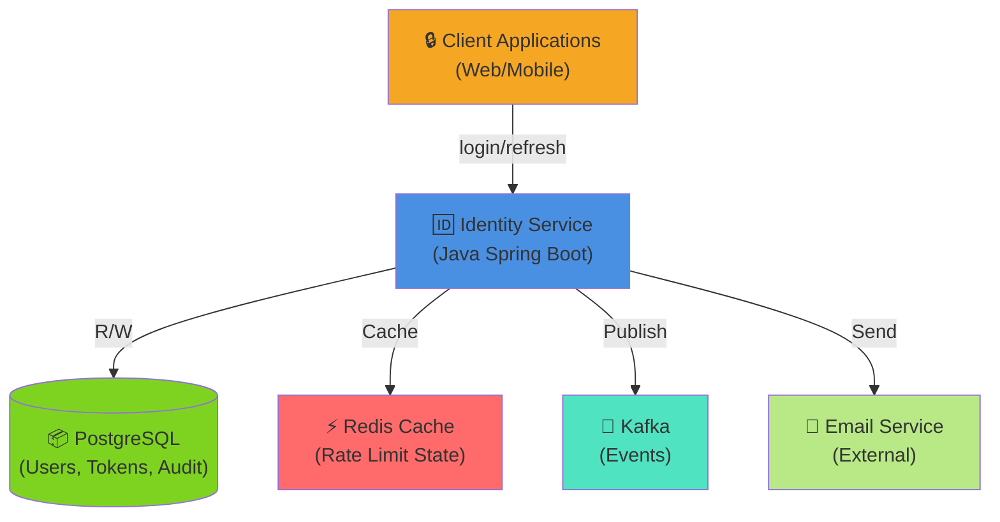
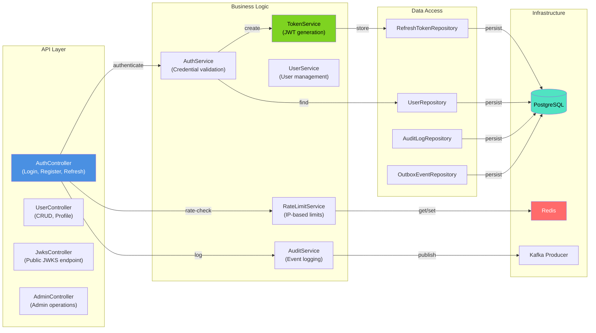

# Identity Service - High-Level Design Diagram

## System Context

```mermaid
graph TB
    Client["🔒 Client Applications<br/>(Web/Mobile)"]
    IdentityService["🆔 Identity Service<br/>(Java Spring Boot)"]
    DB[("📦 PostgreSQL<br/>(Users, Tokens, Audit)")]
    Cache["⚡ Redis Cache<br/>(Rate Limit State)"]
    Kafka["📨 Kafka<br/>(Events)"]
    Email["📧 Email Service<br/>(External)"]

    Client -->|login/refresh| IdentityService
    IdentityService -->|R/W| DB
    IdentityService -->|Cache| Cache
    IdentityService -->|Publish| Kafka
    IdentityService -->|Send| Email

    style IdentityService fill:#4A90E2
    style Client fill:#F5A623
    style DB fill:#7ED321
    style Cache fill:#FF6B6B
    style Kafka fill:#50E3C2
    style Email fill:#B8E986
```

## Component Architecture

```mermaid
graph LR
    subgraph "API Layer"
        AuthCtrl["AuthController<br/>(Login, Register, Refresh)"]
        UserCtrl["UserController<br/>(CRUD, Profile)"]
        JwksCtrl["JwksController<br/>(Public JWKS endpoint)"]
        AdminCtrl["AdminController<br/>(Admin operations)"]
    end

    subgraph "Business Logic"
        AuthSvc["AuthService<br/>(Credential validation)"]
        TokenSvc["TokenService<br/>(JWT generation)"]
        UserSvc["UserService<br/>(User management)"]
        AuditSvc["AuditService<br/>(Event logging)"]
        RateSvc["RateLimitService<br/>(IP-based limits)"]
    end

    subgraph "Data Access"
        UserRepo["UserRepository"]
        TokenRepo["RefreshTokenRepository"]
        AuditRepo["AuditLogRepository"]
        OutboxRepo["OutboxEventRepository"]
    end

    subgraph "Infrastructure"
        DB[("PostgreSQL")]
        Cache["Redis"]
        Event["Kafka Producer"]
    end

    AuthCtrl -->|authenticate| AuthSvc
    AuthCtrl -->|rate-check| RateSvc
    AuthSvc -->|create| TokenSvc
    TokenSvc -->|store| TokenRepo
    AuthSvc -->|find| UserRepo
    AuthCtrl -->|log| AuditSvc
    AuditSvc -->|publish| Event
    RateSvc -->|get/set| Cache

    TokenRepo -->|persist| DB
    UserRepo -->|persist| DB
    AuditRepo -->|persist| DB
    OutboxRepo -->|persist| DB

    style AuthCtrl fill:#4A90E2,color:#fff
    style TokenSvc fill:#7ED321,color:#000
    style DB fill:#50E3C2,color:#000
    style Cache fill:#FF6B6B,color:#fff
```
