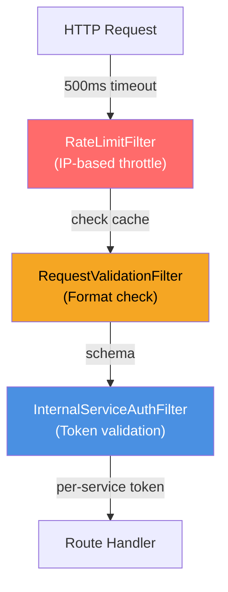
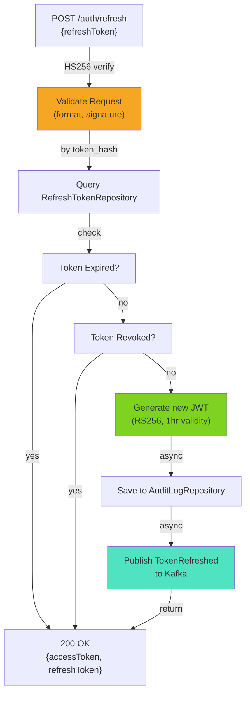
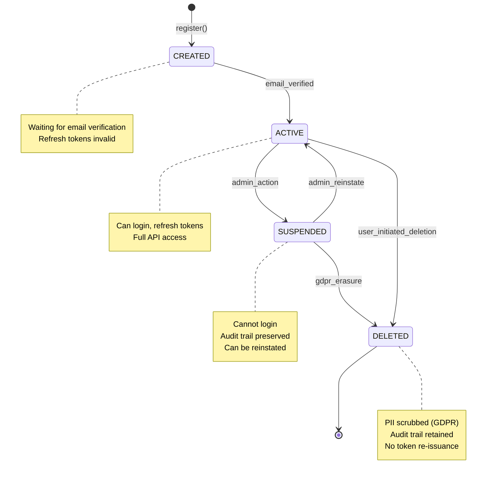
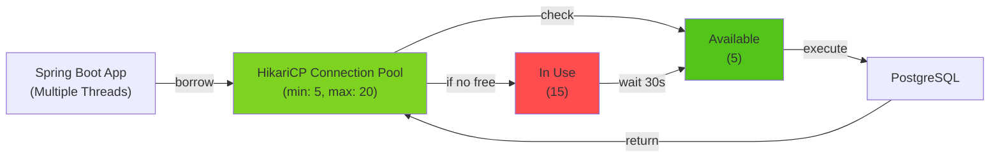
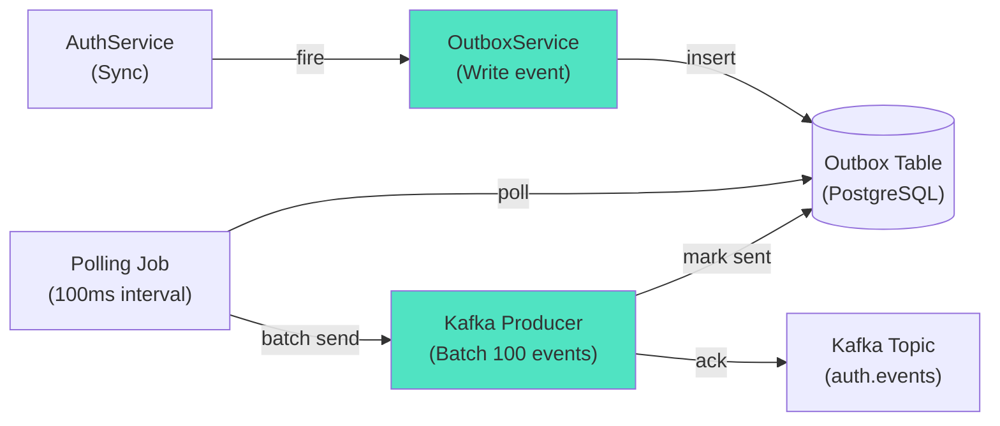

# Identity Service - Low-Level Design Diagram

## Request Handler Architecture



## Token Refresh Flow - Component Level



## State Machine: User Lifecycle



## Database Connection Pool



## JWT Token Structure (Decoded)

```
Header: {
  "alg": "RS256",
  "kid": "identity-service-key-1",
  "typ": "JWT"
}

Payload: {
  "sub": "user-uuid",
  "email": "user@example.com",
  "roles": ["CUSTOMER"],
  "aud": "instacommerce",
  "iss": "identity-service",
  "exp": 1700000000,
  "iat": 1700000000,
  "scope": "api:read api:write"
}

Signature: RS256(header.payload, private_key)
```

## Async Event Publishing Pipeline


