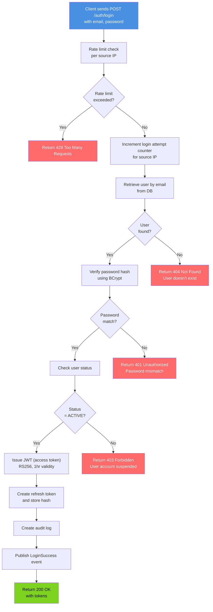
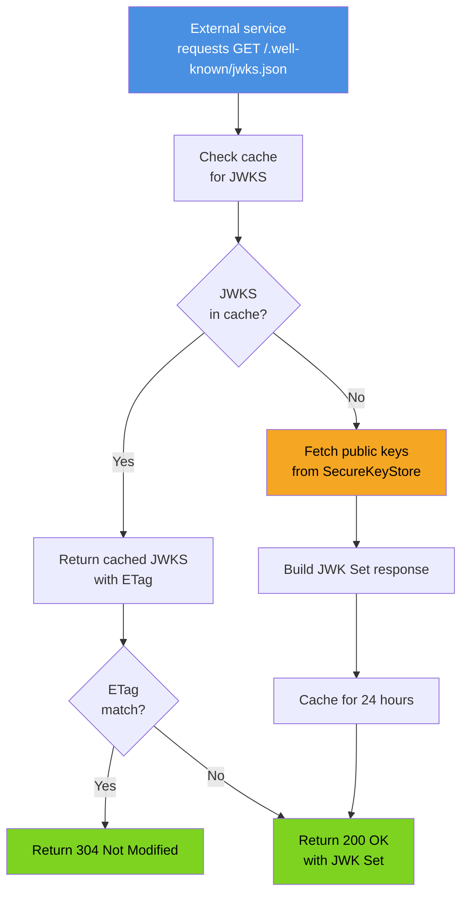

# Identity Service - Flowchart (Token Refresh Read Path)

```mermaid
flowchart TD
    A["Client sends POST /auth/refresh<br/>with refreshToken in body"]
    B{"Request validation<br/>passed?"}
    C["Extract token from request"]
    D["Hash the token using SHA256"]
    E{"Token hash<br/>in DB?"}
    F{"Token<br/>expired?"]
    G{"Token<br/>revoked?"}
    H["Fetch user from DB by user_id"]
    I{"User status<br/>= ACTIVE?"}
    J["Generate RS256 JWT<br/>with 1hr expiration"]
    K["Generate new refresh token"]
    L["Store refresh token hash<br/>in DB"]
    M["Create audit log entry"]
    N["Publish TokenRefreshed<br/>event to Kafka"]
    O["Return 200 OK<br/>with new tokens"]
    P["Return 400 Bad Request<br/>Invalid token format"]
    Q["Return 404 Not Found<br/>Token not found"]
    R["Return 401 Unauthorized<br/>Token expired"]
    S["Return 401 Unauthorized<br/>Token revoked"]
    T["Return 403 Forbidden<br/>User not active"]

    A --> B
    B -->|No| P
    B -->|Yes| C
    C --> D
    D --> E
    E -->|No| Q
    E -->|Yes| F
    F -->|Yes| R
    F -->|No| G
    G -->|Yes| S
    G -->|No| H
    H --> I
    I -->|No| T
    I -->|Yes| J
    J --> K
    K --> L
    L --> M
    M --> N
    N --> O

    style A fill:#4A90E2,color:#fff
    style O fill:#7ED321,color:#000
    style P fill:#FF6B6B,color:#fff
    style Q fill:#FF6B6B,color:#fff
    style R fill:#FF6B6B,color:#fff
    style S fill:#FF6B6B,color:#fff
    style T fill:#FF6B6B,color:#fff
    style J fill:#F5A623,color:#000
    style N fill:#50E3C2,color:#000
```

## Login Flow - Read Path



## Token Validation Read Path (JWKS)


