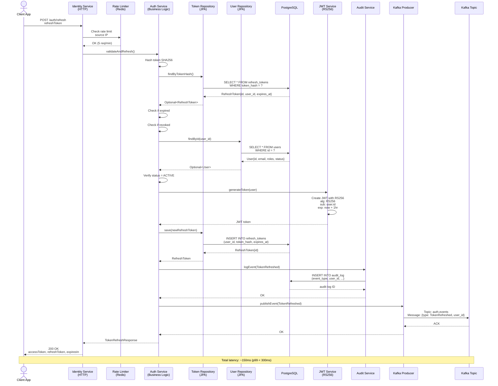
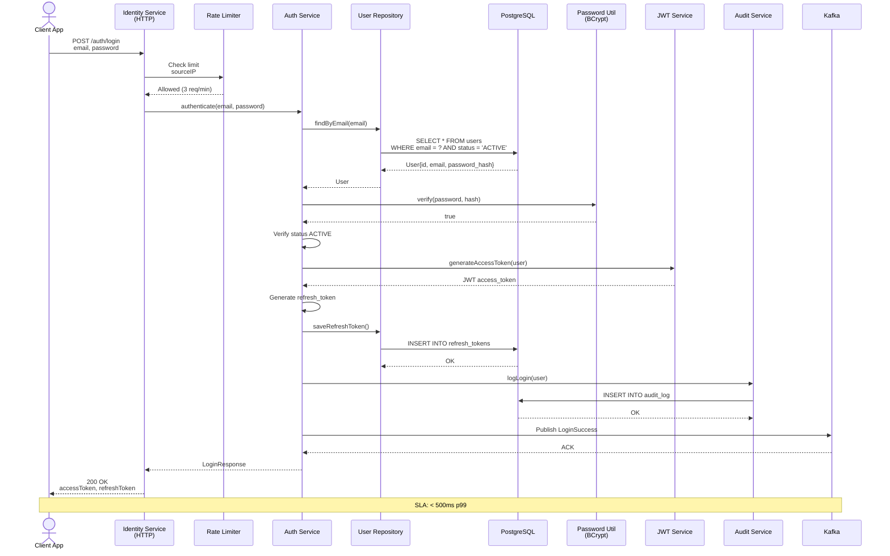
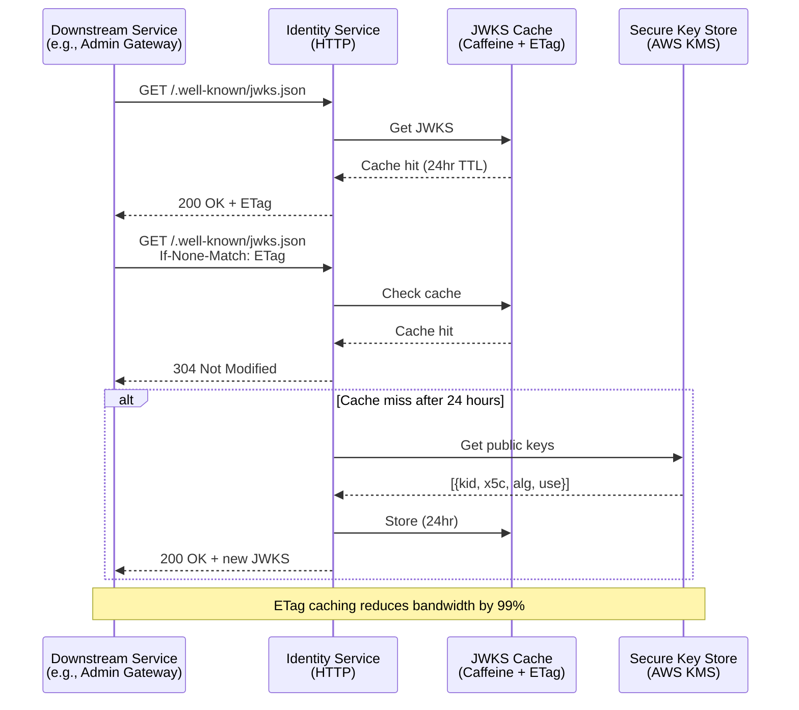

# Identity Service - Sequence Diagram (Token Refresh)

```mermaid
sequenceDiagram
    actor Client as Client App
    participant IdentityAPI as Identity Service<br/>(HTTP)
    participant RateLimit as Rate Limiter<br/>(Redis)
    participant AuthSvc as Auth Service<br/>(Business Logic)
    participant TokenRepo as Token Repository<br/>(JPA)
    participant UserRepo as User Repository<br/>(JPA)
    participant DB as PostgreSQL
    participant JwtSvc as JWT Service<br/>(RS256)
    participant AuditSvc as Audit Service
    participant KafkaProducer as Kafka Producer
    participant Kafka as Kafka Topic

    Client->>IdentityAPI: POST /auth/refresh<br/>refreshToken
    IdentityAPI->>RateLimit: Check rate limit<br/>source IP
    RateLimit-->>IdentityAPI: OK (5 req/min)
    IdentityAPI->>AuthSvc: validateAndRefresh()
    AuthSvc->>AuthSvc: Hash token SHA256
    AuthSvc->>TokenRepo: findByTokenHash()
    TokenRepo->>DB: SELECT * FROM refresh_tokens<br/>WHERE token_hash = ?
    DB-->>TokenRepo: RefreshToken{id, user_id, expires_at}
    TokenRepo-->>AuthSvc: Optional<RefreshToken>
    AuthSvc->>AuthSvc: Check if expired
    AuthSvc->>AuthSvc: Check if revoked
    AuthSvc->>UserRepo: findById(user_id)
    UserRepo->>DB: SELECT * FROM users<br/>WHERE id = ?
    DB-->>UserRepo: User{id, email, roles, status}
    UserRepo-->>AuthSvc: Optional<User>
    AuthSvc->>AuthSvc: Verify status = ACTIVE
    AuthSvc->>JwtSvc: generateToken(user)
    JwtSvc->>JwtSvc: Create JWT with RS256<br/>alg: RS256<br/>sub: user.id<br/>exp: now + 1hr
    JwtSvc-->>AuthSvc: JWT token
    AuthSvc->>TokenRepo: save(newRefreshToken)
    TokenRepo->>DB: INSERT INTO refresh_tokens<br/>(user_id, token_hash, expires_at)
    DB-->>TokenRepo: RefreshToken{id}
    TokenRepo-->>AuthSvc: RefreshToken
    AuthSvc->>AuditSvc: logEvent(TokenRefreshed)
    AuditSvc->>DB: INSERT INTO audit_log<br/>(event_type, user_id, ...)
    DB-->>AuditSvc: audit log ID
    AuditSvc-->>AuthSvc: OK
    AuthSvc->>KafkaProducer: publishEvent(TokenRefreshed)
    KafkaProducer->>Kafka: Topic: auth.events<br/>Message: {type: TokenRefreshed, user_id}
    Kafka-->>KafkaProducer: ACK
    KafkaProducer-->>AuthSvc: OK
    AuthSvc-->>IdentityAPI: TokenRefreshResponse
    IdentityAPI-->>Client: 200 OK<br/>accessToken, refreshToken, expiresIn

    Note over Client,Kafka: Total latency: ~150ms (p99 < 300ms)
```

## Login Sequence

```mermaid
sequenceDiagram
    actor Client as Client App
    participant IdentityAPI as Identity Service<br/>(HTTP)
    participant RateLimitSvc as Rate Limiter
    participant AuthSvc as Auth Service
    participant UserRepo as User Repository
    participant DB as PostgreSQL
    participant PasswordUtil as Password Util<br/>(BCrypt)
    participant JwtSvc as JWT Service
    participant AuditSvc as Audit Service
    participant Kafka as Kafka

    Client->>IdentityAPI: POST /auth/login<br/>email, password
    IdentityAPI->>RateLimitSvc: Check limit<br/>sourceIP
    RateLimitSvc-->>IdentityAPI: Allowed (3 req/min)
    IdentityAPI->>AuthSvc: authenticate(email, password)
    AuthSvc->>UserRepo: findByEmail(email)
    UserRepo->>DB: SELECT * FROM users<br/>WHERE email = ? AND status = 'ACTIVE'
    DB-->>UserRepo: User{id, email, password_hash}
    UserRepo-->>AuthSvc: User
    AuthSvc->>PasswordUtil: verify(password, hash)
    PasswordUtil-->>AuthSvc: true
    AuthSvc->>AuthSvc: Verify status ACTIVE
    AuthSvc->>JwtSvc: generateAccessToken(user)
    JwtSvc-->>AuthSvc: JWT access_token
    AuthSvc->>AuthSvc: Generate refresh_token
    AuthSvc->>UserRepo: saveRefreshToken()
    UserRepo->>DB: INSERT INTO refresh_tokens
    DB-->>UserRepo: OK
    AuthSvc->>AuditSvc: logLogin(user)
    AuditSvc->>DB: INSERT INTO audit_log
    DB-->>AuditSvc: OK
    AuthSvc->>Kafka: Publish LoginSuccess
    Kafka-->>AuthSvc: ACK
    AuthSvc-->>IdentityAPI: LoginResponse
    IdentityAPI-->>Client: 200 OK<br/>accessToken, refreshToken

    Note over Client,Kafka: SLA: < 500ms p99
```

## JWKS Endpoint (Public Key Distribution)

```mermaid
sequenceDiagram
    participant DownstreamSvc as Downstream Service<br/>(e.g., Admin Gateway)
    participant IdentityAPI as Identity Service<br/>(HTTP)
    participant JwksCache as JWKS Cache<br/>(Caffeine + ETag)
    participant KeyStore as Secure Key Store<br/>(AWS KMS)

    DownstreamSvc->>IdentityAPI: GET /.well-known/jwks.json
    IdentityAPI->>JwksCache: Get JWKS
    JwksCache-->>IdentityAPI: Cache hit (24hr TTL)
    IdentityAPI-->>DownstreamSvc: 200 OK + ETag
    DownstreamSvc->>IdentityAPI: GET /.well-known/jwks.json<br/>If-None-Match: ETag
    IdentityAPI->>JwksCache: Check cache
    JwksCache-->>IdentityAPI: Cache hit
    IdentityAPI-->>DownstreamSvc: 304 Not Modified

    alt Cache miss after 24 hours
        IdentityAPI->>KeyStore: Get public keys
        KeyStore-->>IdentityAPI: [{kid, x5c, alg, use}]
        IdentityAPI->>JwksCache: Store (24hr)
        IdentityAPI-->>DownstreamSvc: 200 OK + new JWKS
    end

    Note over DownstreamSvc,KeyStore: ETag caching reduces bandwidth by 99%
```
