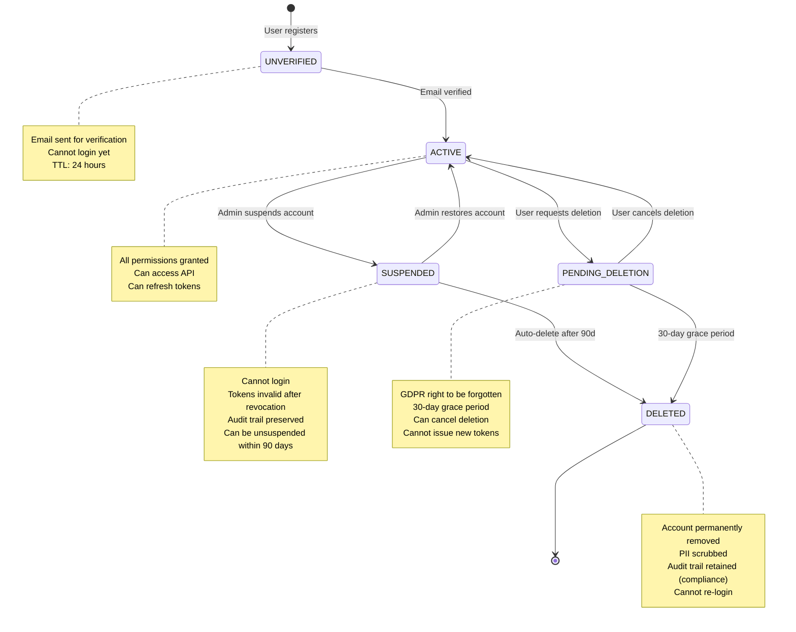
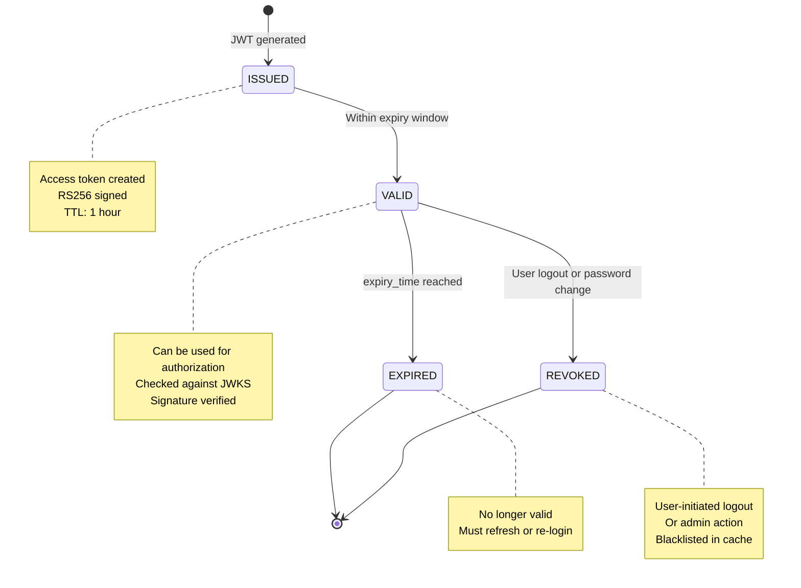
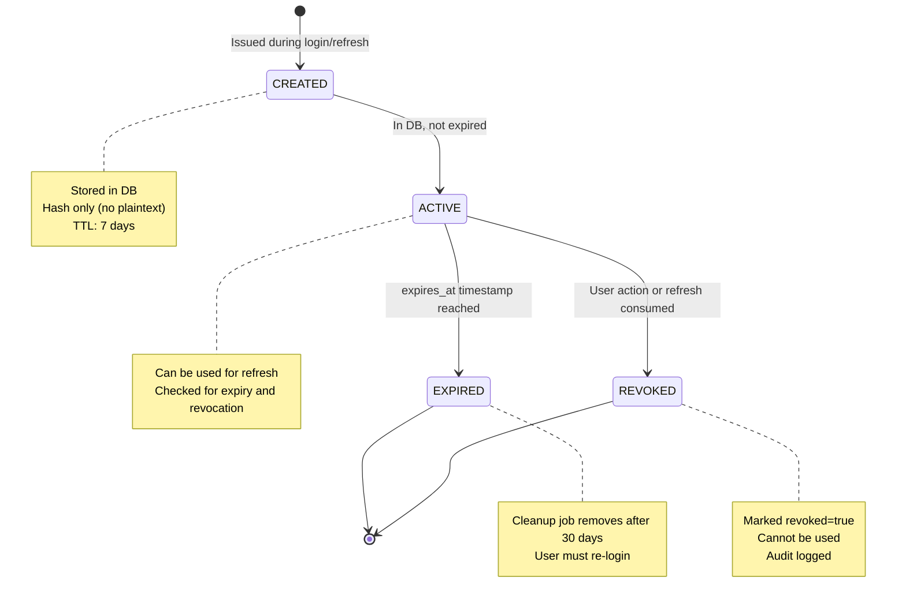
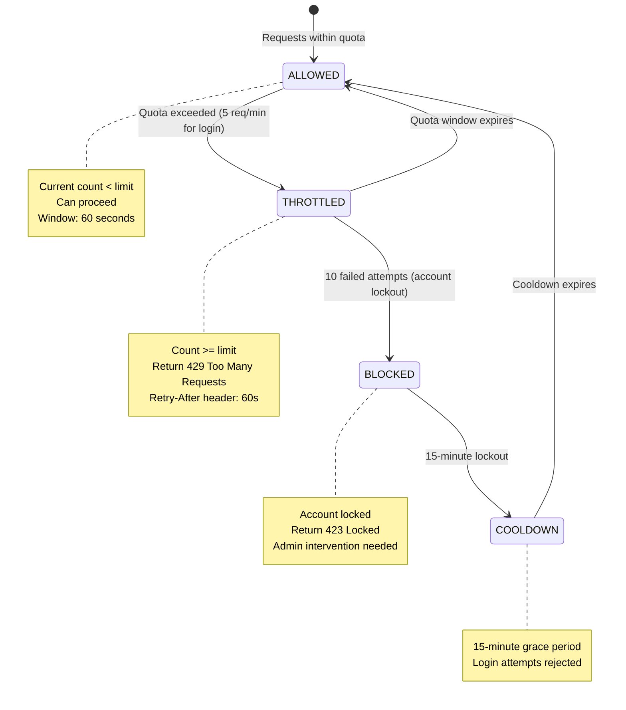
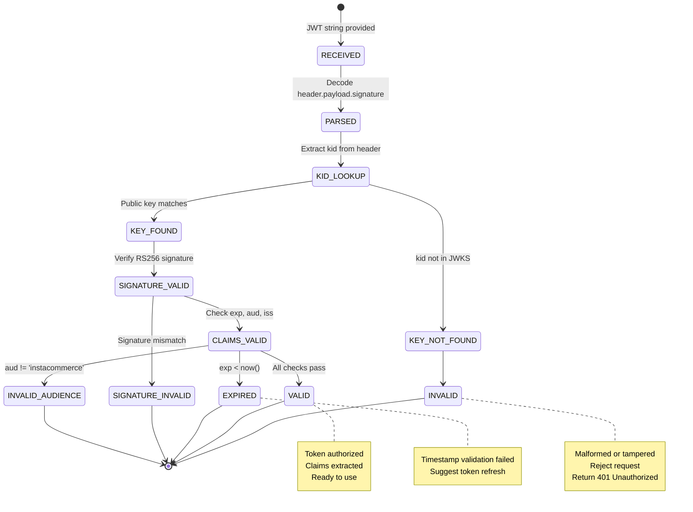

# Identity Service - State Machine Diagrams

## User Account Lifecycle

```mermaid
stateDiagram-v2
    [*] --> UNVERIFIED: User registers
    UNVERIFIED --> ACTIVE: Email verified
    ACTIVE --> SUSPENDED: Admin suspends account
    SUSPENDED --> ACTIVE: Admin restores account
    SUSPENDED --> DELETED: Auto-delete after 90d
    ACTIVE --> PENDING_DELETION: User requests deletion
    PENDING_DELETION --> DELETED: 30-day grace period
    PENDING_DELETION --> ACTIVE: User cancels deletion
    DELETED --> [*]

    note right of UNVERIFIED
        Email sent for verification
        Cannot login yet
        TTL: 24 hours
    end note

    note right of ACTIVE
        All permissions granted
        Can access API
        Can refresh tokens
    end note

    note right of SUSPENDED
        Cannot login
        Tokens invalid after revocation
        Audit trail preserved
        Can be unsuspended within 90 days
    end note

    note right of PENDING_DELETION
        GDPR right to be forgotten
        30-day grace period
        Can cancel deletion
        Cannot issue new tokens
    end note

    note right of DELETED
        Account permanently removed
        PII scrubbed
        Audit trail retained (compliance)
        Cannot re-login
    end note
```

## Token Lifecycle State Machine

```mermaid
stateDiagram-v2
    [*] --> ISSUED: JWT generated
    ISSUED --> VALID: Within expiry window
    VALID --> EXPIRED: expiry_time reached
    EXPIRED --> [*]
    VALID --> REVOKED: User logout or password change
    REVOKED --> [*]

    note right of ISSUED
        Access token created
        RS256 signed
        TTL: 1 hour
    end note

    note right of VALID
        Can be used for authorization
        Checked against JWKS
        Signature verified
    end note

    note right of EXPIRED
        No longer valid
        Must refresh or re-login
    end note

    note right of REVOKED
        User-initiated logout
        Or admin action
        Blacklisted in cache
    end note
```

## Refresh Token States

```mermaid
stateDiagram-v2
    [*] --> CREATED: Issued during login/refresh
    CREATED --> ACTIVE: In DB, not expired
    ACTIVE --> EXPIRED: expires_at timestamp reached
    ACTIVE --> REVOKED: User action or refresh consumed
    EXPIRED --> [*]
    REVOKED --> [*]

    note right of CREATED
        Stored in DB
        Hash only (no plaintext)
        TTL: 7 days
    end note

    note right of ACTIVE
        Can be used for refresh
        Checked for expiry and revocation
    end note

    note right of EXPIRED
        Cleanup job removes after 30 days
        User must re-login
    end note

    note right of REVOKED
        Marked revoked=true
        Cannot be used
        Audit logged
    end note
```

## Rate Limiting State per IP

```mermaid
stateDiagram-v2
    [*] --> ALLOWED: Requests within quota
    ALLOWED --> THROTTLED: Quota exceeded (5 req/min for login)
    THROTTLED --> BLOCKED: 10 failed attempts (account lockout)
    BLOCKED --> COOLDOWN: 15-minute lockout
    COOLDOWN --> ALLOWED: Cooldown expires
    THROTTLED --> ALLOWED: Quota window expires

    note right of ALLOWED
        Current count < limit
        Can proceed
        Window: 60 seconds
    end note

    note right of THROTTLED
        Count >= limit
        Return 429 Too Many Requests
        Retry-After header: 60s
    end note

    note right of BLOCKED
        Account locked
        Return 423 Locked
        Admin intervention needed
    end note

    note right of COOLDOWN
        15-minute grace period
        Login attempts rejected
    end note
```

## JWT Validation State Flow

```mermaid
stateDiagram-v2
    [*] --> RECEIVED: JWT string provided
    RECEIVED --> PARSED: Decode header.payload.signature
    PARSED --> KID_LOOKUP: Extract kid from header
    KID_LOOKUP --> KEY_FOUND: Public key matches
    KID_LOOKUP --> KEY_NOT_FOUND: kid not in JWKS
    KEY_NOT_FOUND --> INVALID
    KEY_FOUND --> SIGNATURE_VALID: Verify RS256 signature
    SIGNATURE_VALID --> CLAIMS_VALID: Check exp, aud, iss
    CLAIMS_VALID --> VALID: All checks pass
    SIGNATURE_VALID --> SIGNATURE_INVALID: Signature mismatch
    CLAIMS_VALID --> EXPIRED: exp < now()
    CLAIMS_VALID --> INVALID_AUDIENCE: aud != 'instacommerce'
    INVALID --> [*]
    VALID --> [*]
    EXPIRED --> [*]
    SIGNATURE_INVALID --> [*]
    INVALID_AUDIENCE --> [*]

    note right of VALID
        Token authorized
        Claims extracted
        Ready to use
    end note

    note right of INVALID
        Malformed or tampered
        Reject request
        Return 401 Unauthorized
    end note

    note right of EXPIRED
        Timestamp validation failed
        Suggest token refresh
    end note
```
