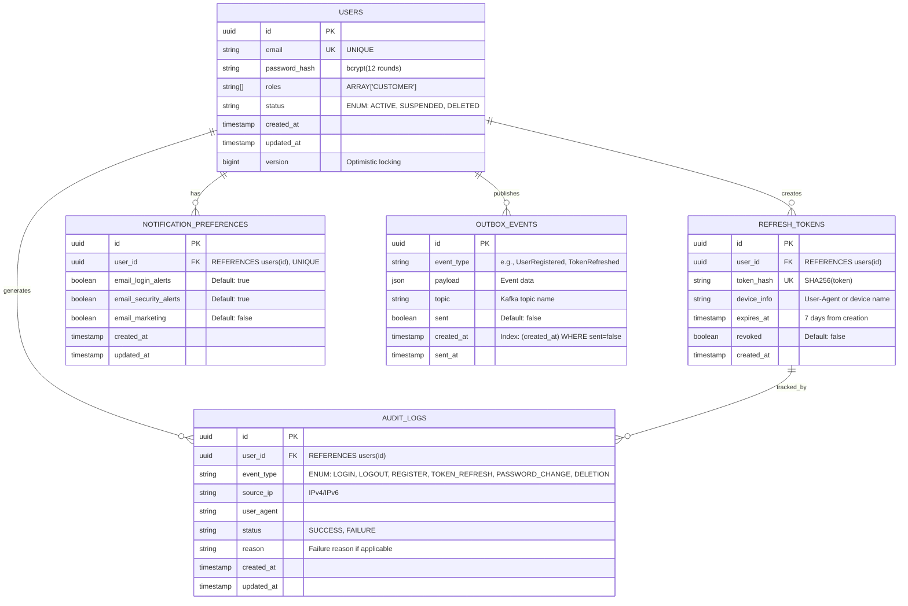
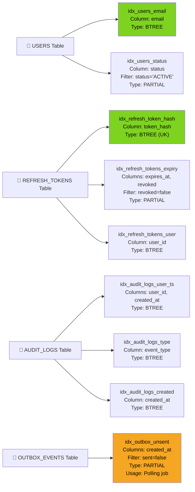
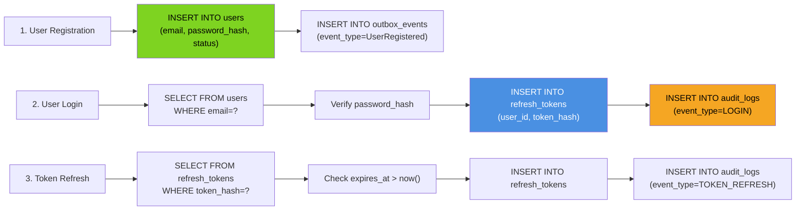

# Identity Service - Entity-Relationship Diagram



## Database Indexes & Performance Tuning



## Column-Level Constraints & Triggers

```mermaid
graph TD
    Users["USERS Table"]
    UEmail["email<br/>NOT NULL, UNIQUE<br/>CHECK length(email) BETWEEN 5 AND 255"]
    UPassHash["password_hash<br/>NOT NULL<br/>CHECK length(password_hash) = 72"]
    URoles["roles<br/>PostgreSQL ARRAY<br/>Elements: CUSTOMER, ADMIN, FRAUD_ANALYST"]
    UStatus["status<br/>CHECK status IN<br/>ACTIVE, SUSPENDED, DELETED"]
    UVersion["version<br/>BIGINT DEFAULT 0<br/>Used for optimistic locking"]

    RefreshTokens["REFRESH_TOKENS Table"]
    RTHash["token_hash<br/>UNIQUE<br/>CHECK length = 64<br/>CHECK NOT NULL"]
    RTExpiry["expires_at<br/>NOT NULL<br/>CHECK expires_at > created_at"]
    RTCascade["ON DELETE CASCADE<br/>from USERS (id)"]

    AuditLogs["AUDIT_LOGS Table"]
    ALType["event_type<br/>CHECK event_type IN<br/>LOGIN, LOGOUT, REGISTER,<br/>TOKEN_REFRESH, DELETE"]

    Users --> UEmail
    Users --> UPassHash
    Users --> URoles
    Users --> UStatus
    Users --> UVersion

    RefreshTokens --> RTHash
    RefreshTokens --> RTExpiry
    RefreshTokens --> RTCascade

    AuditLogs --> ALType

    style RTCascade fill:#FF6B6B,color:#fff
```



## Data Flow Through Schema



## Partitioning Strategy for Large Tables

```mermaid
graph TD
    AuditLogs["AUDIT_LOGS Table<br/>(Range Partitioned by DATE)<br/>Total rows: ~100M/year"]
    P2025Q1["Partition Q1-2025<br/>(Jan-Mar 2025)<br/>~25M rows"]
    P2025Q2["Partition Q2-2025<br/>(Apr-Jun 2025)<br/>~25M rows"]
    P2025Q3["Partition Q3-2025<br/>(Jul-Sep 2025)<br/>~25M rows"]
    P2025Q4["Partition Q4-2025<br/>(Oct-Dec 2025)<br/>~25M rows"]
    PDefault["Partition DEFAULT<br/>(Future dates)"]

    AuditLogs --> P2025Q1
    AuditLogs --> P2025Q2
    AuditLogs --> P2025Q3
    AuditLogs --> P2025Q4
    AuditLogs --> PDefault

    note right of AuditLogs
        Retention: 2 years
        Quarterly cleanup jobs
        Archival to cold storage after 1 year
    end note

    style P2025Q1 fill:#52C41A,color:#fff
    style P2025Q2 fill:#52C41A,color:#fff
    style P2025Q3 fill:#52C41A,color:#fff
    style P2025Q4 fill:#52C41A,color:#fff
```
