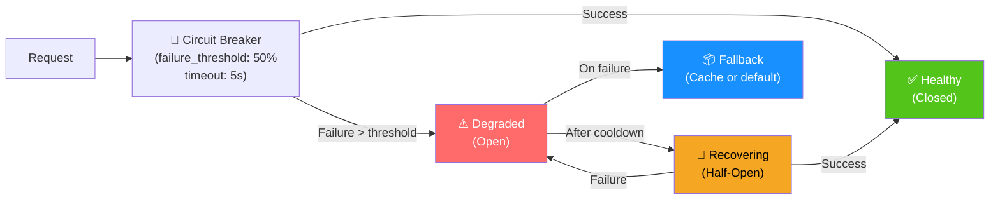
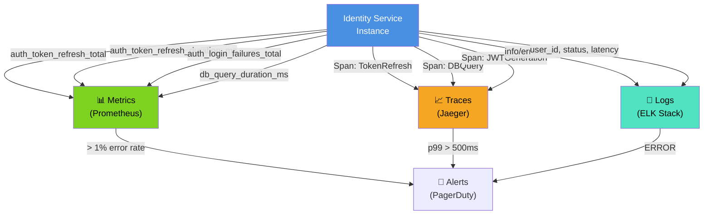

# Identity Service - End-to-End Diagram

## Complete Request Flow: Token Refresh

```mermaid
graph TB
    Client["📱 Client App"]
    CDN["🌐 CDN / ALB"]
    IstioGateway["🔐 Istio Ingress Gateway<br/>(mTLS termination)"]
    RateLimitFilter["⏱️ Rate Limiter Filter<br/>(Redis-backed)"]
    AuthFilter["🔑 Auth Filter<br/>(Per-service token)"]
    RequestValidator["✓ Request Validator<br/>(JSON schema)"]
    AuthController["🎯 AuthController<br/>POST /auth/refresh"]
    AuthService["⚙️ Auth Service<br/>(Business logic)"]
    TokenService["🎫 Token Service<br/>(JWT generation)"]
    TokenRepository["📦 Token Repository<br/>(JPA)"]
    UserRepository["👤 User Repository<br/>(JPA)"]
    PostgreSQL["🗄️ PostgreSQL<br/>(Primary)"]
    PostgreSQLReplica["📊 PostgreSQL Replica<br/>(Read-only)"]
    OutboxService["📤 Outbox Service<br/>(Transactional)"]
    KafkaProducer["📨 Kafka Producer"]
    Kafka["📬 Kafka Broker"]
    AuditService["📋 Audit Service"]

    Client -->|1. POST /auth/refresh| CDN
    CDN -->|2. Forward| IstioGateway
    IstioGateway -->|3. Check TLS cert| RateLimitFilter
    RateLimitFilter -->|4. Check Redis cache<br/>source_ip:5 req/min| AuthFilter
    AuthFilter -->|5. Validate internal token| RequestValidator
    RequestValidator -->|6. Parse JSON| AuthController
    AuthController -->|7. Call refreshToken()| AuthService
    AuthService -->|8. Hash token<br/>SHA256| TokenRepository
    TokenRepository -->|9. Query token_hash| PostgreSQL
    PostgreSQL -->|10. SELECT refresh_tokens<br/>WHERE token_hash=?| PostgreSQLReplica
    PostgreSQLReplica -->|11. Return token data| TokenRepository
    TokenRepository -->|12. RefreshToken| AuthService
    AuthService -->|13. Check expiry & revoked| AuthService
    AuthService -->|14. Fetch user| UserRepository
    UserRepository -->|15. Query user| PostgreSQL
    PostgreSQL -->|16. SELECT * FROM users<br/>WHERE id=?| PostgreSQL
    PostgreSQL -->|17. User object| UserRepository
    UserRepository -->|18. User| AuthService
    AuthService -->|19. Generate JWT<br/>RS256| TokenService
    TokenService -->|20. Sign with private key| TokenService
    TokenService -->|21. JWT token| AuthService
    AuthService -->|22. Create new refresh token| TokenRepository
    TokenRepository -->|23. INSERT refresh_tokens| PostgreSQL
    PostgreSQL -->|24. Confirmation| TokenRepository
    AuthService -->|25. Log audit event| AuditService
    AuditService -->|26. INSERT audit_logs| PostgreSQL
    PostgreSQL -->|27. ACK| AuditService
    AuthService -->|28. Publish to outbox| OutboxService
    OutboxService -->|29. INSERT outbox_events| PostgreSQL
    PostgreSQL -->|30. ACK| OutboxService
    OutboxService -->|31. Batched events| KafkaProducer
    KafkaProducer -->|32. Publish| Kafka
    Kafka -->|33. ACK| KafkaProducer
    AuthService -->|34. TokenRefreshResponse| AuthController
    AuthController -->|35. 200 OK| IstioGateway
    IstioGateway -->|36. Response with headers| CDN
    CDN -->|37. accessToken, refreshToken| Client

    style Client fill:#4A90E2,color:#fff
    style AuthService fill:#7ED321,color:#000
    style TokenService fill:#F5A623,color:#000
    style PostgreSQL fill:#50E3C2,color:#000
    style Kafka fill:#50E3C2,color:#000

    classDef latency1 fill:#52C41A,color:#fff
    classDef latency2 fill:#FF6B6B,color:#fff
    class 1,2,3 latency1
    class 30,31,32,33 latency2
```

## Multi-Service Interaction: Login to Admin Dashboard

```mermaid
graph TB
    User["👤 User (Browser)"]
    LoginApp["📱 Login App"]
    IdentityService["🆔 Identity Service"]
    AdminGateway["🔐 Admin Gateway"]
    Keycloak["🔑 Keycloak<br/>(OIDC/SAML)"]
    JwksEndpoint["📋 /.well-known/jwks.json"]
    AdminDashboard["📊 Admin Dashboard<br/>(React SPA)"]

    User -->|1. Enter credentials| LoginApp
    LoginApp -->|2. POST /auth/login| IdentityService
    IdentityService -->|3. Generate JWT| IdentityService
    IdentityService -->|4. 200 OK {accessToken}| LoginApp
    LoginApp -->|5. Store token| User
    User -->|6. Click Admin Dashboard| AdminDashboard
    AdminDashboard -->|7. GET /api/admin/dashboard<br/>Authorization: Bearer JWT| AdminGateway
    AdminGateway -->|8. Validate JWT signature| AdminGateway
    AdminGateway -->|9. GET /.well-known/jwks.json| JwksEndpoint
    JwksEndpoint -->|10. Return public keys| AdminGateway
    AdminGateway -->|11. Verify signature<br/>kid lookup| AdminGateway
    AdminGateway -->|12. Check aud=instacommerce-admin| AdminGateway
    AdminGateway -->|13. Extract claims| AdminGateway
    AdminGateway -->|14. Route to dashboard handler| AdminDashboard
    AdminDashboard -->|15. Return 200 OK {data}| User

    style IdentityService fill:#4A90E2,color:#fff
    style AdminGateway fill:#7ED321,color:#000
    style JwksEndpoint fill:#F5A623,color:#000
    style User fill:#50E3C2,color:#000
```

## Resilience Patterns



## SLA & Latency Tracking

```mermaid
graph TD
    E2E["End-to-End Latency<br/>Target: < 500ms p99"]
    RateLimit["Rate Limit Check<br/>~5ms<br/>(Redis)"]
    RequestParse["Request Parsing<br/>~2ms"]
    DBQuery["Database Query<br/>~50ms<br/>(SSD, indexed)"]
    JWTGen["JWT Generation<br/>~20ms<br/>(RS256 signing)"]
    KafkaPublish["Kafka Publish<br/>~100ms<br/>(async outbox)"]
    Serialize["Response Serialization<br/>~5ms"]
    NetworkRoundTrip["Network Latency<br/>~100ms"]

    E2E --> RateLimit
    E2E --> RequestParse
    E2E --> DBQuery
    E2E --> JWTGen
    E2E --> KafkaPublish
    E2E --> Serialize
    E2E --> NetworkRoundTrip

    note right of E2E
        5ms + 2ms + 50ms + 20ms + 100ms + 5ms + 100ms
        = ~282ms (typical)
        p99 target: < 500ms
        p99.9 target: < 1s
    end note

    style E2E fill:#4A90E2,color:#fff
    style DBQuery fill:#F5A623,color:#000
    style KafkaPublish fill:#50E3C2,color:#000
```

## Observability Signals


