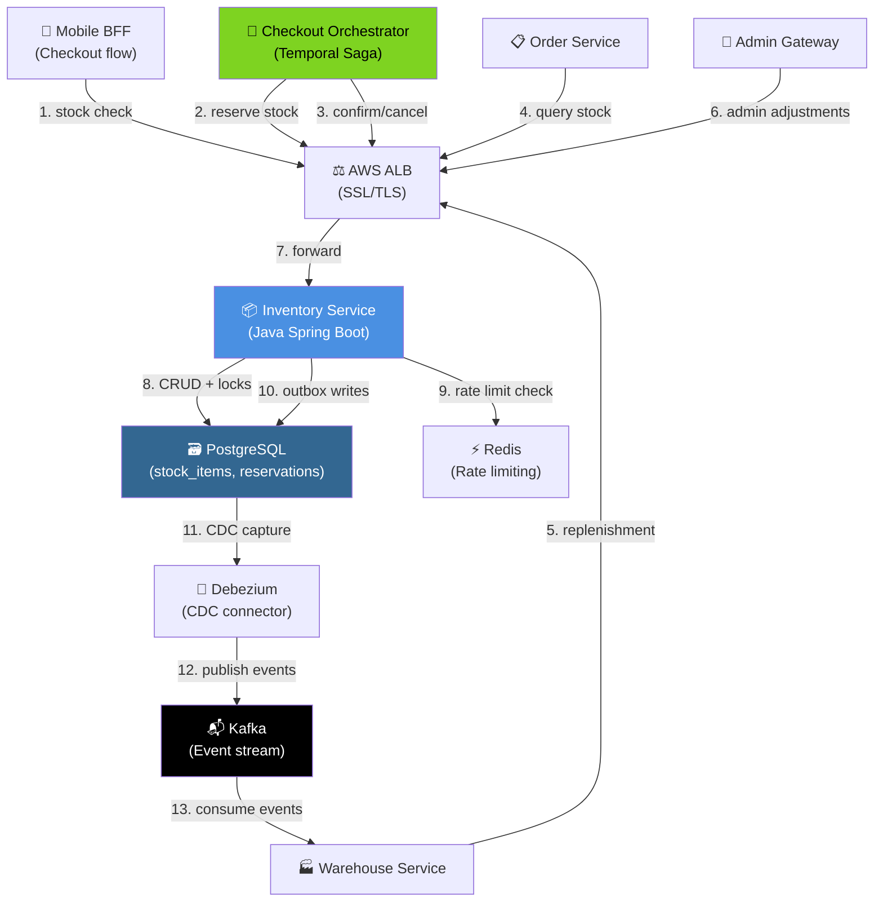
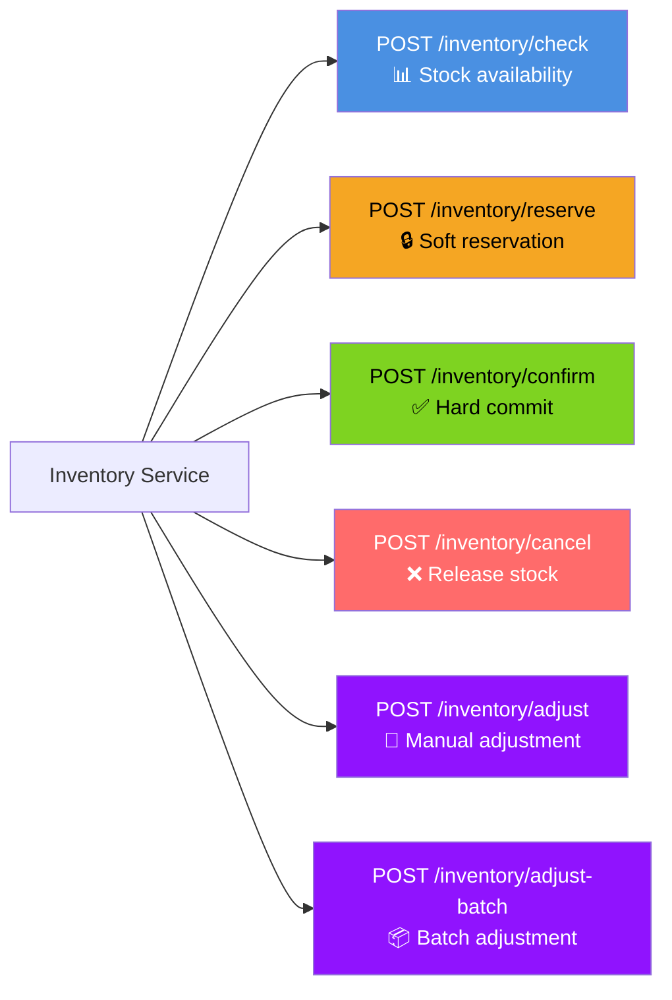
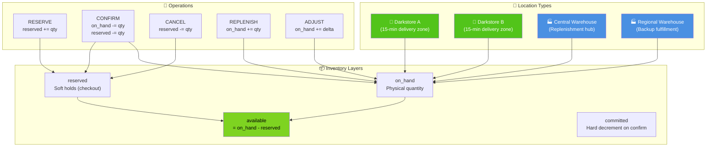
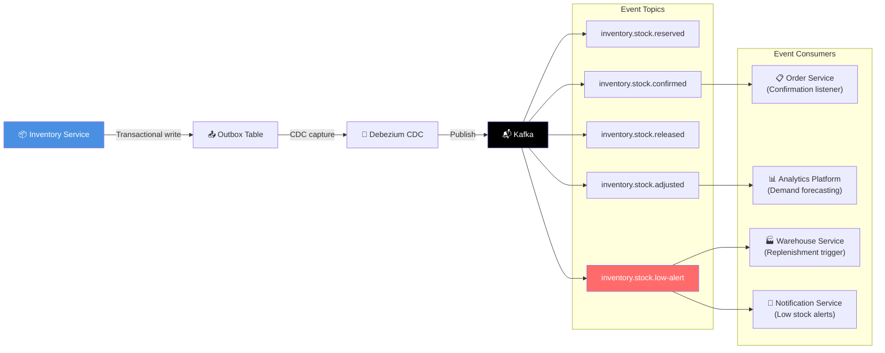
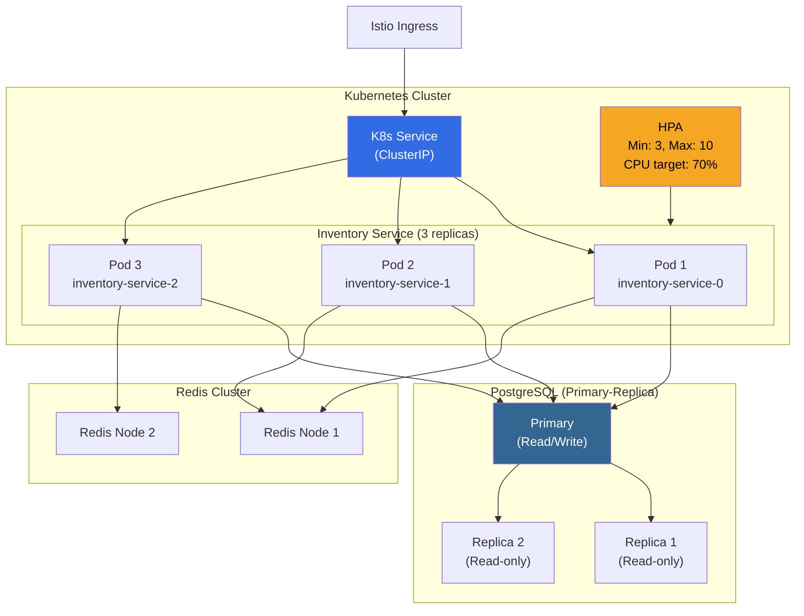

# Inventory Service - High-Level Design

```mermaid
graph TB
    MobileBFF["📱 Mobile BFF<br/>(Checkout flow)"]
    CheckoutOrch["🔄 Checkout Orchestrator<br/>(Temporal Saga)"]
    OrderService["📋 Order Service"]
    WarehouseService["🏭 Warehouse Service"]
    AdminGateway["🔐 Admin Gateway"]

    ALB["⚖️ AWS ALB<br/>(SSL/TLS)"]
    InventoryService["📦 Inventory Service<br/>(Java Spring Boot)"]
    PostgreSQL["🗃️ PostgreSQL<br/>(stock_items, reservations)"]
    Redis["⚡ Redis<br/>(Rate limiting)"]
    Kafka["📬 Kafka<br/>(Event stream)"]
    Debezium["🔗 Debezium<br/>(CDC connector)"]

    MobileBFF -->|1. stock check| ALB
    CheckoutOrch -->|2. reserve stock| ALB
    CheckoutOrch -->|3. confirm/cancel| ALB
    OrderService -->|4. query stock| ALB
    WarehouseService -->|5. replenishment| ALB
    AdminGateway -->|6. admin adjustments| ALB

    ALB -->|7. forward| InventoryService
    InventoryService -->|8. CRUD + locks| PostgreSQL
    InventoryService -->|9. rate limit check| Redis
    InventoryService -->|10. outbox writes| PostgreSQL

    PostgreSQL -->|11. CDC capture| Debezium
    Debezium -->|12. publish events| Kafka
    Kafka -->|13. consume events| WarehouseService

    style InventoryService fill:#4A90E2,color:#fff
    style PostgreSQL fill:#336791,color:#fff
    style CheckoutOrch fill:#7ED321,color:#000
    style Kafka fill:#000000,color:#fff
```

## Inventory API Endpoints

```mermaid
graph LR
    Gateway["Inventory Service"]

    CheckEP["POST /inventory/check<br/>📊 Stock availability"]
    ReserveEP["POST /inventory/reserve<br/>🔒 Soft reservation"]
    ConfirmEP["POST /inventory/confirm<br/>✅ Hard commit"]
    CancelEP["POST /inventory/cancel<br/>❌ Release stock"]
    AdjustEP["POST /inventory/adjust<br/>🔧 Manual adjustment"]
    AdjustBatchEP["POST /inventory/adjust-batch<br/>📦 Batch adjustment"]

    Gateway --> CheckEP
    Gateway --> ReserveEP
    Gateway --> ConfirmEP
    Gateway --> CancelEP
    Gateway --> AdjustEP
    Gateway --> AdjustBatchEP

    style CheckEP fill:#4A90E2,color:#fff
    style ReserveEP fill:#F5A623,color:#000
    style ConfirmEP fill:#7ED321,color:#000
    style CancelEP fill:#FF6B6B,color:#fff
    style AdjustEP fill:#9013FE,color:#fff
    style AdjustBatchEP fill:#9013FE,color:#fff
```

## Multi-Location Inventory Model

```mermaid
graph TB
    subgraph Locations["📍 Location Types"]
        Darkstore1["🏪 Darkstore A<br/>(15-min delivery zone)"]
        Darkstore2["🏪 Darkstore B<br/>(15-min delivery zone)"]
        Warehouse1["🏭 Central Warehouse<br/>(Replenishment hub)"]
        Warehouse2["🏭 Regional Warehouse<br/>(Backup fulfillment)"]
    end

    subgraph InventoryLayers["📦 Inventory Layers"]
        OnHand["on_hand<br/>Physical quantity"]
        Reserved["reserved<br/>Soft holds (checkout)"]
        Available["available<br/>= on_hand - reserved"]
        Committed["committed<br/>Hard decrement on confirm"]
    end

    subgraph Operations["🔄 Operations"]
        Reserve["RESERVE<br/>reserved += qty"]
        Confirm["CONFIRM<br/>on_hand -= qty<br/>reserved -= qty"]
        Cancel["CANCEL<br/>reserved -= qty"]
        Replenish["REPLENISH<br/>on_hand += qty"]
        Adjust["ADJUST<br/>on_hand += delta"]
    end

    Darkstore1 --> OnHand
    Darkstore2 --> OnHand
    Warehouse1 --> OnHand
    Warehouse2 --> OnHand

    OnHand --> Available
    Reserved --> Available

    Reserve --> Reserved
    Confirm --> OnHand
    Confirm --> Reserved
    Cancel --> Reserved
    Replenish --> OnHand
    Adjust --> OnHand

    style Darkstore1 fill:#52C41A,color:#fff
    style Darkstore2 fill:#52C41A,color:#fff
    style Warehouse1 fill:#4A90E2,color:#fff
    style Warehouse2 fill:#4A90E2,color:#fff
    style Available fill:#7ED321,color:#000
```

## Event-Driven Architecture

```mermaid
graph LR
    InventoryService["📦 Inventory Service"]
    Outbox["📤 Outbox Table"]
    Debezium["🔗 Debezium CDC"]
    Kafka["📬 Kafka"]

    subgraph Topics["Event Topics"]
        StockReserved["inventory.stock.reserved"]
        StockConfirmed["inventory.stock.confirmed"]
        StockReleased["inventory.stock.released"]
        StockAdjusted["inventory.stock.adjusted"]
        LowStockAlert["inventory.stock.low-alert"]
    end

    subgraph Consumers["Event Consumers"]
        OrderSvc["📋 Order Service<br/>(Confirmation listener)"]
        WarehouseSvc["🏭 Warehouse Service<br/>(Replenishment trigger)"]
        AnalyticsSvc["📊 Analytics Platform<br/>(Demand forecasting)"]
        NotificationSvc["📧 Notification Service<br/>(Low stock alerts)"]
    end

    InventoryService -->|Transactional write| Outbox
    Outbox -->|CDC capture| Debezium
    Debezium -->|Publish| Kafka

    Kafka --> StockReserved
    Kafka --> StockConfirmed
    Kafka --> StockReleased
    Kafka --> StockAdjusted
    Kafka --> LowStockAlert

    StockConfirmed --> OrderSvc
    LowStockAlert --> WarehouseSvc
    StockAdjusted --> AnalyticsSvc
    LowStockAlert --> NotificationSvc

    style InventoryService fill:#4A90E2,color:#fff
    style Kafka fill:#000000,color:#fff
    style LowStockAlert fill:#FF6B6B,color:#fff
```

## High-Availability Deployment

```mermaid
graph TB
    subgraph K8sCluster["Kubernetes Cluster"]
        subgraph Replicas["Inventory Service (3 replicas)"]
            Pod1["Pod 1<br/>inventory-service-0"]
            Pod2["Pod 2<br/>inventory-service-1"]
            Pod3["Pod 3<br/>inventory-service-2"]
        end

        Service["K8s Service<br/>(ClusterIP)"]
        HPA["HPA<br/>Min: 3, Max: 10<br/>CPU target: 70%"]
    end

    subgraph Database["PostgreSQL (Primary-Replica)"]
        Primary["Primary<br/>(Read/Write)"]
        Replica1["Replica 1<br/>(Read-only)"]
        Replica2["Replica 2<br/>(Read-only)"]
    end

    subgraph Caching["Redis Cluster"]
        RedisNode1["Redis Node 1"]
        RedisNode2["Redis Node 2"]
    end

    Istio["Istio Ingress"]
    Istio --> Service
    Service --> Pod1
    Service --> Pod2
    Service --> Pod3

    Pod1 --> Primary
    Pod2 --> Primary
    Pod3 --> Primary

    Primary --> Replica1
    Primary --> Replica2

    Pod1 --> RedisNode1
    Pod2 --> RedisNode1
    Pod3 --> RedisNode2

    HPA --> Replicas

    style Primary fill:#336791,color:#fff
    style Service fill:#326CE5,color:#fff
    style HPA fill:#F5A623,color:#000
```
