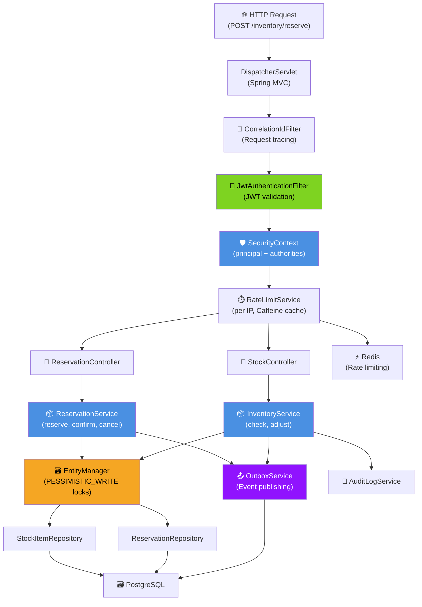
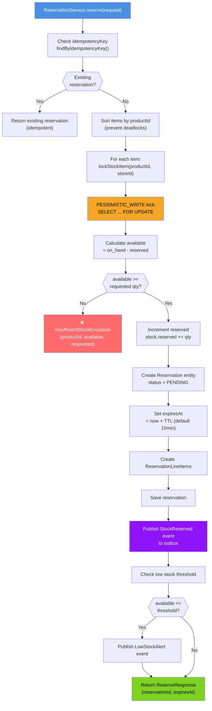
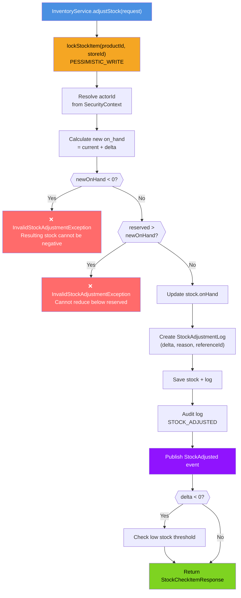
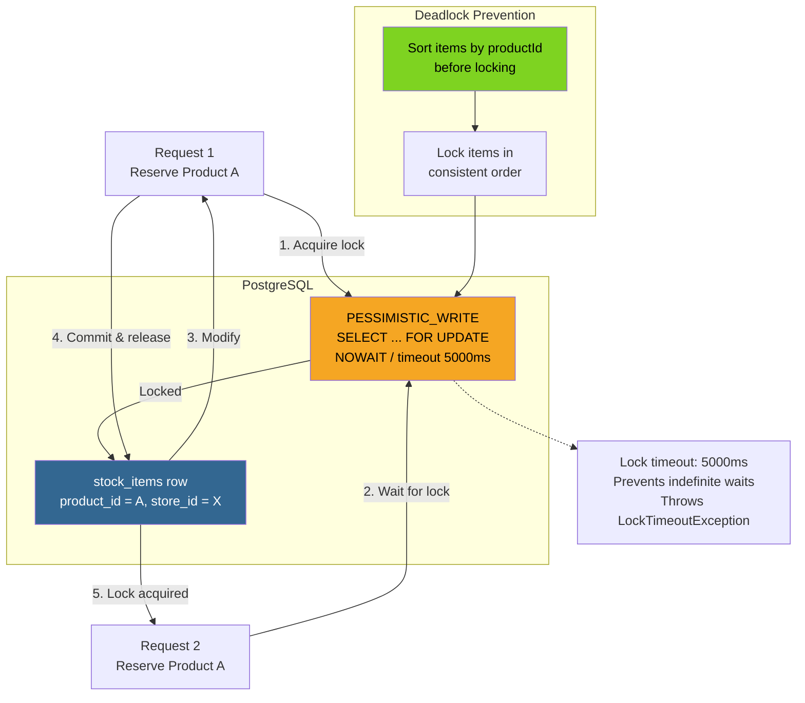
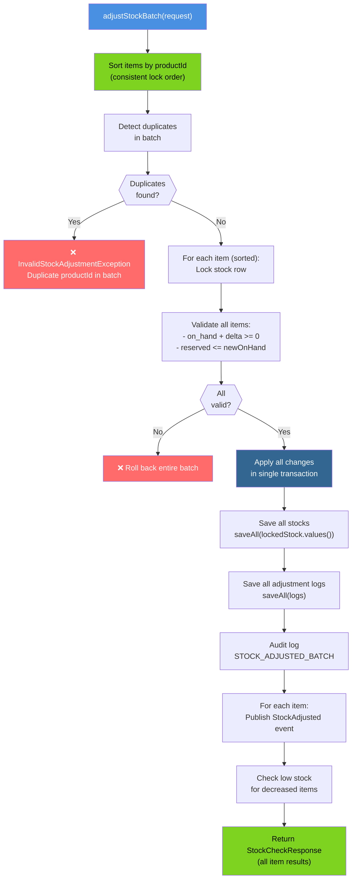
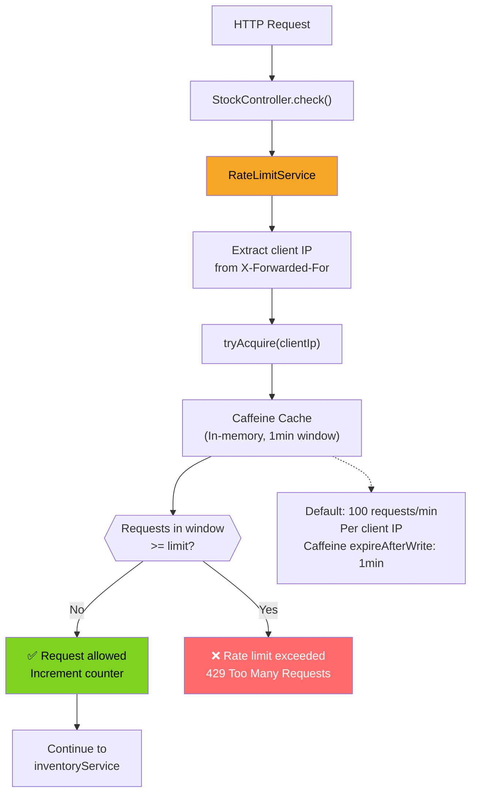
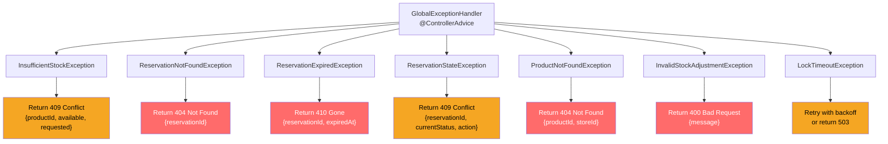

# Inventory Service - Low-Level Design

## Component Architecture



## ReservationService Implementation



## InventoryService Stock Adjustment



## Pessimistic Locking Strategy



## Batch Adjustment Processing



## OutboxService Event Publishing

```mermaid
graph TB
    Service["ReservationService<br/>or InventoryService"]
    OutboxService["OutboxService"]
    OutboxTable["outbox_events table"]
    Transaction["Same DB Transaction"]
    Debezium["Debezium CDC"]
    Kafka["Kafka"]

    subgraph EventPayload["Event Payload Structure"]
        EventId["event_id: UUID"]
        EventType["event_type: StockReserved"]
        AggregateType["aggregate_type: Reservation"]
        AggregateId["aggregate_id: reservation_id"]
        Payload["payload: JSON<br/>{items, reservedAt, expiresAt}"]
        CreatedAt["created_at: timestamp"]
    end

    Service -->|1. publish()| OutboxService
    OutboxService -->|2. Create OutboxEvent| OutboxTable
    Service -->|3. Commit| Transaction
    Transaction --> OutboxTable

    OutboxTable -->|4. CDC capture| Debezium
    Debezium -->|5. Transform & publish| Kafka

    OutboxService --> EventPayload

    style OutboxService fill:#9013FE,color:#fff
    style Transaction fill:#336791,color:#fff
    style Kafka fill:#000000,color:#fff
```

## Rate Limiting Implementation



## SLO: P99 Latency Target <100ms (Reserve)

```
┌─────────────────────────────────────────────────────────────┐
│  Inventory Reserve Request Timeline (P99 target: <100ms)    │
├─────────────────────────────────────────────────────────────┤
│ Request parsing & validation:          ~2ms                 │
│ JWT Authentication:                    ~5ms                 │
│ Rate limit check (Caffeine):           ~1ms                 │
│ Subtotal (overhead):                   ~8ms                 │
│                                                             │
│ Idempotency key lookup:                ~3ms                 │
│ Sort items by productId:               ~0.1ms               │
│ Lock stock rows (PESSIMISTIC_WRITE):   ~15ms (p99)          │
│   - Per row: ~5ms                                           │
│   - Lock contention adds latency                            │
│                                                             │
│ Availability check (per item):         ~1ms                 │
│ Update reserved counts:                ~2ms                 │
│ Create reservation + line items:       ~3ms                 │
│ Outbox event write:                    ~2ms                 │
│ Low stock check:                       ~1ms                 │
│ Transaction commit:                    ~5ms                 │
│                                                             │
│ Response serialization:                ~2ms                 │
│                                                             │
│ TOTAL P99:                             ~42ms                │
│ BUFFER (100ms target):                 ~58ms                │
│ STATUS:                                ✅ WITHIN SLO        │
└─────────────────────────────────────────────────────────────┘
```

## Error Handling & Resilience


