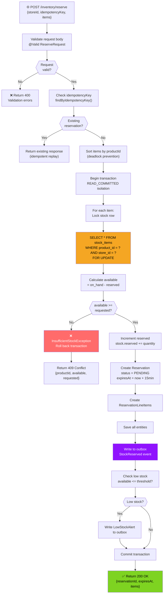
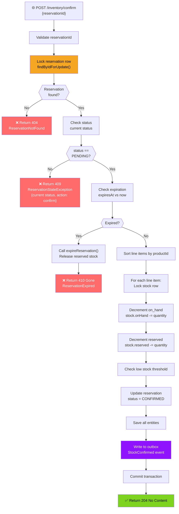
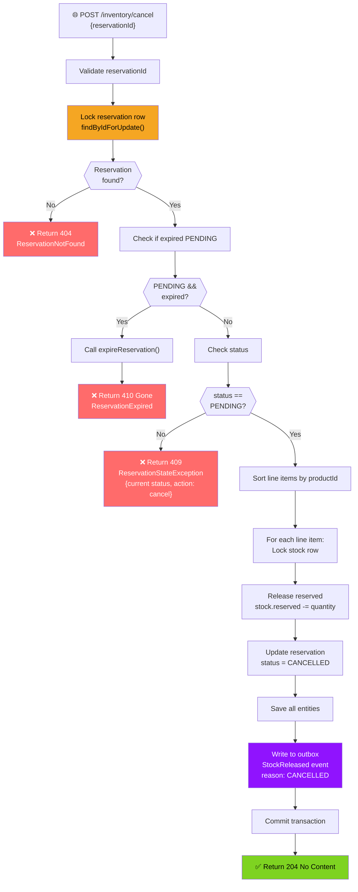
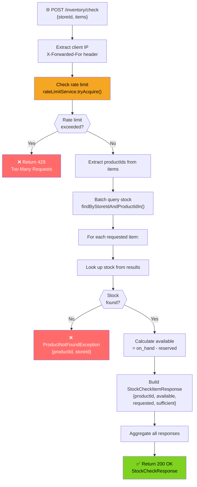
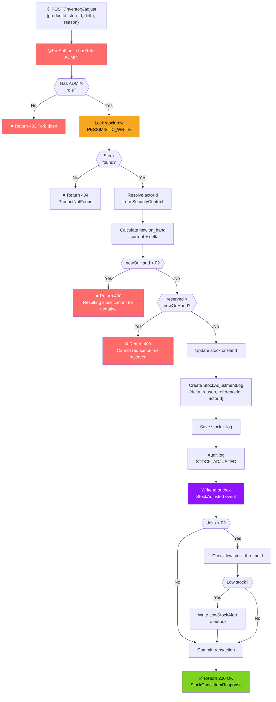
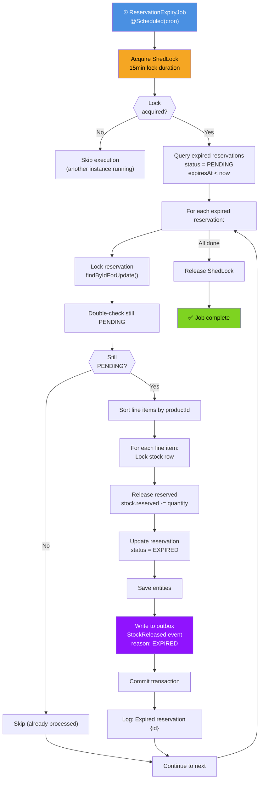
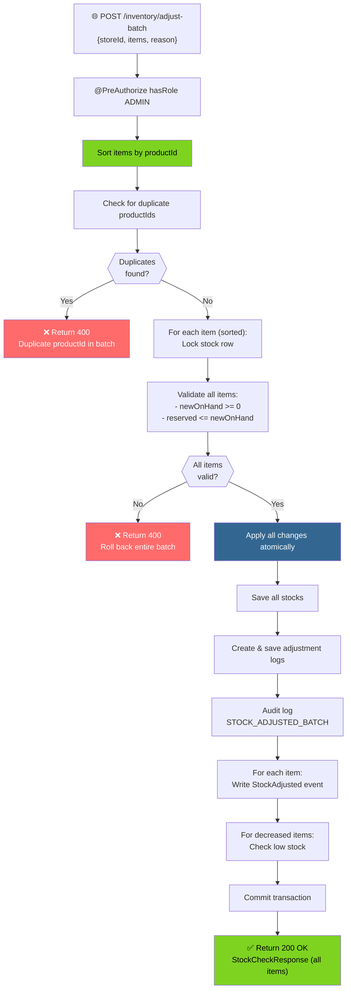

# Inventory Service - Request Flowcharts

## Stock Reservation Flow

## Stock Confirmation Flow

## Stock Cancellation Flow

## Stock Availability Check Flow

## Manual Stock Adjustment Flow

## Reservation Expiry Job Flow

## Batch Stock Adjustment Flow

