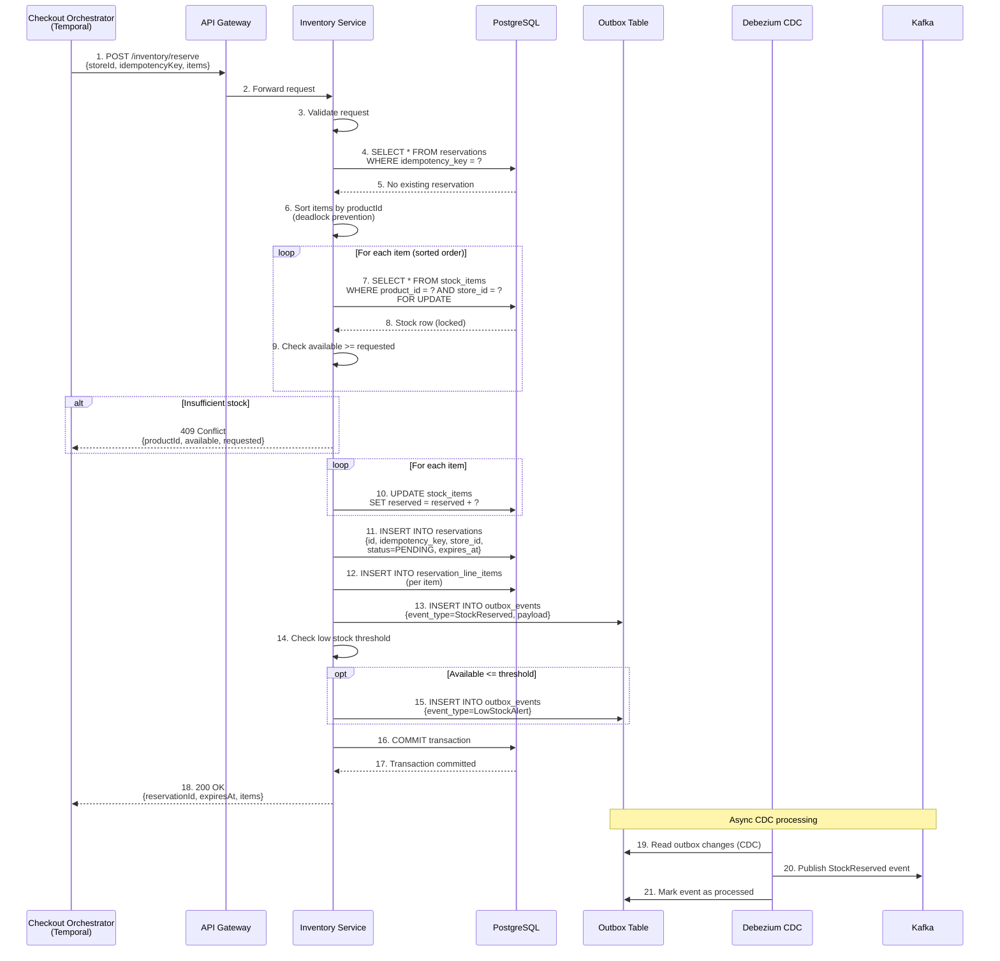
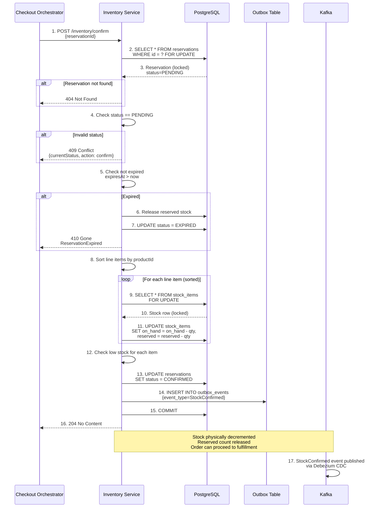
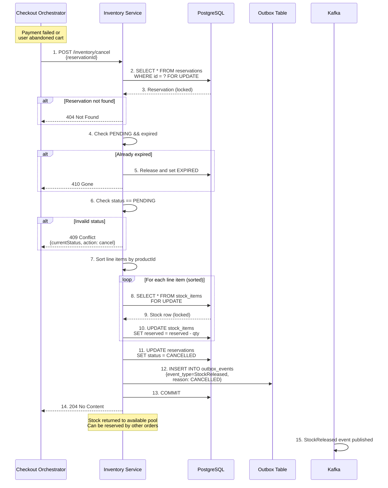
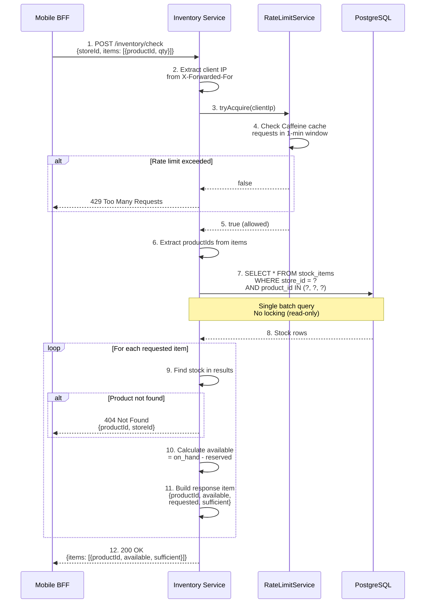
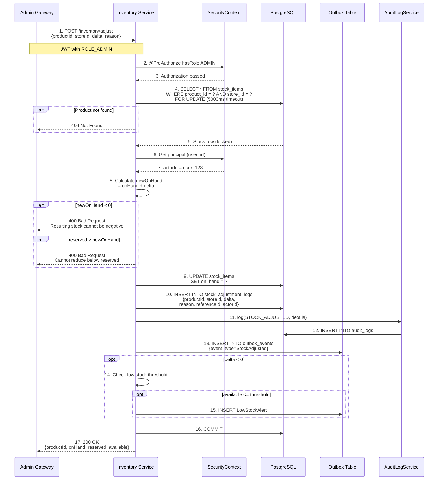
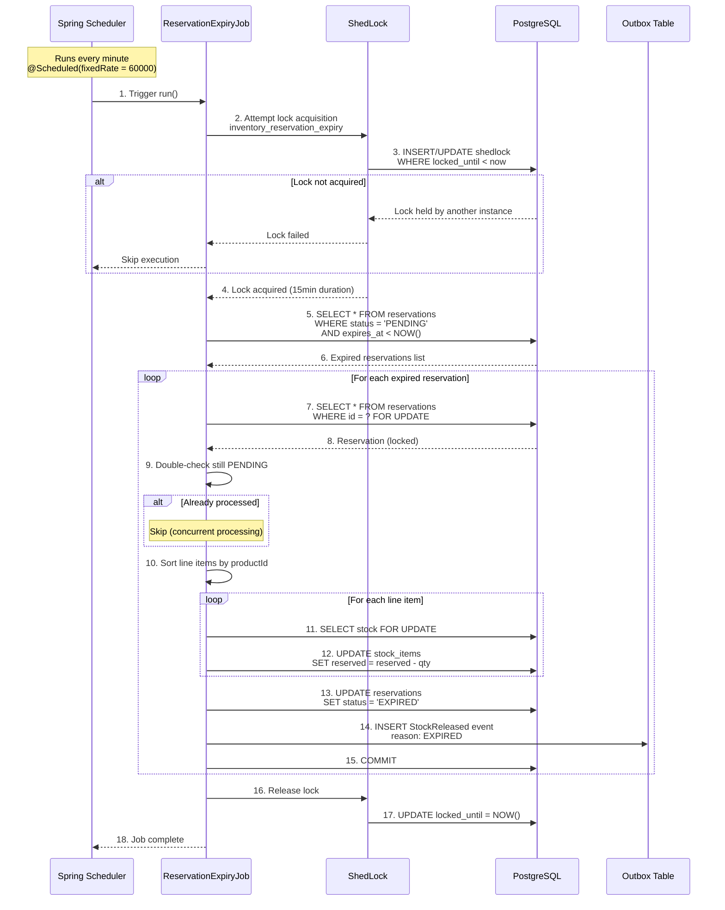
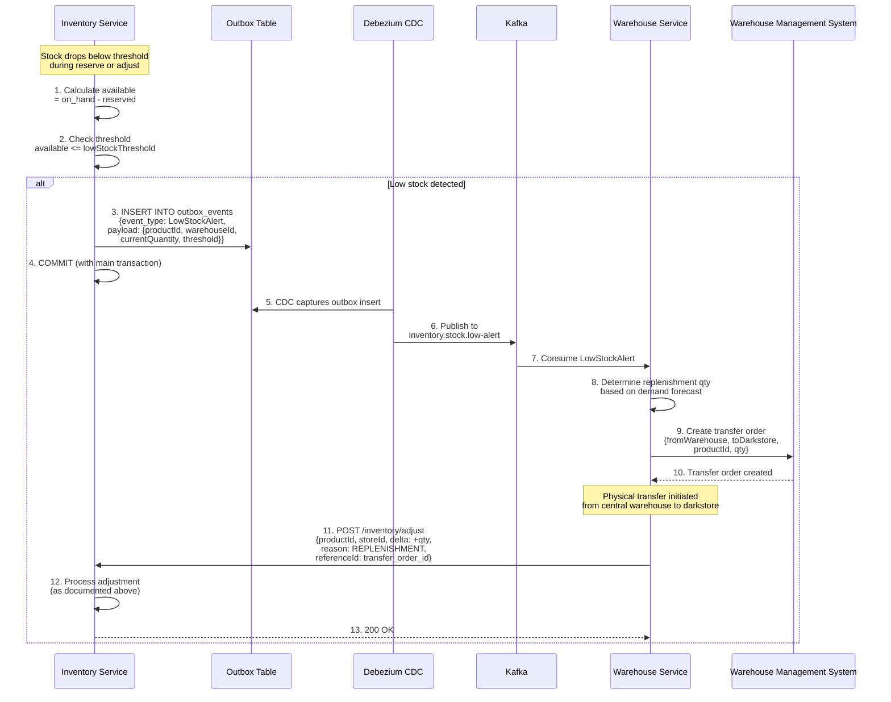

# Inventory Service - Sequence Diagrams

## Checkout Reservation Sequence (Complete Flow)

## Stock Confirmation Sequence

## Stock Cancellation Sequence

## Stock Availability Check Sequence

## Manual Stock Adjustment Sequence

## Reservation Expiry Job Sequence

## Replenishment Trigger Sequence

